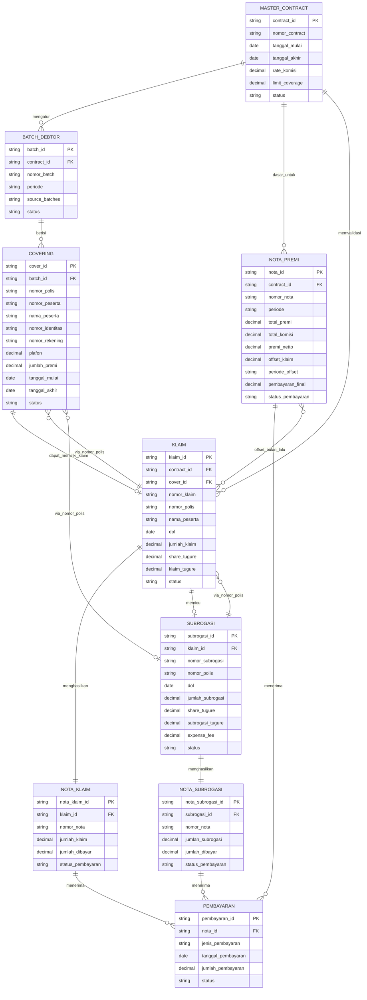

# SISTEM REASURANSI A3M (AUTO FACULTATIVE CREDIT COMMERCIAL)
## ANALISIS SISTEM ANTARA BRINS - TUGURE

---

## DAFTAR ISI

1. [Workflow - Diagram Sekuens Mermaid](#1-workflow---diagram-sekuens-mermaid)
2. [Karakteristik Kunci Sistem](#2-karakteristik-kunci-sistem)
3. [Pemodelan Informasi](#3-pemodelan-informasi)
4. [Pemodelan Data](#4-pemodelan-data)
5. [Pemodelan Proses](#5-pemodelan-proses)
6. [Pemodelan Interaksi](#6-pemodelan-interaksi)
7. [Logika Bisnis & Formula Kalkulasi](#7-logika-bisnis--formula-kalkulasi)
8. [Aturan Validasi](#8-aturan-validasi)
9. [Titik Integrasi Sistem](#9-titik-integrasi-sistem)
10. [Skenario Penanganan Eksepsi](#10-skenario-penanganan-eksepsi)
11. [Kebutuhan Pelaporan](#11-kebutuhan-pelaporan)
12. [Audit Trail & Kepatuhan](#12-audit-trail--kepatuhan)

---

## 1. WORKFLOW 

## - Master Contract
Kesepakatan master contract (berlaku 1 tahun) bisa ada revisi (adendum) juga brins, tugure actknowledgement.
BRINS mengirimkan master contract 
Tugure untuk direview.
Jika master contract disetujui, Tugure mengonfirmasi persetujuan.
Pembuatan Draft Nota & Batch premi (total premi) per bulan
BSM (broker) kirim data debitur ke BRINS per batch
BRINS akan review data batch dari BSM ketika sudah sesuai di kumpulin sampai full 3 batch
Setelah kumpul 3 batch generate nota per bulan berisi 3 batch lanjut dikirm ke Tugure dan tim Finance BRINS & generate Nota di akhir bulan (setelah 3 batch terkumpul).
Tugure review & remark (notes) jika ada kekurangan
BRINS diminta untuk merevisi batch debitur tersebut dan mengunggah ulang.
Nota mengikuti revisi batch (jika ada revisi batch nota ikut berubah)

## - Pembayaran Premi oleh BRINS ke Tugure:
Setelah semua batch debitur diterima (nota final terbentuk), BRINS melakukan pembayaran premi sesuai dengan nota final.
Tugure melakukan verifikasi pembayaran premi dan melakukan rekonsiliasi pembayaran untuk memastikan apakah jumlah yang dibayar sesuai dengan nota.
Jika pembayaran cocok, ditandai nota sebagai "fully paid."
Jika terdapat selisih pembayaran, sistem memberi notifikasi exception ke BRINS, dan BRINS mengonfirmasi exception tersebut. Tugure kemudian menghasilkan Debit Note (DN) / Credit Note (CN), dan sistem memperbarui saldo nota.
BRINS akan sebatas memverifikasi nota DN CN (jika ada selisih)
## - Klaim:
BRINS mengunggah klaim base on batch untuk diperiksa oleh Tugure.
System melakukan validasi claim (validasi claim vs master contract)
Tugure meninjau klaim yang diunggah dan jika claim disetujui, klaim tersebut diproses menjadi nota klaim yang kemudian diterima oleh BRINS.
Tugure membayarkan klaim yang approved.
Jika klaim ditolak, BRINS diminta untuk merevisi klaim tersebut.
Jika terdapat selisih pembayaran antara nota claim dan pembayaran seharusnya maka tugure generate DN / CN
BRINS melakukan verifikasi.
## - Subrogasi:
BRINS juga mengajukan subrogasi untuk setiap debitur (reference ke claim)
System melakukan validasi subrogasi.
Kemudian diperiksa oleh Tugure, jika subrogasi disetujui, nota subrogasi dibuat, dan status pembayaran diperbarui.
Tugure membayarkan subrogasi.
Jika ditolak, BRINS diminta untuk merevisi subrogasi tersebut.
Jika terdapat selisih pembayaran antara nota subrogasi dan pembayaran seharusnya maka tugure generate DN / CN
BRINS melakukan verifikasi.
 
### 1.1 Workflow Master Contract & Nota Premi

```mermaid
sequenceDiagram
    autonumber

    participant BSM as BSM (Broker)
    participant BR as BRINS
    participant SYS as Sistem
    participant TG as Tugure
    participant FIN as Finance BRINS

    %% ========================================
    %% FASE 1: MASTER CONTRACT
    %% ========================================
    
    Note over BR,TG: FASE 1: KESEPAKATAN MASTER CONTRACT (Berlaku 1 Tahun)
    
    BR->>SYS: Buat master contract (syarat treaty)
    SYS->>TG: Kirim master contract untuk review
    
    alt Master Contract Disetujui
        TG->>SYS: Setujui master contract
        SYS->>BR: Master contract diakui
        SYS->>SYS: Aktifkan master contract (1 tahun)
    else Master Contract Ditolak
        TG->>SYS: Tolak master contract dengan catatan
        SYS->>BR: Master contract ditolak (catatan)
        BR->>SYS: Revisi master contract
        SYS->>TG: Kirim master contract yang direvisi
    end
    
    alt Adendum Master Contract
        TG->>SYS: Minta adendum
        SYS->>BR: Notifikasi permintaan adendum
        BR->>SYS: Buat adendum
        SYS->>TG: Kirim adendum untuk review
        TG->>SYS: Setujui/Tolak adendum
    end

    %% ========================================
    %% FASE 2: PEMBUATAN NOTA PREMI & BATCH DEBITUR
    %% ========================================
    
    Note over BSM,FIN: FASE 2: PEMBUATAN NOTA & BATCH PREMI (Per Bulan)
    
    %% BSM kirim per batch ke BRINS
    BSM->>BR: Kirim data debitur batch 1
    BR->>BR: Review data batch 1 dari BSM
    
    BSM->>BR: Kirim data debitur batch 2
    BR->>BR: Review data batch 2 dari BSM
    
    BSM->>BR: Kirim data debitur batch 3
    BR->>BR: Review data batch 3 dari BSM
    
    Note over BR: BRINS kumpulkan sampai full 3 batch
    Note over BR: Setelah data batch sesuai, dikumpulkan sampai full 3 batch
    
    %% Generate nota setelah 3 batch terkumpul
    BR->>BR: Generate nota premi per bulan (berisi 3 batch)
    Note over BR: Generate Nota di akhir bulan setelah 3 batch terkumpul
    
    %% BRINS upload ke sistem
    BR->>SYS: Upload batch debitur + nota premi ke sistem
    
    %% Sistem validasi dan kirim ke Tugure & Finance
    SYS->>SYS: Validasi batch debitur terhadap master contract
    SYS->>SYS: Validasi perhitungan nota premi
    SYS->>SYS: Cek semua nomor polis unik
    SYS->>TG: Kirim batch debitur + nota untuk review
    SYS->>FIN: Kirim nota premi untuk review
    
    alt Batch Debitur & Nota Disetujui
        TG->>SYS: Setujui batch debitur + nota
        SYS->>SYS: Finalisasi batch debitur
        SYS->>SYS: Aktifkan nota premi
        Note over SYS: Nota final terbentuk
        SYS->>BR: Batch debitur disetujui, nota siap dibayar
    else Ada Kekurangan / Ditolak
        TG->>SYS: Review & remark (notes) jika ada kekurangan
        SYS->>BR: Batch debitur ditolak dengan catatan
        Note over BR: BRINS diminta revisi batch debitur
        BR->>BR: Revisi batch debitur
        BR->>BR: Regenerate nota premi (nota mengikuti revisi batch)
        BR->>SYS: Upload ulang batch debitur + nota premi
        SYS->>TG: Kirim batch & nota yang direvisi untuk review
    end

    %% ========================================
    %% FASE 3: PEMBAYARAN PREMI (DENGAN OFFSET KLAIM)
    %% ========================================
    
    Note over BR,TG: FASE 3: PEMBAYARAN PREMI
    
    SYS->>SYS: Cek klaim yang disetujui dari bulan sebelumnya
    
    alt Ada Klaim dari Bulan Sebelumnya
        SYS->>SYS: Hitung offset klaim
        Note over SYS: Jumlah Offset = Total Klaim Bulan Lalu
        SYS->>SYS: Hitung pembayaran premi netto
        Note over SYS: Pembayaran Netto = Premi Nota - Offset Klaim
        SYS->>BR: Notifikasi jumlah premi setelah offset
        SYS->>TG: Notifikasi offset klaim diterapkan
        
        alt Pembayaran Netto > 0
            BR->>TG: Transfer pembayaran premi netto (setelah offset)
            Note over BR,TG: Premi - Klaim Bulan Lalu
        else Pembayaran Netto = 0
            Note over SYS: Tidak perlu pembayaran (fully offset)
            SYS->>SYS: Tandai sebagai "Settled via Offset Klaim"
        else Pembayaran Netto < 0
            Note over SYS: Klaim melebihi premi
            TG->>BR: Tugure bayar selisih ke BRINS
            Note over TG,BR: Klaim - Premi
        end
        
    else Tidak Ada Klaim dari Bulan Sebelumnya
        BR->>TG: Transfer pembayaran premi penuh
        Note over BR,TG: Pembayaran premi reguler tanpa offset
    end
    
    TG->>SYS: Verifikasi pembayaran premi (dengan offset diperhitungkan)
    SYS->>SYS: Rekonsiliasi pembayaran vs nota (dengan offset)
    
    alt Pembayaran Cocok Penuh (termasuk offset)
        SYS->>SYS: Tandai nota sebagai "Lunas"
        SYS->>BR: Pembayaran dikonfirmasi
    else Ditemukan Selisih Pembayaran
        SYS->>BR: Notifikasi eksepsi (pembayaran tidak cocok)
        BR->>SYS: Konfirmasi eksepsi
        
        alt Kurang Bayar
            TG->>SYS: Generate Debit Note (DN)
            SYS->>BR: Kirim DN untuk verifikasi
            BR->>SYS: Akui DN
            BR->>TG: Bayar jumlah tambahan
        else Lebih Bayar
            TG->>SYS: Generate Credit Note (CN)
            SYS->>BR: Kirim CN untuk verifikasi
            BR->>SYS: Akui CN
            TG->>BR: Refund jumlah kelebihan
        end
        
        SYS->>SYS: Update saldo nota
    end
```



### 1.2 Workflow Klaim & Subrogasi

```mermaid
sequenceDiagram
    autonumber

    participant BR as BRINS
    participant SYS as Sistem
    participant TG as Tugure
    participant FIN as Finance Tugure

    %% ========================================
    %% FASE 4: KLAIM
    %% ========================================
    
    Note over BR,TG: FASE 4: PROSES KLAIM
    Note over BR: Klaim merujuk debitur dengan nomor polis
    
    BR->>SYS: Upload klaim per batch (referensi: nomor polis)
    SYS->>SYS: Validasi klaim vs master contract
    SYS->>SYS: Cocokkan klaim ke debitur via nomor polis
    SYS->>SYS: Validasi klaim vs data batch debitur
    SYS->>SYS: Validasi limit & kondisi klaim
    SYS->>TG: Kirim klaim untuk review
    
    alt Klaim Disetujui
        TG->>SYS: Setujui klaim
        SYS->>SYS: Generate nota klaim (format treaty note)
        Note over SYS: Treaty Note = Format standar untuk nota
        SYS->>BR: Kirim nota klaim
        BR->>SYS: Akui nota klaim
        
        TG->>FIN: Siapkan pembayaran klaim
        FIN->>BR: Transfer pembayaran klaim
        BR->>SYS: Konfirmasi pembayaran klaim diterima
        
        alt Pembayaran Klaim Cocok
            SYS->>SYS: Tandai nota klaim sebagai "Lunas"
        else Selisih Pembayaran Klaim
            BR->>SYS: Laporkan selisih pembayaran
            
            alt Kurang Bayar
                TG->>SYS: Generate Debit Note (DN)
                SYS->>BR: Kirim DN untuk verifikasi
                BR->>SYS: Verifikasi DN
                TG->>BR: Bayar jumlah klaim tambahan
            else Lebih Bayar
                TG->>SYS: Generate Credit Note (CN)
                SYS->>BR: Kirim CN untuk verifikasi
                BR->>SYS: Verifikasi CN
                BR->>TG: Refund jumlah klaim berlebih
            end
            
            SYS->>SYS: Update saldo nota klaim
        end
        
    else Klaim Ditolak
        TG->>SYS: Tolak klaim dengan alasan
        SYS->>BR: Klaim ditolak (catatan)
        BR->>SYS: Revisi klaim
        SYS->>TG: Kirim klaim yang direvisi
    end

    %% ========================================
    %% FASE 5: SUBROGASI
    %% ========================================
    
    Note over BR,TG: FASE 5: PROSES SUBROGASI
    Note over BR: Subrogasi merujuk klaim & debitur dengan nomor polis
    
    BR->>SYS: Submit subrogasi per debitur (referensi: nomor polis + klaim)
    SYS->>SYS: Cocokkan subrogasi ke klaim via nomor polis
    SYS->>SYS: Cocokkan subrogasi ke debitur via nomor polis
    SYS->>SYS: Validasi subrogasi vs klaim
    SYS->>SYS: Validasi subrogasi vs master contract
    SYS->>TG: Kirim subrogasi untuk review
    
    alt Subrogasi Disetujui
        TG->>SYS: Setujui subrogasi
        SYS->>SYS: Generate nota subrogasi (format treaty note)
        Note over SYS: Treaty Note = Format standar untuk nota
        SYS->>TG: Update status pembayaran
        SYS->>BR: Kirim nota subrogasi
        BR->>SYS: Akui nota subrogasi
        
        TG->>FIN: Siapkan pembayaran subrogasi
        FIN->>BR: Transfer pembayaran subrogasi
        BR->>SYS: Konfirmasi pembayaran subrogasi diterima
        
        alt Pembayaran Subrogasi Cocok
            SYS->>SYS: Tandai nota subrogasi sebagai "Lunas"
        else Selisih Pembayaran Subrogasi
            BR->>SYS: Laporkan selisih pembayaran
            
            alt Kurang Bayar
                TG->>SYS: Generate Debit Note (DN)
                SYS->>BR: Kirim DN untuk verifikasi
                BR->>SYS: Verifikasi DN
                TG->>BR: Bayar subrogasi tambahan
            else Lebih Bayar
                TG->>SYS: Generate Credit Note (CN)
                SYS->>BR: Kirim CN untuk verifikasi
                BR->>SYS: Verifikasi CN
                BR->>TG: Refund subrogasi berlebih
            end
            
            SYS->>SYS: Update saldo nota subrogasi
        end
        
    else Subrogasi Ditolak
        TG->>SYS: Tolak subrogasi dengan alasan
        SYS->>BR: Subrogasi ditolak (catatan)
        BR->>SYS: Revisi subrogasi
        SYS->>TG: Kirim subrogasi yang direvisi
    end
    
    %% ========================================
    %% FASE 6: TREATY NOTE BULANAN & REKONSILIASI
    %% ========================================
    
    Note over BR,TG: FASE 6: TREATY NOTE BULANAN & REKONSILIASI
    Note over SYS: Treaty Note = Dokumen rekonsiliasi bulanan
    
    SYS->>SYS: Generate treaty note bulanan
    Note over SYS: Premi - Komisi - Klaim + Subrogasi = Netto
    SYS->>TG: Kirim treaty note untuk approval
    SYS->>BR: Kirim treaty note untuk review
    
    TG->>SYS: Setujui treaty note
    BR->>SYS: Akui treaty note
    
    alt Netto Positif (BRINS berutang ke Tugure)
        BR->>TG: Bayar jumlah netto
        TG->>SYS: Konfirmasi pembayaran
    else Netto Negatif (Tugure berutang ke BRINS)
        TG->>BR: Bayar jumlah netto
        BR->>SYS: Konfirmasi pembayaran
    end
    
    SYS->>SYS: Tutup rekonsiliasi bulanan
```



---

## 2. KARAKTERISTIK KUNCI SISTEM

### 2.1 Model Submission Batch
**Penting**: Sistem memperlakukan submission batch dengan proses bertahap:

- **BSM kirim data debitur per batch** ke BRINS (1 per 1, bukan sekaligus)
- **BRINS review data batch** yang diterima dari BSM
- **BRINS kumpulkan sampai 3 batch penuh** sebelum generate nota
- **BRINS generate 1 nota premi** setelah 3 batch terkumpul (di akhir bulan)
- **Nota berisi total premi dari 3 batch** yang sudah dikumpulkan
- **BRINS upload batch + nota ke sistem** untuk review Tugure
- **Nota mengikuti revisi batch**: Jika ada revisi batch, nota ikut berubah

**Ilustrasi:**
```
BSM → [Batch 1] → BRINS (review & simpan)
BSM → [Batch 2] → BRINS (review & simpan)
BSM → [Batch 3] → BRINS (review & simpan)
      ↓
BRINS → Kumpulkan 3 batch → Generate [Nota Premi]
      ↓
BRINS → Upload [3 Batch + Nota] → Sistem
      ↓
Sistem → Kirim ke Tugure & Finance untuk review
```

**Poin Kunci:**
- ✅ BSM kirim **per batch** ke BRINS (tidak sekaligus 3 batch)
- ✅ BRINS yang **mengumpulkan dan review** batch dari BSM
- ✅ BRINS **generate nota di akhir bulan** setelah 3 batch terkumpul
- ✅ BRINS **upload** ke sistem untuk review Tugure & Finance
- ✅ Nota **mengikuti revisi batch** (jika batch direvisi, nota ikut berubah)

### 2.2 Nomor Polis sebagai Identifier Kunci
**Penting**: Nomor polis berfungsi sebagai kunci referensi utama di seluruh sistem:

- **Covering/Debitur** diidentifikasi dengan nomor polis
- **Klaim merujuk debitur** via nomor polis
- **Subrogasi merujuk klaim DAN debitur** via nomor polis
- **Rantai referensi**: Subrogasi → Klaim → Debitur (semua terhubung via nomor polis)
- **Constraint unik**: Nomor polis harus unik di seluruh 3 batch dalam submission
- **Integritas data**: Nomor polis harus ada di batch yang disetujui sebelum klaim bisa merujuknya

**Ilustrasi:**
```
COVERING (Debitur)
├── Nomor Polis: "BRI-2025-11-001234"
├── Nama: Ahmad Pratama
└── Plafon: Rp 500.000.000

KLAIM
├── Nomor Polis: "BRI-2025-11-001234" ← Cocok ke debitur
├── Jumlah Klaim: Rp 450.000.000
└── Status: Disetujui

SUBROGASI
├── Nomor Polis: "BRI-2025-11-001234" ← Cocok ke klaim & debitur
├── Jumlah Subrogasi: Rp 200.000.000
└── Status: Disetujui
```

### 2.3 Pembayaran Premi dengan Offset Klaim
**Penting**: Pembayaran premi tidak langsung - mempertimbangkan klaim bulan sebelumnya:

- **Sistem mengecek klaim yang disetujui** dari bulan sebelumnya (bulan N-1)
- **Perhitungan offset**: Pembayaran premi (bulan N) - Klaim dibayar (bulan N-1)
- **Tiga skenario pembayaran**:
  1. **Hasil positif**: BRINS bayar Tugure (premi > klaim)
  2. **Hasil nol**: Tidak perlu pembayaran (premi = klaim, fully offset)
  3. **Hasil negatif**: Tugure bayar BRINS (klaim > premi)
- **Offset otomatis**: Sistem otomatis menghitung dan menerapkan offset
- **Transparansi**: Kedua pihak diberitahu tentang jumlah offset dan perhitungan
- **Fleksibilitas settlement**: Mengurangi cash flow dengan netting kewajiban

**Ilustrasi:**
```
Bulan November 2025 (Premi Jatuh Tempo)
    ↓
Sistem Cek Bulan Oktober 2025
    ↓
Temukan Klaim yang Disetujui di Oktober
    ↓
Hitung: Premi (Nov) - Klaim (Okt) = Pembayaran Netto
    ↓
Tiga Skenario ↓

Skenario A: Rp 29.6M - Rp 8.1M = Rp 21.5M → BRINS bayar Tugure
Skenario B: Rp 15.0M - Rp 15.0M = Rp 0 → Tidak perlu bayar (Offset penuh)
Skenario C: Rp 10.0M - Rp 12.0M = -Rp 2.0M → Tugure bayar BRINS (Pembayaran terbalik)
```

### 2.4 Treaty Note sebagai Format Nota Standar
**Penting**: Treaty Note adalah format/template standar yang digunakan untuk semua jenis nota:

- **Treaty Note** bukan hanya dokumen rekonsiliasi bulanan
- **Treaty Note adalah FORMAT** yang digunakan untuk:
  - Nota Premi (Premium Note)
  - Nota Klaim (Claim Note)
  - Nota Subrogasi (Subrogation Note)
  - Dokumen Rekonsiliasi Bulanan (Monthly Settlement)
- **Format standar** yang berisi:
  - Informasi pihak-pihak (BRINS & Tugure)
  - Periode treaty
  - Rincian transaksi
  - Perhitungan
  - Total yang harus dibayar/diterima
- **Konsistensi dokumen**: Semua nota menggunakan template treaty note yang sama

**Ilustrasi Penggunaan Treaty Note:**
```
FORMAT TREATY NOTE digunakan untuk:

1. NOTA PREMI (Premium Note)
   ├── Header: Treaty Note - Premium
   ├── Periode: November 2025
   ├── Total Premi: Rp 29.6M
   ├── Komisi: Rp 2.4M
   ├── Offset Klaim: Rp 8.1M
   └── Netto: Rp 19.1M

2. NOTA KLAIM (Claim Note)
   ├── Header: Treaty Note - Claim
   ├── Periode: November 2025
   ├── Jumlah Klaim: Rp 8.1M
   ├── Share Tugure: 43.5%
   └── Netto: Rp 3.5M

3. NOTA SUBROGASI (Subrogation Note)
   ├── Header: Treaty Note - Subrogation
   ├── Periode: November 2025
   ├── Jumlah Subrogasi: Rp 2.0M
   ├── Expense Fee: Rp 100K
   └── Netto: Rp 1.9M

4. REKONSILIASI BULANAN (Monthly Settlement)
   ├── Header: Treaty Note - Monthly Settlement
   ├── Periode: November 2025
   ├── Total Premi: Rp 29.6M
   ├── Total Komisi: -Rp 2.4M
   ├── Total Klaim: -Rp 8.1M
   ├── Total Subrogasi: +Rp 2.0M
   └── Netto: Rp 21.1M
```

---

## 3. PEMODELAN INFORMASI

### 3.1 Entitas Bisnis

#### Entitas Primer

1. **Master Contract**
   - Identifier unik untuk perjanjian treaty
   - Berlaku 1 tahun dengan kemungkinan adendum
   - Berisi syarat, kondisi, dan limit coverage
   - Mendefinisikan struktur komisi
   - Menetapkan aturan penyelesaian klaim

2. **Batch Debitur**
   - Collection of debtor/insured data
   - **BSM kirim data debitur per batch ke BRINS** (1 per 1)
   - **BRINS review dan kumpulkan sampai 3 batch penuh**
   - **BRINS generate nota premi setelah 3 batch terkumpul** (di akhir bulan)
   - **BRINS upload batch + nota ke sistem** untuk review
   - Berisi data covering/polis individual
   - Terhubung ke master contract
   - Nomor polis adalah identifier kunci untuk setiap debitur
   - Menjadi dasar perhitungan premi
   - **Nota mengikuti revisi batch**: Jika batch direvisi, nota ikut berubah

3. **Nota Premi (Premium Note)**
   - Nota/invoice premi bulanan
   - **Di-generate oleh BRINS setelah 3 batch terkumpul** (di akhir bulan)
   - **Di-upload bersama batch debitur ke sistem** oleh BRINS
   - Berisi total premi dari 3 batch
   - **Menggunakan format Treaty Note**
   - Subjek rekonsiliasi pembayaran
   - **Pembayaran dapat di-offset dengan klaim dari bulan sebelumnya**
   - Dapat memicu DN/CN jika ada ketidakcocokan pembayaran
   - **Nota mengikuti revisi batch**: Jika batch direvisi, nota ikut regenerated

4. **Klaim (Claim)**
   - Permintaan pembayaran klaim
   - **Merujuk debitur menggunakan nomor polis** sebagai identifier kunci
   - Berdasarkan batch debitur yang disetujui
   - Divalidasi terhadap syarat master contract
   - Menghasilkan nota klaim (format treaty note) ketika disetujui
   - **Digunakan untuk offset pembayaran premi di bulan berikutnya**
   - Dapat mengarah ke subrogasi

5. **Subrogasi (Subrogation)**
   - Pengalihan hak pemulihan
   - **Merujuk klaim dan debitur menggunakan nomor polis** sebagai identifier kunci
   - Merujuk klaim asli
   - Divalidasi terhadap klaim dan contract
   - Menghasilkan nota subrogasi (format treaty note)
   - Subjek rekonsiliasi pembayaran

6. **Treaty Note**
   - **Format/template standar untuk semua nota**
   - Digunakan untuk:
     * Nota Premi (Premium Note)
     * Nota Klaim (Claim Note)
     * Nota Subrogasi (Subrogation Note)
     * Dokumen Rekonsiliasi Bulanan (Monthly Settlement)
   - Berisi informasi pihak-pihak
   - Periode treaty
   - Rincian transaksi
   - Perhitungan dan total
   - Dasar untuk settlement akhir

7. **Debit Note (DN) / Credit Note (CN)**
   - Dokumen penyesuaian pembayaran
   - Di-generate ketika terjadi ketidakcocokan pembayaran
   - Mengupdate saldo nota
   - Memerlukan verifikasi dari kedua pihak

#### Entitas Pendukung

8. **Covering/Polis**
   - Coverage asuransi individual
   - Bagian dari batch debitur
   - Berisi detail polis dan informasi tertanggung
   - Memiliki tanggal mulai dan berakhir
   - Terhubung ke perhitungan premi

9. **Pembayaran (Payment)**
   - Record transaksi keuangan
   - Bisa berupa pembayaran premi, pembayaran klaim, atau pembayaran subrogasi
   - Subjek rekonsiliasi
   - Memicu DN/CN jika tidak cocok

10. **Record Approval/Rejection**
    - Tracking status workflow
    - Berisi catatan/remarks
    - Memelihara audit trail
    - Memicu revisi ketika ditolak

### 3.2 Aturan Bisnis

#### Aturan Master Contract
- Berlaku 1 tahun dari tanggal aktivasi
- Dapat di-amend melalui proses addendum
- Harus disetujui sebelum submission batch apapun
- Penolakan memerlukan revisi dan re-submission

#### Aturan Batch & Nota Premi
- **BSM kirim data debitur per batch ke BRINS** (1 per 1)
- **BRINS review data batch dari BSM**
- **BRINS kumpulkan sampai 3 batch penuh**
- **BRINS generate nota premi setelah 3 batch terkumpul** (di akhir bulan)
- **BRINS upload batch + nota ke sistem** untuk review Tugure & Finance
- Setiap batch divalidasi terhadap master contract oleh sistem
- Total premi di nota harus sama dengan jumlah semua premi covering dari 3 batch
- Nomor polis harus unik di seluruh semua debitur dalam 3 batch
- Komisi harus dihitung dengan benar
- Premi netto harus sama dengan premi dikurangi komisi
- **Pembayaran nota premi dapat di-offset dengan klaim dari bulan sebelumnya**
- **Nota mengikuti revisi batch**: Jika batch direvisi, BRINS harus regenerate nota
- Penolakan memerlukan revisi batch debitur dan regenerasi nota

#### Aturan Pembayaran
- **Sistem mengecek klaim yang disetujui dari bulan sebelumnya sebelum pembayaran**
- **Pembayaran premi = Jumlah nota - Klaim dari bulan sebelumnya (offset)**
- Jika jumlah offset sama dengan premi, tidak perlu pembayaran (fully offset)
- Jika klaim melebihi premi, Tugure bayar selisih ke BRINS
- Pembayaran harus cocok dengan jumlah yang dihitung (setelah offset) dengan tepat
- DN di-generate untuk kurang bayar (setelah perhitungan offset)
- CN di-generate untuk lebih bayar (setelah perhitungan offset)
- Semua penyesuaian memerlukan verifikasi
- Pembayaran memicu update status nota

#### Aturan Klaim
- **Harus merujuk debitur menggunakan nomor polis sebagai identifier kunci**
- Harus merujuk batch debitur yang disetujui
- Divalidasi terhadap limit master contract
- Memerlukan approval Tugure sebelum diproses
- Klaim yang ditolak dapat direvisi
- Selisih pembayaran memicu DN/CN
- **Klaim yang disetujui digunakan untuk offset pembayaran premi di bulan berikutnya**

#### Aturan Subrogasi
- **Harus merujuk klaim dan debitur menggunakan nomor polis sebagai identifier kunci**
- Harus merujuk klaim yang disetujui dan dibayar
- Jumlah subrogasi tidak boleh melebihi jumlah klaim
- Harus merujuk debitur yang sama dengan klaim asli via nomor polis
- DOL harus cocok dengan DOL klaim
- Perhitungan share harus konsisten dengan klaim
- Satu subrogasi per klaim debitur (per nomor polis)
- Divalidasi terhadap klaim dan contract
- Selisih pembayaran memicu DN/CN
- Mengupdate status pembayaran keseluruhan

#### Aturan Treaty Note
- **Treaty Note adalah format standar untuk semua nota**
- Di-generate bulanan setelah semua transaksi
- Rumus: Premi - Komisi - Klaim + Subrogasi = Netto
- Memerlukan approval dari kedua pihak
- Menentukan jumlah settlement akhir
- Menutup siklus rekonsiliasi bulanan

---

## 4. PEMODELAN DATA

### 4.1 Diagram Relasi Entitas (ERD) - Mermaid



### 4.2 Kamus Data (Field Penting)

#### MASTER_CONTRACT
| Field | Tipe | Deskripsi |
|-------|------|-----------|
| contract_id | VARCHAR(50) | Primary key |
| nomor_contract | VARCHAR(50) | Nomor referensi contract |
| tanggal_mulai | DATE | Tanggal mulai (1 tahun) |
| tanggal_akhir | DATE | Tanggal akhir |
| rate_komisi | DECIMAL(5,4) | % komisi (contoh: 0.08 = 8%) |
| limit_coverage | DECIMAL(18,2) | Limit maksimum coverage |
| status | VARCHAR(20) | Active/Inactive/Amended |

#### BATCH_DEBTOR
| Field | Tipe | Deskripsi |
|-------|------|-----------|
| batch_id | VARCHAR(50) | Primary key |
| contract_id | VARCHAR(50) | FK ke master contract |
| nomor_batch | VARCHAR(50) | Nomor batch (unique) |
| periode | VARCHAR(7) | Periode YYYY-MM |
| source_batches | VARCHAR(200) | ID 3 batch dari BSM (comma separated) |
| status | VARCHAR(20) | Pending/Approved/Rejected |

#### COVERING
| Field | Tipe | Deskripsi |
|-------|------|-----------|
| cover_id | VARCHAR(50) | Primary key |
| batch_id | VARCHAR(50) | FK ke batch |
| nomor_polis | VARCHAR(50) | **Nomor polis (UNIQUE, KEY)** |
| nomor_peserta | VARCHAR(50) | Nomor peserta |
| nama_peserta | VARCHAR(200) | Nama tertanggung |
| nomor_identitas | VARCHAR(50) | KTP/NPWP |
| nomor_rekening | VARCHAR(50) | Nomor rekening pinjaman |
| plafon | DECIMAL(18,2) | Jumlah pinjaman |
| jumlah_premi | DECIMAL(18,2) | Jumlah premi |
| tanggal_mulai | DATE | Mulai coverage |
| tanggal_akhir | DATE | Akhir coverage |
| status | VARCHAR(20) | Active/Inactive |

#### NOTA_PREMI
| Field | Tipe | Deskripsi |
|-------|------|-----------|
| nota_id | VARCHAR(50) | Primary key |
| contract_id | VARCHAR(50) | FK ke master contract |
| nomor_nota | VARCHAR(50) | Nomor nota (unique) |
| periode | VARCHAR(7) | Periode YYYY-MM |
| total_premi | DECIMAL(18,2) | Total premi dari 3 batch |
| total_komisi | DECIMAL(18,2) | Total komisi |
| premi_netto | DECIMAL(18,2) | Premi - Komisi |
| offset_klaim | DECIMAL(18,2) | **Offset klaim bulan lalu** |
| periode_offset | VARCHAR(7) | Periode klaim yang di-offset |
| pembayaran_final | DECIMAL(18,2) | **Premi netto - Offset** |
| status_pembayaran | VARCHAR(20) | Unpaid/Paid/Offset |

#### KLAIM
| Field | Tipe | Deskripsi |
|-------|------|-----------|
| klaim_id | VARCHAR(50) | Primary key |
| contract_id | VARCHAR(50) | FK ke master contract |
| cover_id | VARCHAR(50) | FK ke covering |
| nomor_klaim | VARCHAR(50) | Nomor klaim (unique) |
| nomor_polis | VARCHAR(50) | **Nomor polis (KEY untuk matching)** |
| nama_peserta | VARCHAR(200) | Nama claimant |
| dol | DATE | Date of loss |
| jumlah_klaim | DECIMAL(18,2) | Total klaim |
| share_tugure | DECIMAL(5,4) | % share (contoh: 0.435 = 43.5%) |
| klaim_tugure | DECIMAL(18,2) | Klaim × share |
| status | VARCHAR(20) | Pending/Approved/Rejected/Paid |

#### NOTA_KLAIM
| Field | Tipe | Deskripsi |
|-------|------|-----------|
| nota_klaim_id | VARCHAR(50) | Primary key |
| klaim_id | VARCHAR(50) | FK ke klaim |
| nomor_nota | VARCHAR(50) | Nomor nota (format treaty note) |
| jumlah_klaim | DECIMAL(18,2) | Jumlah klaim |
| jumlah_dibayar | DECIMAL(18,2) | Jumlah dibayar |
| status_pembayaran | VARCHAR(20) | Unpaid/Paid |

#### SUBROGASI
| Field | Tipe | Deskripsi |
|-------|------|-----------|
| subrogasi_id | VARCHAR(50) | Primary key |
| klaim_id | VARCHAR(50) | FK ke klaim |
| nomor_subrogasi | VARCHAR(50) | Nomor subrogasi (unique) |
| nomor_polis | VARCHAR(50) | **Nomor polis (KEY untuk matching)** |
| dol | DATE | Date of loss (harus = DOL klaim) |
| jumlah_subrogasi | DECIMAL(18,2) | Total subrogasi |
| share_tugure | DECIMAL(5,4) | % share (sama dengan klaim) |
| subrogasi_tugure | DECIMAL(18,2) | (Subrogasi - Fee) × share |
| expense_fee | DECIMAL(18,2) | Biaya expense |
| status | VARCHAR(20) | Pending/Approved/Rejected/Paid |

#### NOTA_SUBROGASI
| Field | Tipe | Deskripsi |
|-------|------|-----------|
| nota_subrogasi_id | VARCHAR(50) | Primary key |
| subrogasi_id | VARCHAR(50) | FK ke subrogasi |
| nomor_nota | VARCHAR(50) | Nomor nota (format treaty note) |
| jumlah_subrogasi | DECIMAL(18,2) | Jumlah subrogasi |
| jumlah_dibayar | DECIMAL(18,2) | Jumlah dibayar |
| status_pembayaran | VARCHAR(20) | Unpaid/Paid |

#### PEMBAYARAN
| Field | Tipe | Deskripsi |
|-------|------|-----------|
| pembayaran_id | VARCHAR(50) | Primary key |
| nota_id | VARCHAR(50) | FK ke nota (premi/klaim/subrogasi) |
| jenis_pembayaran | VARCHAR(20) | Premium/Claim/Subrogation |
| tanggal_pembayaran | DATE | Tanggal bayar |
| jumlah_pembayaran | DECIMAL(18,2) | Jumlah |
| status | VARCHAR(20) | Pending/Completed |

---

## 4.3 Index Penting

### Index untuk Performa
```sql
-- Index untuk nomor polis (sering digunakan untuk lookup)
CREATE INDEX idx_covering_nomor_polis ON COVERING(nomor_polis);
CREATE INDEX idx_klaim_nomor_polis ON KLAIM(nomor_polis);
CREATE INDEX idx_subrogasi_nomor_polis ON SUBROGASI(nomor_polis);

-- Index untuk periode (untuk query offset klaim)
CREATE INDEX idx_nota_premi_periode ON NOTA_PREMI(periode);
CREATE INDEX idx_klaim_periode ON KLAIM(periode, status);

-- Index untuk status (untuk query workflow)
CREATE INDEX idx_batch_status ON BATCH_DEBTOR(status);
CREATE INDEX idx_klaim_status ON KLAIM(status);
CREATE INDEX idx_subrogasi_status ON SUBROGASI(status);
```

### Constraint Unik
```sql
-- Nomor polis harus unik
ALTER TABLE COVERING ADD CONSTRAINT uk_nomor_polis UNIQUE (nomor_polis);

-- Nomor nota harus unik
ALTER TABLE NOTA_PREMI ADD CONSTRAINT uk_nota_premi UNIQUE (nomor_nota);
ALTER TABLE NOTA_KLAIM ADD CONSTRAINT uk_nota_klaim UNIQUE (nomor_nota);
ALTER TABLE NOTA_SUBROGASI ADD CONSTRAINT uk_nota_subrogasi UNIQUE (nomor_nota);
```

---

## 4.4 Entitas Tambahan (Opsional)

### DEBIT_NOTE / CREDIT_NOTE
Dokumen penyesuaian pembayaran yang di-generate ketika ada selisih antara pembayaran aktual dengan nota.

**Field Utama:**
- `note_id` (PK)
- `nota_id` (FK ke nota yang disesuaikan)
- `note_number` (nomor DN/CN)
- `jumlah` (jumlah penyesuaian)
- `alasan` (alasan penyesuaian)
- `status` (Pending/Verified/Settled)

**Kapan digunakan:**
- **DN (Debit Note)**: Kurang bayar - BRINS harus bayar tambahan
- **CN (Credit Note)**: Lebih bayar - Tugure harus refund

### TREATY_NOTE
Dokumen rekonsiliasi bulanan yang merangkum semua transaksi dalam periode.

**Field Utama:**
- `treaty_note_id` (PK)
- `contract_id` (FK)
- `periode` (YYYY-MM)
- `jenis_nota` (Premium/Claim/Subrogation/Settlement)
- `total_premi`, `total_komisi`, `total_klaim`, `total_subrogasi`
- `netto` (hasil kalkulasi)
- `arah_netto` (siapa yang bayar ke siapa)
- `status` (Draft/Approved/Settled)

**Formula:**
```
Netto = Total Premi - Total Komisi - Total Klaim + Total Subrogasi

Jika Netto > 0: BRINS bayar ke Tugure
Jika Netto < 0: Tugure bayar ke BRINS
Jika Netto = 0: Tidak perlu pembayaran
```

---

## 7. LOGIKA BISNIS & FORMULA KALKULASI

### 7.1 Perhitungan Premi
```
Total Premi = Σ (Premi Covering Individual dari 3 Batch)
Premi Netto = Total Premi - Komisi
Komisi = Total Premi × Rate Komisi (dari Master Contract)

Offset Klaim = Σ (Klaim yang Disetujui dari Bulan Sebelumnya)
Jumlah Pembayaran Final = Premi Netto - Offset Klaim

Jika Jumlah Pembayaran Final > 0:
    BRINS bayar Tugure (premi melebihi klaim)
Jika Jumlah Pembayaran Final = 0:
    Tidak perlu pembayaran (fully offset oleh klaim)
Jika Jumlah Pembayaran Final < 0:
    Tugure bayar BRINS (klaim melebihi premi)
```

### 7.2 Perhitungan Klaim
```
Jumlah Klaim Tugure = Total Jumlah Klaim × Persentase Share Tugure
Persentase Share = Nilai dari Master Contract (contoh: 0.435 = 43.5%)
```

### 7.3 Perhitungan Subrogasi
```
Jumlah Subrogasi Tugure = (Total Jumlah Subrogasi - Expense Fee) × Persentase Share Tugure
Subrogasi Netto = Jumlah Subrogasi - Expense Fee
```

### 7.4 Perhitungan Treaty Note (Rekonsiliasi Bulanan)
```
Total Premi = Σ (Semua Nota Premi dalam Periode)
Total Komisi = Σ (Semua Komisi dalam Periode)
Total Klaim = Σ (Semua Klaim yang Disetujui dalam Periode)
Total Subrogasi = Σ (Semua Subrogasi yang Disetujui dalam Periode)

Netto = Total Premi - Total Komisi - Total Klaim + Total Subrogasi

Jika Netto > 0: BRINS berutang ke Tugure
Jika Netto < 0: Tugure berutang ke BRINS
Jika Netto = 0: Tidak perlu settlement
```

### 7.5 Logika Rekonsiliasi Pembayaran
```
Pembayaran yang Diharapkan = Jumlah Pembayaran Final (Premi Netto - Offset Klaim)
Selisih Pembayaran = Pembayaran Aktual - Pembayaran yang Diharapkan

Jika Selisih Pembayaran = 0:
    Status = "Fully Paid" atau "Offset Settled"
Jika Selisih Pembayaran > 0:
    Generate Credit Note (CN)
    Jumlah Refund = Selisih Pembayaran
Jika Selisih Pembayaran < 0:
    Generate Debit Note (DN)
    Pembayaran Tambahan Diperlukan = |Selisih Pembayaran|
```

### 7.6 Logika Offset Klaim untuk Pembayaran Premi
```
Langkah 1: Cek Klaim Bulan Sebelumnya
Periode_Bulan_Sebelumnya = Periode_Saat_Ini - 1 bulan
Klaim_Disetujui = SELECT klaim WHERE periode = Periode_Bulan_Sebelumnya AND status = 'Approved'

Langkah 2: Hitung Total Offset
Jumlah_Offset_Klaim = Σ (Jumlah_Klaim_Tugure dari Klaim_Disetujui)

Langkah 3: Hitung Pembayaran Final
Premi_Netto = Total_Premi - Komisi
Jumlah_Pembayaran_Final = Premi_Netto - Jumlah_Offset_Klaim

Langkah 4: Tentukan Arah Pembayaran
Jika Jumlah_Pembayaran_Final > 0:
    Arah_Pembayaran = "BRINS_KE_TUGURE"
    Jumlah_Pembayaran = Jumlah_Pembayaran_Final
Jika Jumlah_Pembayaran_Final = 0:
    Arah_Pembayaran = "FULLY_OFFSET"
    Jumlah_Pembayaran = 0
Jika:  // Jumlah_Pembayaran_Final < 0
    Arah_Pembayaran = "TUGURE_KE_BRINS"
    Jumlah_Pembayaran = |Jumlah_Pembayaran_Final|
```

---

## 8. ATURAN VALIDASI

### 8.1 Validasi Master Contract
- Nomor contract harus unik
- Tanggal mulai harus sebelum tanggal akhir
- Limit coverage harus positif
- Rate komisi harus antara 0 dan 1
- Periode contract tidak boleh melebihi 1 tahun tanpa renewal

### 8.2 Validasi Batch Debitur
- Harus merujuk master contract aktif yang valid
- **BRINS harus menerima 3 batch dari BSM**
- **BRINS harus review dan validasi setiap batch**
- **BRINS harus generate nota setelah 3 batch terkumpul**
- **Nota premi harus di-upload bersama batch ke sistem**
- Semua covering harus memiliki tanggal valid
- Jumlah premi harus positif
- Tanggal mulai covering harus dalam periode contract
- **Nomor polis harus unik di seluruh 3 batch**
- Tidak boleh ada nomor rekening pinjaman duplikat dalam submission
- Total premi di nota harus cocok dengan jumlah semua covering

### 8.3 Validasi Nota Premi
- **Harus di-generate oleh BRINS setelah 3 batch terkumpul** (di akhir bulan)
- **Harus di-upload bersama batch debitur ke sistem**
- Harus berisi data dari tepat 3 batch
- Semua batch harus dari periode yang sama
- Total premi harus sama dengan jumlah semua premi covering di 3 batch
- Komisi harus dihitung dengan benar per master contract
- Premi netto harus sama dengan premi dikurangi komisi
- **Jika ada klaim dari bulan sebelumnya, offset harus dihitung**
- **Jumlah pembayaran final = Premi netto - Offset klaim**
- **Tidak dapat difinalisasi jika klaim bulan sebelumnya belum diselesaikan**
- **Jika batch direvisi, nota harus di-regenerate oleh BRINS**

### 8.4 Validasi Klaim
- **Harus menyediakan nomor polis valid untuk merujuk debitur**
- **Nomor polis harus ada di batch debitur yang disetujui**
- Harus merujuk covering yang ada dan disetujui via nomor polis
- Jumlah klaim tidak boleh melebihi limit coverage
- DOL (Date of Loss) harus dalam periode coverage
- Harus merujuk batch debitur yang valid
- Perhitungan share Tugure harus benar
- Tidak boleh ada nomor klaim duplikat
- **Klaim yang disetujui akan digunakan untuk offset di pembayaran premi bulan berikutnya**

### 8.5 Validasi Subrogasi
- **Harus menyediakan nomor polis valid untuk merujuk klaim dan debitur**
- **Nomor polis harus cocok dengan nomor polis klaim yang disetujui**
- Harus merujuk klaim yang disetujui dan dibayar via nomor polis
- Jumlah subrogasi tidak boleh melebihi jumlah klaim
- Harus merujuk debitur yang sama dengan klaim asli
- DOL harus cocok dengan DOL klaim
- Perhitungan share harus konsisten dengan klaim
- Satu subrogasi per klaim debitur (per nomor polis)
- **Nomor polis berfungsi sebagai identifier unik yang menghubungkan subrogasi → klaim → debitur**

### 8.6 Validasi Pembayaran
- Jumlah pembayaran harus positif
- Tanggal pembayaran tidak boleh di masa depan
- Harus merujuk nota yang valid
- Metode pembayaran harus dispesifikasikan
- Nomor referensi pembayaran harus unik

### 8.7 Validasi Treaty Note
- Harus mencakup semua transaksi untuk periode tersebut
- Semua nota komponen harus dalam status approved/paid
- Perhitungan netto harus akurat
- Periode harus lengkap (semua 3 batch telah diproses)
- Tidak dapat di-generate untuk periode dengan item yang pending

---

## 10. SKENARIO PENANGANAN EKSEPSI

### 10.1 Eksepsi Pembayaran
**Skenario**: Jumlah pembayaran tidak cocok dengan nota
**Tindakan**:
1. Sistem generate notifikasi eksepsi
2. BRINS konfirmasi eksepsi
3. Sistem tentukan tipe selisih
4. Generate DN (kurang bayar) atau CN (lebih bayar)
5. Sesuaikan pembayaran dan update saldo

### 10.2 Penolakan Batch
**Skenario**: Tugure menolak batch debitur
**Tindakan**:
1. Tambahkan catatan penolakan
2. Notifikasi BRINS
3. BRINS revisi data batch
4. Submit ulang untuk review
5. Jika disetujui, lanjutkan dengan generasi nota

### 10.3 Revisi Nota Diperlukan
**Skenario**: Nota premi ditolak karena perubahan batch
**Tindakan**:
1. Identifikasi batch mana yang perlu revisi
2. Minta revisi batch dari BRINS
3. Regenerate nota setelah batch disetujui
4. Submit ulang untuk approval

### 10.4 Kegagalan Validasi Klaim
**Skenario**: Klaim melebihi limit coverage
**Tindakan**:
1. Sistem tolak klaim otomatis
2. Berikan pesan error detail
3. BRINS revisi jumlah klaim
4. Validasi ulang dan submit ulang

### 10.5 Subrogasi Tanpa Klaim
**Skenario**: Subrogasi di-submit tanpa klaim yang disetujui
**Tindakan**:
1. Sistem tolak subrogasi
2. Notifikasi BRINS bahwa klaim harus disetujui dulu
3. Tunggu approval klaim
4. Submit ulang subrogasi

### 10.6 Error Perhitungan Offset Klaim
**Skenario**: Klaim bulan sebelumnya belum sepenuhnya diselesaikan saat menghitung offset
**Tindakan**:
1. Sistem identifikasi klaim yang belum diselesaikan
2. Notifikasi kedua pihak tentang klaim yang pending
3. Tunggu penyelesaian klaim lengkap
4. Hitung ulang offset setelah settlement
5. Update nota premi dengan jumlah offset yang benar

### 10.7 Jumlah Pembayaran Negatif (Klaim Melebihi Premi)
**Skenario**: Offset klaim melebihi jumlah premi netto
**Tindakan**:
1. Sistem hitung jumlah pembayaran negatif
2. Balik arah pembayaran (Tugure bayar BRINS)
3. Generate notifikasi ke kedua pihak
4. Tugure proses pembayaran ke BRINS
5. Update status nota sebagai "Reverse Payment - Offset"

---

## 11. KEBUTUHAN PELAPORAN

### 11.1 Laporan Operasional
1. **Laporan Status Batch Harian**
   - Batch yang di-submit
   - Batch yang disetujui/ditolak
   - Review yang pending

2. **Laporan Status Nota Mingguan**
   - Nota yang di-generate
   - Nota menunggu pembayaran
   - Status rekonsiliasi pembayaran

3. **Laporan Klaim Bulanan**
   - Klaim yang di-submit
   - Klaim yang disetujui/ditolak
   - Total jumlah klaim

4. **Laporan Subrogasi Bulanan**
   - Subrogasi yang di-submit
   - Subrogasi yang disetujui
   - Total jumlah pemulihan

### 11.2 Laporan Keuangan
1. **Laporan Koleksi Premi**
   - Total premi yang ditagih
   - Total premi yang terkumpul
   - Premi outstanding

2. **Laporan Pembayaran Klaim**
   - Klaim yang dibayar
   - Jumlah klaim
   - Tanggal pembayaran

3. **Ringkasan Treaty Note**
   - Treaty note bulanan
   - Jumlah netto
   - Status settlement

4. **Laporan Komisi**
   - Jumlah komisi per periode
   - Rate komisi
   - Total komisi dibayar

5. **Laporan Offset Klaim**
   - Offset klaim per periode
   - Jumlah offset
   - Dampak pada pembayaran premi

### 11.3 Laporan Manajemen
1. **Dashboard Performa Contract**
   - Contract aktif
   - Volume premi
   - Rasio klaim
   - Rasio kerugian

2. **Laporan Ringkasan Eksepsi**
   - Selisih pembayaran
   - Jumlah item yang ditolak
   - Status penyelesaian

3. **Laporan Aging**
   - Pembayaran outstanding
   - Item overdue
   - Approval yang pending

---

## 12. AUDIT TRAIL & KEPATUHAN

### 12.1 Kebutuhan Audit
Semua transaksi harus memelihara:
- Timestamp tindakan
- User yang melakukan tindakan
- Nilai sebelum dan sesudah (untuk update)
- Alasan perubahan
- Rantai approval

### 12.2 Retensi Dokumen
- Master contract: 7 tahun setelah kadaluarsa
- Nota premi: 7 tahun setelah pembayaran
- Klaim: 7 tahun setelah settlement
- Subrogasi: 7 tahun setelah settlement
- Treaty note: 7 tahun setelah settlement
- Log audit: 7 tahun

### 12.3 Checkpoint Kepatuhan
1. Semua pembayaran harus direkonsiliasi
2. Semua eksepsi harus diselesaikan
3. Semua approval harus didokumentasikan
4. Semua perhitungan harus dapat diverifikasi
5. Semua perubahan harus dapat dilacak

---

## RIWAYAT VERSI DOKUMEN

| Versi | Tanggal | Penulis | Deskripsi |
|-------|---------|---------|-----------|
| 1.0 | 2025-01-21 | Claude | Dokumen analisis lengkap dalam Bahasa Indonesia |

---

## LAMPIRAN

### A. Glosarium Istilah

- **A3M**: Auto Facultative Credit Commercial
- **BRINS**: BRI Insurance (Cedant)
- **Tugure**: PT Tugu Reasuransi Indonesia (Reasuransi)
- **BSM**: Broker Surya Mas (Broker)
- **Bordero**: Bordereau (Daftar transaksi)
- **DOL**: Date of Loss (Tanggal Kerugian)
- **KOL**: Known of Loss (Tanggal Diketahui Kerugian)
- **DN**: Debit Note (Nota Debit)
- **CN**: Credit Note (Nota Kredit)
- **Nota**: Invoice/Note
- **Subrogasi**: Subrogation (Hak pemulihan)
- **Treaty Note**: Format standar nota untuk semua jenis transaksi

### B. Singkatan

- **PK**: Primary Key
- **FK**: Foreign Key
- **BPMN**: Business Process Model and Notation
- **ERD**: Entity Relationship Diagram
- **UC**: Use Case

### C. Referensi

- Dokumentasi Master Contract
- Dokumen Workflow (Untitled_document.pdf)
- Sample Bordero Klaim November 2025
- Sample Bordereaux Premi November 2025
- Sample Pelimpahan Subrogasi
- Treaty Note November 2025

---

**AKHIR DOKUMEN**
