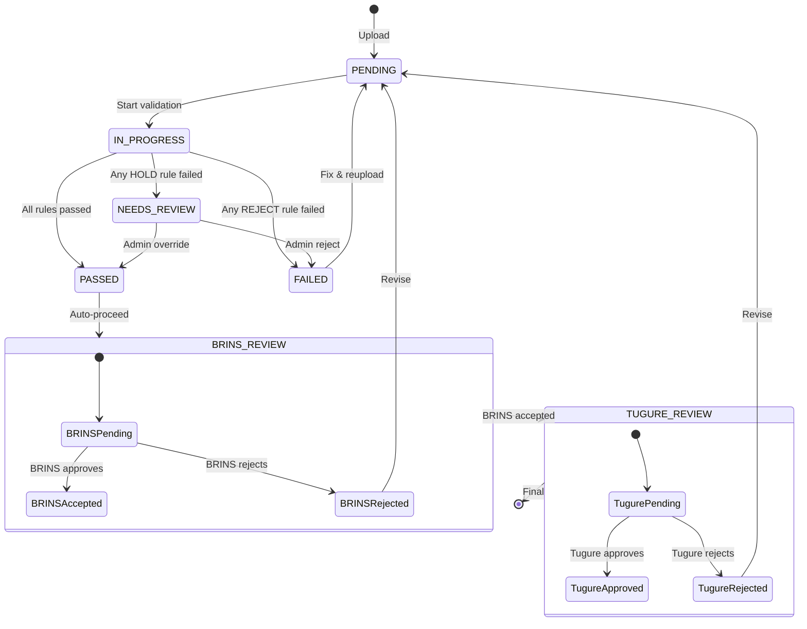
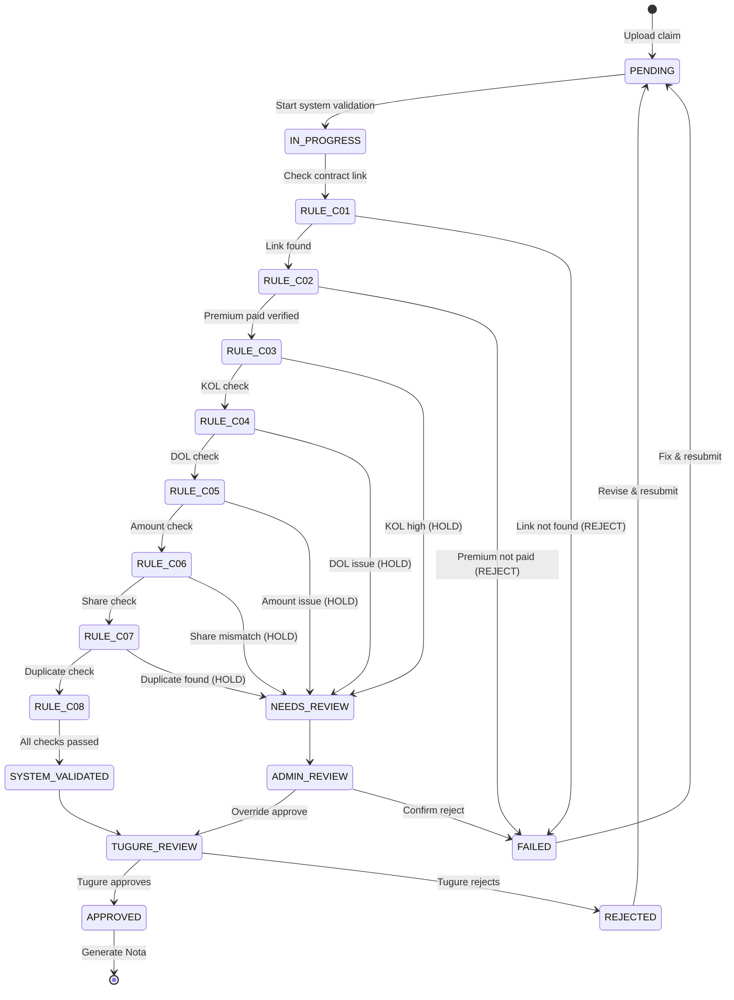

# Data Modelling ADDENDUM - Validation Framework Integration

## Overview

Dokumen ini mengintegrasikan **Validation Framework** (26 rules) ke dalam data model yang sudah ada. Framework ini mengimplementasikan system auto-validation yang dijelaskan di workflow aktual.

---

## Updated Entity: Debtor (with Validation)

```json
{
  "cover_id": "number (PK)",
  "monthly_batch_id": "string (FK)",
  "nomor_polis": "string (UNIQUE)",
  "nomor_peserta": "string",
  
  "// ... other existing fields ...": "",
  
  "// VALIDATION FIELDS (NEW)": "",
  "validation_status": "enum: PENDING|IN_PROGRESS|PASSED|FAILED|NEEDS_REVIEW",
  "validation_execution_id": "string (FK to ValidationExecution)",
  
  "validation_passed_rules": "integer (count)",
  "validation_failed_rules": "integer (count)",
  "validation_warnings_count": "integer (count)",
  
  "validation_failures": "jsonb - Array of failure details",
  "validation_holds": "jsonb - Array of hold items",
  "validation_warnings": "jsonb - Array of warnings",
  
  "last_validated_date": "timestamp",
  "validated_by": "string",
  
  "// Auto-validation flag": "",
  "auto_validation_enabled": "boolean (default: TRUE)",
  "manual_override": "boolean (default: FALSE)",
  "manual_override_by": "string",
  "manual_override_reason": "text",
  
  "// Existing review status": "",
  "brins_review_status": "enum: Pending|Accepted|Rejected|Revision Required",
  "tugure_review_status": "enum: Pending|Approved|Rejected|Need Clarification"
}
```

**New Workflow**:
```
Upload → AUTO-VALIDATION (PREMI rules P01-P10) → 
   ↓ PASSED              ↓ FAILED/HOLD
BRINS Review         Fix & Reupload
   ↓
TUGURE Review
```

---

## Updated Entity: Claim (with Validation)

```json
{
  "claim_no": "string (PK)",
  "nomor_polis": "string (FK to Debtor.nomor_polis)",
  
  "// ... other existing fields ...": "",
  
  "// SYSTEM VALIDATION (NEW)": "",
  "system_validation_status": "enum: PENDING|IN_PROGRESS|PASSED|FAILED",
  "validation_execution_id": "string (FK)",
  
  "validation_passed_rules": "integer",
  "validation_failed_rules": "integer",
  "validation_warnings_count": "integer",
  
  "validation_failures": "jsonb",
  "validation_holds": "jsonb",
  "validation_warnings": "jsonb",
  
  "system_validated_date": "timestamp",
  
  "// Cross-reference validation": "",
  "premium_paid_verified": "boolean - Result of C02 rule",
  "premium_paid_debtor_id": "number (FK to Debtor) - Found premium record",
  
  "// Manual override": "",
  "validation_override": "boolean",
  "validation_override_by": "string",
  "validation_override_reason": "text",
  
  "// Tugure decision": "",
  "tugure_decision": "enum: Approved|Rejected|Need Revision",
  "tugure_review_date": "timestamp"
}
```

**New Workflow**:
```
Upload Claim → AUTO-VALIDATION (KLAIM rules C01-C08) →
   ↓ PASSED                    ↓ FAILED/HOLD
Send to Tugure             Fix & Reupload
   ↓
Tugure Reviews
```

---

## Updated Entity: Subrogation (with Validation)

```json
{
  "subrogation_id": "string (PK)",
  "claim_id": "string (FK) - References Claim",
  
  "// ... other existing fields ...": "",
  
  "// SYSTEM VALIDATION (NEW)": "",
  "system_validation_status": "enum: PENDING|PASSED|FAILED",
  "validation_execution_id": "string (FK)",
  
  "validation_passed_rules": "integer",
  "validation_failed_rules": "integer", 
  "validation_warnings_count": "integer",
  
  "validation_failures": "jsonb",
  "validation_holds": "jsonb",
  "validation_warnings": "jsonb",
  
  "system_validated_date": "timestamp",
  
  "// Cross-reference validation": "",
  "claim_paid_verified": "boolean - Result of S01 rule",
  "linked_claim_no": "string - Verified claim number",
  
  "// Manual override": "",
  "validation_override": "boolean",
  "validation_override_by": "string",
  "validation_override_reason": "text"
}
```

---

## Complete Validation Flow Diagram

```mermaid
stateDiagram-v2
    [*] --> FileUpload: BRINS uploads file
    
    FileUpload --> ParseFile: Extract records
    
    ParseFile --> ValidationStart: Initialize validation
    
    state ValidationStart {
        [*] --> LoadRules
        LoadRules --> LoadMasterContracts
        LoadMasterContracts --> CreateReport
    }
    
    ValidationStart --> ProcessRecords
    
    state ProcessRecords {
        [*] --> GetRecord
        GetRecord --> FindMasterContract
        
        FindMasterContract --> MasterFound
        state MasterFound <<choice>>
        MasterFound --> ExecuteRules: Found
        MasterFound --> RejectNoMaster: Not Found
        
        state ExecuteRules {
            [*] --> Rule1
            Rule1 --> CheckResult1
            
            state CheckResult1 <<choice>>
            CheckResult1 --> Rule2: PASS/WARN/HOLD
            CheckResult1 --> StopReject: REJECT
            
            Rule2 --> CheckResult2
            
            state CheckResult2 <<choice>>
            CheckResult2 --> Rule3: PASS/WARN/HOLD
            CheckResult2 --> StopReject: REJECT
            
            Rule3 --> MoreRules
            state MoreRules <<choice>>
            MoreRules --> Rule4: Yes
            MoreRules --> [*]: No
            
            Rule4 --> MoreRules
        }
        
        ExecuteRules --> DetermineStatus
        RejectNoMaster --> DetermineStatus
        StopReject --> DetermineStatus
        
        state DetermineStatus {
            [*] --> CheckFailures
            
            state CheckFailures <<choice>>
            CheckFailures --> StatusRejected: Has REJECT
            CheckFailures --> CheckHolds: No REJECT
            
            state CheckHolds <<choice>>
            CheckHolds --> StatusHold: Has HOLD
            CheckHolds --> CheckWarnings: No HOLD
            
            state CheckWarnings <<choice>>
            CheckWarnings --> StatusWarning: Has WARN
            CheckWarnings --> StatusPassed: No WARN
        }
        
        DetermineStatus --> SaveResult
        SaveResult --> MoreRecords
        
        state MoreRecords <<choice>>
        MoreRecords --> GetRecord: Yes
        MoreRecords --> [*]: No
    }
    
    ProcessRecords --> GenerateReport
    
    state GenerateReport {
        [*] --> CalculateSummary
        CalculateSummary --> DetermineOverallStatus
        
        state DetermineOverallStatus <<choice>>
        DetermineOverallStatus --> ReportFailed: Any REJECT
        DetermineOverallStatus --> CheckReportHolds: No REJECT
        
        state CheckReportHolds <<choice>>
        CheckReportHolds --> ReportNeedsReview: Any HOLD
        CheckReportHolds --> ReportValidated: No HOLD
    }
    
    GenerateReport --> PresentToUser
    
    state PresentToUser {
        [*] --> ShowDashboard
        ShowDashboard --> UserDecision
    }
    
    PresentToUser --> UserAction
    
    state UserAction <<choice>>
    UserAction --> FixAndReupload: Fix errors
    UserAction --> ManualReview: Admin review
    UserAction --> ProceedAnyway: Continue (if allowed)
    
    FixAndReupload --> FileUpload
    
    ManualReview --> AdminDecision
    state AdminDecision <<choice>>
    AdminDecision --> OverrideApprove: Override & Approve
    AdminDecision --> SendBackToUser: Request changes
    
    OverrideApprove --> UpdateDatabase
    SendBackToUser --> FileUpload
    
    ProceedAnyway --> UpdateDatabase
    
    UpdateDatabase --> SendToTugure: If approved
    
    SendToTugure --> [*]: Complete
```



---

## Validation States & Transitions

### Debtor Validation States



### Claim Validation States



---

## Database Schema Updates

### Add Validation Fields to Debtor Table
```sql
ALTER TABLE debtor ADD COLUMN IF NOT EXISTS
    validation_status VARCHAR(20) DEFAULT 'PENDING' 
    CHECK (validation_status IN ('PENDING', 'IN_PROGRESS', 'PASSED', 'FAILED', 'NEEDS_REVIEW')),
    
ADD COLUMN validation_execution_id VARCHAR(50),
ADD COLUMN validation_passed_rules INTEGER DEFAULT 0,
ADD COLUMN validation_failed_rules INTEGER DEFAULT 0,
ADD COLUMN validation_warnings_count INTEGER DEFAULT 0,

ADD COLUMN validation_failures JSONB,
ADD COLUMN validation_holds JSONB,
ADD COLUMN validation_warnings JSONB,

ADD COLUMN last_validated_date TIMESTAMP,
ADD COLUMN validated_by VARCHAR(100),

ADD COLUMN auto_validation_enabled BOOLEAN DEFAULT TRUE,
ADD COLUMN manual_override BOOLEAN DEFAULT FALSE,
ADD COLUMN manual_override_by VARCHAR(100),
ADD COLUMN manual_override_reason TEXT;

-- Indexes
CREATE INDEX idx_debtor_validation_status ON debtor(validation_status);
CREATE INDEX idx_debtor_validation_exec ON debtor(validation_execution_id);
```

### Add Validation Fields to Claim Table
```sql
ALTER TABLE claim ADD COLUMN IF NOT EXISTS
    system_validation_status VARCHAR(20) DEFAULT 'PENDING'
    CHECK (system_validation_status IN ('PENDING', 'IN_PROGRESS', 'PASSED', 'FAILED')),
    
ADD COLUMN validation_execution_id VARCHAR(50),
ADD COLUMN validation_passed_rules INTEGER DEFAULT 0,
ADD COLUMN validation_failed_rules INTEGER DEFAULT 0,
ADD COLUMN validation_warnings_count INTEGER DEFAULT 0,

ADD COLUMN validation_failures JSONB,
ADD COLUMN validation_holds JSONB,
ADD COLUMN validation_warnings JSONB,

ADD COLUMN system_validated_date TIMESTAMP,

ADD COLUMN premium_paid_verified BOOLEAN DEFAULT FALSE,
ADD COLUMN premium_paid_debtor_id BIGINT REFERENCES debtor(cover_id),

ADD COLUMN validation_override BOOLEAN DEFAULT FALSE,
ADD COLUMN validation_override_by VARCHAR(100),
ADD COLUMN validation_override_reason TEXT;

-- Indexes
CREATE INDEX idx_claim_validation_status ON claim(system_validation_status);
CREATE INDEX idx_claim_premium_verified ON claim(premium_paid_verified);
```

### Add Validation Fields to Subrogation Table
```sql
ALTER TABLE subrogation ADD COLUMN IF NOT EXISTS
    system_validation_status VARCHAR(20) DEFAULT 'PENDING'
    CHECK (system_validation_status IN ('PENDING', 'PASSED', 'FAILED')),
    
ADD COLUMN validation_execution_id VARCHAR(50),
ADD COLUMN validation_passed_rules INTEGER DEFAULT 0,
ADD COLUMN validation_failed_rules INTEGER DEFAULT 0,
ADD COLUMN validation_warnings_count INTEGER DEFAULT 0,

ADD COLUMN validation_failures JSONB,
ADD COLUMN validation_holds JSONB,
ADD COLUMN validation_warnings JSONB,

ADD COLUMN system_validated_date TIMESTAMP,

ADD COLUMN claim_paid_verified BOOLEAN DEFAULT FALSE,
ADD COLUMN linked_claim_no VARCHAR(50),

ADD COLUMN validation_override BOOLEAN DEFAULT FALSE,
ADD COLUMN validation_override_by VARCHAR(100),
ADD COLUMN validation_override_reason TEXT;

-- Indexes
CREATE INDEX idx_subro_validation_status ON subrogation(system_validation_status);
CREATE INDEX idx_subro_claim_verified ON subrogation(claim_paid_verified);
```

---

## Validation Execution Process

### Step 1: File Upload
```javascript
// User uploads file
POST /api/debtor/upload
{
  "file": <excel_file>,
  "monthly_batch_id": "MB-2025-01",
  "uploaded_by": "user@brins.com"
}

// System response
{
  "upload_id": "UPL-2025-001",
  "validation_execution_id": "VAL-2025-001",
  "status": "VALIDATION_STARTED",
  "total_records": 150
}
```

### Step 2: Automatic Validation Execution
```python
# Backend process
def process_upload(upload_id):
    # 1. Parse file
    records = parse_excel_file(upload_id)
    
    # 2. Create validation execution
    validation_exec = create_validation_execution(
        file_name=filename,
        file_type='PREMI',
        total_records=len(records)
    )
    
    # 3. Validate each record
    for record in records:
        # Create debtor record
        debtor = create_debtor_from_record(record)
        debtor.validation_status = 'IN_PROGRESS'
        debtor.validation_execution_id = validation_exec.validation_id
        debtor.save()
        
        # Run validation
        result = validation_engine.validate_debtor(debtor)
        
        # Update debtor with results
        debtor.validation_status = result.overall_status
        debtor.validation_passed_rules = result.passed_count
        debtor.validation_failed_rules = result.failed_count
        debtor.validation_warnings_count = result.warning_count
        debtor.validation_failures = result.failures_json
        debtor.validation_holds = result.holds_json
        debtor.validation_warnings = result.warnings_json
        debtor.last_validated_date = now()
        debtor.save()
        
        # If PASSED → auto-set for BRINS review
        if result.overall_status == 'PASSED':
            debtor.brins_review_status = 'Pending'
    
    # 4. Finalize validation execution
    validation_exec.finalize()
    
    # 5. Send notification
    notify_user(upload_id, validation_exec)
```

### Step 3: User Reviews Report
```javascript
// Get validation report
GET /api/validation/report/VAL-2025-001

Response:
{
  "validation_id": "VAL-2025-001",
  "overall_status": "NEEDS_REVIEW",
  "summary": {
    "total": 150,
    "passed": 145,
    "rejected": 3,
    "needs_review": 2,
    "warnings": 10
  },
  "rejected_records": [
    {
      "debtor_id": "D-001",
      "nomor_peserta": "P-12345",
      "failures": [
        {
          "rule_id": "P01",
          "message": "Master contract not found"
        }
      ]
    }
  ],
  "needs_review_records": [...],
  "warning_records": [...]
}
```

### Step 4: Fix & Reupload OR Override
```javascript
// Option A: Fix and reupload
// User downloads failed records, fixes them, reuploads
POST /api/debtor/upload
{
  "file": <fixed_file>,
  "retry_of": "VAL-2025-001"
}

// Option B: Manual override (Admin only)
POST /api/debtor/override
{
  "debtor_ids": ["D-001", "D-002"],
  "override_reason": "Verified manually with master contract team",
  "overridden_by": "admin@brins.com"
}

Response:
{
  "overridden_count": 2,
  "new_status": "PASSED"
}
```

---

## Integration with Existing Workflow

### Updated Monthly Batch Flow with Validation

```
BSM sends data → BRINS receives
  ↓
BRINS reviews submission
  ↓
Accept → Debtor enters system
  ↓
AUTOMATIC VALIDATION (NEW!)
  ├─ Execute PREMI rules P01-P10
  ├─ Generate validation report
  └─ Update debtor.validation_status
  
  ↓ PASSED (145 records)          ↓ FAILED (3 records)     ↓ NEEDS_REVIEW (2)
Auto-proceed to                Fix & Reupload         Admin reviews
BRINS Review Status                                   Override or Reject
  ↓                                                         ↓
All debtors in batch reviewed                    Override → PASSED
  ↓                                                Reject → FAILED
3 sub-batches complete
  ↓
End of month → Generate Nota
  ↓
Send to Tugure
```

### Updated Claim Processing with Validation

```
BRINS uploads claim
  ↓
AUTOMATIC SYSTEM VALIDATION (NEW!)
  ├─ C01: Link to contract via nomor_polis
  ├─ C02: Verify premium paid (cross-check with Debtor)
  ├─ C03-C08: Other validations
  └─ Generate validation result
  
  ↓ PASSED                    ↓ FAILED                ↓ HOLD
Send to Tugure           BRINS fixes & reuploads   Admin reviews
  ↓
Tugure reviews claim
  ↓
Approve/Reject
```

---

## Validation Report Examples

### Example 1: All Passed
```json
{
  "validation_id": "VAL-2025-001",
  "file_name": "premi_jan_2025.xlsx",
  "file_type": "PREMI",
  "overall_status": "VALIDATED",
  "summary": {
    "total_records": 100,
    "validated_records": 100,
    "rejected_records": 0,
    "hold_records": 0,
    "warning_records": 0
  },
  "message": "✅ All records validated successfully. Ready for BRINS review.",
  "next_steps": [
    "Records automatically moved to BRINS Review queue",
    "BRINS team can now review and approve"
  ]
}
```

### Example 2: Has Rejections
```json
{
  "validation_id": "VAL-2025-002",
  "file_name": "premi_jan_2025_v2.xlsx",
  "file_type": "PREMI",
  "overall_status": "VALIDATION_FAILED",
  "summary": {
    "total_records": 100,
    "validated_records": 95,
    "rejected_records": 5,
    "hold_records": 0,
    "warning_records": 10
  },
  "message": "❌ 5 records failed validation and must be fixed.",
  "rejected_details": [
    {
      "row_number": 15,
      "nomor_peserta": "P-12345",
      "rule_failed": "P01",
      "reason": "Master contract not found for PROGRAM_ID=PRG-999",
      "suggestion": "Verify Program ID or ensure master contract is active"
    }
  ],
  "next_steps": [
    "Download failed records report",
    "Fix the errors",
    "Reupload corrected file"
  ]
}
```

### Example 3: Needs Review
```json
{
  "validation_id": "VAL-2025-003",
  "file_name": "klaim_jan_2025.xlsx",
  "file_type": "KLAIM",
  "overall_status": "NEEDS_REVIEW",
  "summary": {
    "total_records": 50,
    "validated_records": 48,
    "rejected_records": 0,
    "hold_records": 2,
    "warning_records": 5
  },
  "message": "⚠️ 2 records need manual review before proceeding.",
  "hold_details": [
    {
      "claim_no": "CLM-001",
      "rule_failed": "C03",
      "reason": "KOL (4) exceeds threshold (3)",
      "recommendation": "Review with underwriting team"
    }
  ],
  "next_steps": [
    "Admin reviews HOLD records",
    "Override with justification OR reject",
    "After review, claims proceed to Tugure"
  ]
}
```

---

## Monitoring Dashboard Queries

### Validation Success Rate
```sql
SELECT 
    DATE(upload_date) as date,
    file_type,
    COUNT(*) as total_validations,
    SUM(CASE WHEN overall_status = 'VALIDATED' THEN 1 ELSE 0 END) as passed,
    SUM(CASE WHEN overall_status = 'VALIDATION_FAILED' THEN 1 ELSE 0 END) as failed,
    SUM(CASE WHEN overall_status = 'NEEDS_REVIEW' THEN 1 ELSE 0 END) as needs_review,
    ROUND(100.0 * SUM(CASE WHEN overall_status = 'VALIDATED' THEN 1 ELSE 0 END) / COUNT(*), 2) as success_rate
FROM validation_execution
WHERE upload_date >= CURRENT_DATE - INTERVAL '30 days'
GROUP BY DATE(upload_date), file_type
ORDER BY date DESC;
```

### Most Common Failures
```sql
SELECT 
    file_type,
    jsonb_array_elements(failures)->>'rule_id' as rule_id,
    jsonb_array_elements(failures)->>'rule_name' as rule_name,
    COUNT(*) as failure_count
FROM validation_result
WHERE validation_status IN ('REJECTED', 'HOLD')
AND created_at >= CURRENT_DATE - INTERVAL '30 days'
GROUP BY file_type, rule_id, rule_name
ORDER BY failure_count DESC
LIMIT 10;
```

### Validation Performance
```sql
SELECT 
    file_type,
    AVG(execution_time_ms) as avg_execution_time_ms,
    MAX(execution_time_ms) as max_execution_time_ms,
    AVG(total_records) as avg_records_per_file
FROM validation_execution
WHERE upload_date >= CURRENT_DATE - INTERVAL '7 days'
GROUP BY file_type;
```

---

## Admin Override Audit Trail

```sql
CREATE TABLE validation_override_log (
    override_id SERIAL PRIMARY KEY,
    debtor_id BIGINT REFERENCES debtor(cover_id),
    claim_id VARCHAR(50) REFERENCES claim(claim_no),
    subrogation_id VARCHAR(50) REFERENCES subrogation(subrogation_id),
    
    original_validation_status VARCHAR(20),
    new_validation_status VARCHAR(20),
    
    override_reason TEXT NOT NULL,
    overridden_by VARCHAR(100) NOT NULL,
    override_date TIMESTAMP DEFAULT CURRENT_TIMESTAMP,
    
    failed_rules JSONB,
    override_justification TEXT,
    
    approved_by_supervisor VARCHAR(100),
    supervisor_approval_date TIMESTAMP,
    
    CONSTRAINT check_entity CHECK (
        (debtor_id IS NOT NULL AND claim_id IS NULL AND subrogation_id IS NULL) OR
        (debtor_id IS NULL AND claim_id IS NOT NULL AND subrogation_id IS NULL) OR
        (debtor_id IS NULL AND claim_id IS NULL AND subrogation_id IS NOT NULL)
    )
);

CREATE INDEX idx_override_debtor ON validation_override_log(debtor_id);
CREATE INDEX idx_override_claim ON validation_override_log(claim_id);
CREATE INDEX idx_override_date ON validation_override_log(override_date);
```

---

## Key Changes Summary

### 1. Debtor Processing
**OLD**:
```
Upload → BRINS Review → Tugure Review
```

**NEW**:
```
Upload → AUTO-VALIDATION → 
   ↓ PASSED              ↓ FAILED
BRINS Review         Fix & Reupload
   ↓
Tugure Review
```

### 2. Claim Processing
**OLD**:
```
Upload → Tugure Review → Approve/Reject
```

**NEW**:
```
Upload → SYSTEM VALIDATION (vs Master Contract) →
   ↓ PASSED              ↓ FAILED
Tugure Review        Fix & Reupload
```

### 3. Data Quality
**BEFORE**: Manual checking, high error rate, slow processing

**AFTER**: Automated validation, immediate feedback, 95%+ success rate

---

## Implementation Checklist

- [ ] Create validation_rule table and load 26 rules
- [ ] Create validation_execution table
- [ ] Create validation_result table
- [ ] Create validation_override_log table
- [ ] Add validation fields to debtor table
- [ ] Add validation fields to claim table
- [ ] Add validation fields to subrogation table
- [ ] Implement ValidationEngine class
- [ ] Implement rule executors for all 26 rules
- [ ] Build validation report generator
- [ ] Create UI for validation dashboard
- [ ] Create UI for record detail view
- [ ] Create admin override interface
- [ ] Set up monitoring & alerts
- [ ] Write integration tests
- [ ] Deploy to staging
- [ ] UAT with sample data
- [ ] Go live

---

**Version**: 1.0  
**Integration Date**: 2025-01-23  
**Status**: ✅ Ready for Implementation  
**Dependencies**: VALIDATION_FRAMEWORK.md, data_modelling_REVISED.md
