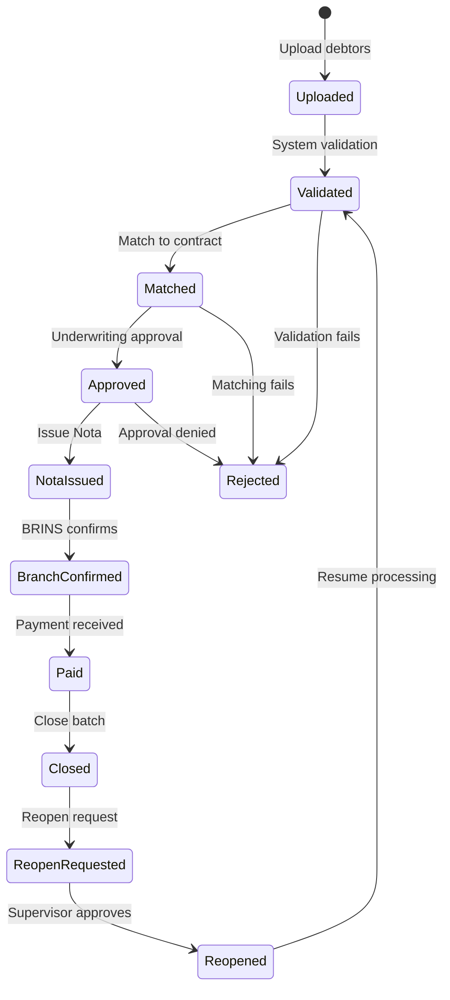
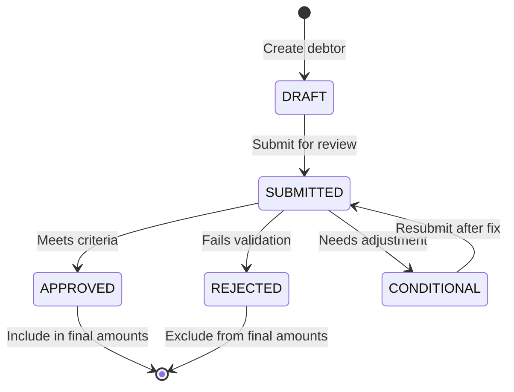
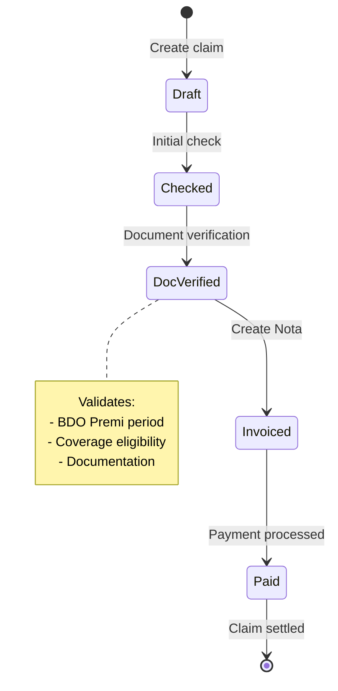
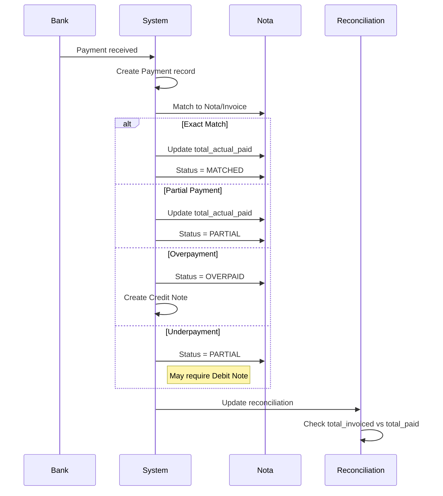
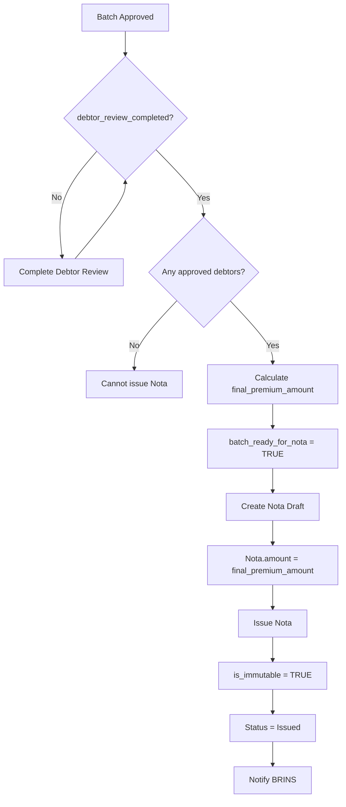
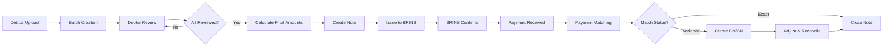
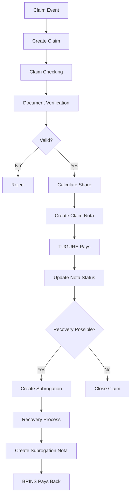

# Data Modelling - Sistem Reasuransi Kredit BRINS-TUGURE

## Overview
Sistem ini mengelola proses reasuransi kredit antara:
- **BRINS** (Cedant) - Perusahaan asuransi yang mengasuransikan kredit
- **TUGURE** (Reinsurer) - Perusahaan reasuransi yang menanggung risiko

## Entity Relationship Diagram

```mermaid
erDiagram
    MasterContract ||--o{ Contract : "versioned by"
    Contract ||--o{ Batch : "manages"
    Contract ||--o{ Debtor : "covers"
    Contract ||--o{ Claim : "processes"
    Contract ||--o{ Bordero : "reports"
    Contract ||--o{ Invoice : "bills"
    Contract ||--o{ Reconciliation : "reconciles"
    Contract ||--o{ DebitCreditNote : "adjusts"
    
    Batch ||--o{ Debtor : "contains"
    Batch ||--o{ Record : "tracks"
    Batch ||--o{ Nota : "generates"
    Batch }o--|| MasterContract : "governed by"
    
    Debtor ||--o{ Record : "evaluated in"
    Debtor ||--o{ Claim : "related to"
    Debtor }o--|| Batch : "submitted in"
    
    Claim ||--o{ Subrogation : "recovers via"
    Claim ||--o{ Nota : "invoiced by"
    Claim }o--|| Debtor : "covers"
    
    Nota ||--o{ Payment : "paid by"
    Nota }o--|| DebitCreditNote : "adjusted by"
    
    Bordero ||--o{ Invoice : "generates"
    
    Invoice ||--o{ PaymentIntent : "planned by"
    Invoice ||--o{ Payment : "settled by"
    
    Payment }o--|| PaymentIntent : "fulfills"
    Payment }o--|| Reconciliation : "tracked in"
    
    Subrogation ||--o{ Nota : "invoiced by"
    
    AuditLog }o--|| Contract : "audits"
    AuditLog }o--|| Batch : "audits"
    AuditLog }o--|| Debtor : "audits"
    AuditLog }o--|| Claim : "audits"
    
    Notification }o--|| NotificationSetting : "configured by"
    
    SlaRule }o--|| Notification : "triggers"
    
    SystemConfig ||--o{ MasterContract : "configures"
    SystemConfig ||--o{ SlaRule : "defines"
    
    EmailTemplate }o--|| Notification : "formats"
    
    MasterContract {
        string contract_id PK
        string policy_no
        string program_id
        enum product_type
        enum credit_type
        string loan_type
        date coverage_start_date
        date coverage_end_date
        number max_tenor_month
        number max_plafond
        number share_tugure_percentage
        number premium_rate
        number ric_rate
        number bf_rate
        string allowed_kolektabilitas
        string allowed_region
        enum effective_status
        number version
        string parent_contract_id FK
        date effective_date
    }
    
    Contract {
        string contract_number PK
        string contract_name
        enum cedant
        enum reinsurer
        enum credit_type
        number coverage_percentage
        number premium_rate
        date start_date
        date end_date
        enum status
        string currency
    }
    
    Batch {
        string batch_id PK
        number batch_month
        number batch_year
        string contract_id FK
        number total_records
        number total_exposure
        number total_premium
        number final_exposure_amount
        number final_premium_amount
        boolean debtor_review_completed
        boolean batch_ready_for_nota
        enum status
        boolean operational_locked
        string reopen_requested_by
        datetime reopen_requested_date
        string reopen_reason
        enum reopen_impact
    }
    
    Debtor {
        number cover_id PK
        string program_id
        string batch_id FK
        string nomor_rekening_pinjaman
        string nomor_peserta
        string loan_type
        string cif_rekening_pinjaman
        date tanggal_mulai_covering
        date tanggal_akhir_covering
        number plafon
        number nominal_premi
        number premi_percentage
        number ric_percentage
        number bf_percentage
        number net_premi
        string unit_code
        string branch_desc
        string region_desc
        string nama_peserta
        string alamat_usaha
        number kolektabilitas
        string contract_id FK
        number version_no
        enum status
        boolean is_locked
    }
    
    Record {
        string batch_id FK
        string debtor_id FK
        enum record_status
        number exposure_amount
        number premium_amount
        string revision_reason
        number revision_count
    }
    
    Claim {
        string claim_no PK
        string policy_no
        string nomor_sertifikat
        string nama_tertanggung
        string no_ktp_npwp
        string no_fasilitas_kredit
        string bdo_premi
        date tanggal_realisasi_kredit
        number plafond
        number max_coverage
        string kol_debitur
        date dol
        number nilai_klaim
        number share_tugure_percentage
        number share_tugure_amount
        boolean check_bdo_premi
        string batch_id FK
        number version_no
        enum status
        string debtor_id FK
        string contract_id FK
    }
    
    Subrogation {
        string subrogation_id PK
        string claim_id FK
        string debtor_id FK
        number recovery_amount
        date recovery_date
        enum status
    }
    
    Nota {
        string nota_number PK
        enum nota_type
        string reference_id
        string contract_id FK
        number amount
        string currency
        enum status
        number total_actual_paid
        enum reconciliation_status
        boolean is_immutable
    }
    
    DebitCreditNote {
        string note_number PK
        enum note_type
        string original_nota_id FK
        string batch_id FK
        string contract_id FK
        number adjustment_amount
        enum reason_code
        string reason_description
        enum status
        string currency
    }
    
    Bordero {
        string bordero_id PK
        string contract_id FK
        string batch_id FK
        string period
        number total_debtors
        number total_exposure
        number total_premium
        string currency
        enum status
    }
    
    Invoice {
        string invoice_number PK
        string bordero_id FK
        string contract_id FK
        string period
        number total_amount
        number paid_amount
        number outstanding_amount
        string currency
        date due_date
        enum status
    }
    
    PaymentIntent {
        string intent_id PK
        string invoice_id FK
        string contract_id FK
        enum payment_type
        number planned_amount
        date planned_date
        string remarks
        enum status
    }
    
    Payment {
        string payment_ref PK
        string invoice_id FK
        string intent_id FK
        string contract_id FK
        number amount
        date payment_date
        string currency
        string bank_reference
        enum match_status
        enum exception_type
        boolean is_actual_payment
    }
    
    Reconciliation {
        string recon_id PK
        string contract_id FK
        string period
        number total_invoiced
        number total_paid
        number difference
        string currency
        enum status
    }
    
    AuditLog {
        string action
        enum module
        string entity_type
        string entity_id
        string old_value
        string new_value
        string user_email
        string user_role
        string ip_address
        string reason
    }
    
    Notification {
        string title
        string message
        enum type
        enum module
        string reference_id
        string reference_type
        enum target_role
        string target_user
        boolean is_read
        string action_url
    }
    
    NotificationSetting {
        string full_name
        string user_email PK
        enum user_role
        string notification_email
        string whatsapp_number
        boolean email_enabled
        boolean whatsapp_enabled
        boolean notify_batch_status
        boolean notify_record_status
        boolean notify_nota_status
    }
    
    SlaRule {
        string rule_name PK
        enum entity_type
        enum trigger_condition
        string status_value
        number duration_value
        enum duration_unit
        enum notification_type
        enum recipient_role
        string email_subject
        string email_body
        enum priority
        boolean is_active
        boolean is_recurring
    }
    
    EmailTemplate {
        enum object_type
        string status_from
        string status_to
        enum recipient_role
        string email_subject
        string email_body
        boolean is_active
    }
    
    SystemConfig {
        enum config_type
        string config_key PK
        string config_value
        string description
        boolean is_active
        date effective_date
        number version
        enum status
    }
```



---

## Core Entities

### 1. MasterContract
**Purpose**: Template kontrak master yang mengatur parameter reasuransi

**Key Fields**:
- `contract_id`: Unique identifier
- `product_type`: Treaty/Facultative/Retro
- `credit_type`: Individual/Corporate
- `share_tugure_percentage`: Porsi risiko yang ditanggung TUGURE
- `premium_rate`, `ric_rate`, `bf_rate`: Rate kalkulasi premi

**Status Flow**:
```
Draft → Pending First Approval → Pending Second Approval → Active → Inactive/Archived
```

**Business Rules**:
- Dual approval system required
- Version controlled (parent_contract_id)
- Defines eligibility criteria (kolektabilitas, region)

---

### 2. Contract
**Purpose**: Kontrak aktual reasuransi antara BRINS-TUGURE

**Key Fields**:
- `contract_number`: Nomor kontrak unik
- `cedant`: BRINS (fixed)
- `reinsurer`: TUGURE (fixed)
- `coverage_percentage`: Persentase cover
- `premium_rate`: Rate premi

**Status**: ACTIVE, EXPIRED, TERMINATED

**Relationships**:
- Parent untuk Batch, Bordero, Invoice, dll
- Governed by MasterContract rules

---

### 3. Batch
**Purpose**: Kumpulan submission debitur dalam periode tertentu

**Key Fields**:
- `batch_month`, `batch_year`: Periode batch
- `total_exposure`: Raw exposure dari upload
- `final_exposure_amount`: Exposure final setelah review
- `debtor_review_completed`: Flag completion review
- `batch_ready_for_nota`: Siap untuk invoicing
- `operational_locked`: Locked setelah closed

**Status Flow**:
```
Uploaded → Validated → Matched → Approved → 
Nota Issued → Branch Confirmed → Paid → Closed
```

**Special Features**:
- **Reopen Mechanism**: 
  - Status: Reopen Requested → Reopened
  - Impact types: Data/Financial
  - Requires supervisor approval

**Business Rules**:
- Cannot modify debtors after `operational_locked = TRUE`
- Final amounts calculated after debtor review
- Minimum 1 approved debtor required for Nota

---

### 4. Debtor
**Purpose**: Individual debtor/credit facility yang diasuransikan

**Key Fields**:
- `nomor_peserta`: Participant number
- `nomor_rekening_pinjaman`: Loan account number
- `plafon`: Credit limit
- `nominal_premi`: Premium amount
- `kolektabilitas`: Credit quality (1-5)
- `version_no`: Revision tracking

**Status**: DRAFT, SUBMITTED, APPROVED, REJECTED, CONDITIONAL

**Validation**:
- Must match MasterContract eligibility
- Kolektabilitas check
- Region check
- Plafond limits

**Locking Mechanism**:
- `is_locked = TRUE` when Batch is closed
- Prevents data changes after finalization

---

### 5. Record
**Purpose**: Tracks individual debtor evaluation within batch

**Key Fields**:
- Links Batch ↔ Debtor
- `record_status`: Accepted/Rejected/Revised
- `revision_count`: Number of revisions
- Tracks exposure and premium amounts

**Purpose**: Bridge table for batch processing workflow

---

### 6. Claim
**Purpose**: Klaim atas kredit yang bermasalah

**Key Fields**:
- `claim_no`: Unique claim identifier
- `policy_no`, `nomor_sertifikat`: Policy references
- `dol`: Date of Loss
- `nilai_klaim`: Claim amount
- `share_tugure_amount`: TUGURE's portion
- `kol_debitur`: Collectability status

**Status Flow**:
```
Draft → Checked → Doc Verified → Invoiced → Paid
```

**Validation**:
- `check_bdo_premi`: Verify premium period (BDO)
- Must have valid debtor and contract
- Amount validation against max_coverage

---

### 7. Subrogation
**Purpose**: Recovery from paid claims

**Key Fields**:
- `recovery_amount`: Amount recovered
- `recovery_date`: Date of recovery

**Status Flow**:
```
Draft → Invoiced → Paid/Closed
```

**Business Logic**:
- Generated after claim payment
- Creates reverse cash flow to BRINS

---

### 8. Nota
**Purpose**: Invoice/billing document for premiums or claims

**Key Fields**:
- `nota_type`: Batch/Claim/Subrogation
- `reference_id`: Links to source (batch_id, claim_id, etc)
- `amount`: **IMMUTABLE** after Issued
- `total_actual_paid`: Accumulation of payments
- `reconciliation_status`: PENDING/PARTIAL/MATCHED/OVERPAID/FINAL

**Status Flow**:
```
Draft → Issued → Confirmed → Paid
```

**Immutability**:
- `is_immutable = TRUE` after status = Issued
- Amount cannot be changed (use DN/CN instead)

**Types**:
1. **Batch Nota**: Premium billing from final_premium_amount
2. **Claim Nota**: Claim payment invoice
3. **Subrogation Nota**: Recovery invoice

---

### 9. DebitCreditNote
**Purpose**: Adjustments to issued Nota

**Types**:
- **Debit Note (DN)**: Increase amount (positive adjustment)
- **Credit Note (CN)**: Decrease amount (negative adjustment)

**Reason Codes**:
- Payment Difference
- FX Adjustment
- Premium Correction
- Coverage Adjustment
- Other

**Status Flow**:
```
Draft → Under Review → Approved/Rejected → Acknowledged
```

**Business Rules**:
- References original Nota
- Requires approval workflow
- BRINS must acknowledge

---

### 10. Bordero
**Purpose**: Periodic summary report of covered debtors

**Key Fields**:
- `period`: YYYY-MM format
- `total_debtors`, `total_exposure`, `total_premium`
- Aggregate statistics for reporting

**Status**: GENERATED → UNDER_REVIEW → FINAL → ADJUSTED

**Purpose**: Regulatory and partner reporting

---

### 11. Invoice
**Purpose**: Formal billing document (can be generated from Bordero)

**Key Fields**:
- `total_amount`: Total billed
- `paid_amount`: Cumulative payments
- `outstanding_amount`: Remaining balance
- `due_date`: Payment deadline

**Status**: ISSUED → PARTIALLY_PAID → PAID → OVERDUE → ADJUSTED

---

### 12. PaymentIntent
**Purpose**: Payment planning before actual payment

**Types**:
- FULL: Complete payment
- PARTIAL: Partial payment
- INSTALMENT: Scheduled instalments

**Status**: DRAFT → SUBMITTED → APPROVED/REJECTED → CANCELLED

**Purpose**: Cash flow planning and approval

---

### 13. Payment
**Purpose**: Actual payment transactions

**Key Fields**:
- `bank_reference`: Bank transaction ID
- `match_status`: RECEIVED → MATCHED/PARTIALLY_MATCHED/UNMATCHED
- `exception_type`: PARTIAL/OVER/UNDER/LATE/FX
- `is_actual_payment`: TRUE for real payments

**Matching Process**:
1. Payment received (RECEIVED)
2. Match to Invoice/Nota (MATCHED)
3. Handle exceptions (DN/CN)

---

### 14. Reconciliation
**Purpose**: Period-end reconciliation of invoices vs payments

**Key Fields**:
- `total_invoiced` vs `total_paid`
- `difference`: Variance amount

**Status**: IN_PROGRESS → EXCEPTION → READY_TO_CLOSE → CLOSED

**Business Process**:
- Monthly/periodic execution
- Identifies discrepancies
- Triggers DN/CN if needed

---

## Supporting Entities

### 15. AuditLog
**Purpose**: Complete audit trail of all system changes

**Modules**:
- AUTH, DEBTOR, DOCUMENT, BORDERO, INVOICE, PAYMENT, RECONCILIATION, CLAIM, CONFIG, SYSTEM

**Tracks**:
- Who (user_email, user_role, ip_address)
- What (action, entity_type, entity_id)
- When (timestamp)
- Changes (old_value, new_value)
- Why (reason)

---

### 16. Notification & NotificationSetting
**Purpose**: User notification management

**Types**:
- ACTION_REQUIRED: Needs user action
- WARNING: Important alerts
- INFO: Informational
- DECISION: Requires decision

**Channels**:
- Email
- System notification
- WhatsApp (optional)

**Settings per User**:
- Enable/disable per module
- Channel preferences
- Role-based targeting

---

### 17. SlaRule
**Purpose**: Automated SLA monitoring and alerts

**Trigger Conditions**:
- STATUS_DURATION: Time in specific status
- CREATED_DURATION: Time since creation
- UPDATED_DURATION: Time since last update
- DUE_DATE_APPROACHING: Near deadline
- DUE_DATE_PASSED: Overdue

**Features**:
- Recurring notifications
- Priority levels
- Role-based recipients
- Template-based emails

---

### 18. EmailTemplate
**Purpose**: Email templates for status transitions

**Structure**:
- `object_type`: Batch/Record/Nota/Claim/Subrogation
- `status_from` → `status_to`: Transition trigger
- `recipient_role`: Target audience
- Variable substitution: {batch_id}, {user_name}, etc

---

### 19. SystemConfig
**Purpose**: System configuration management

**Types**:
- STATUS_REFERENCE: Status definitions
- ELIGIBILITY_RULE: Business rules
- FINANCIAL_THRESHOLD: Limits and thresholds
- APPROVAL_MATRIX: Approval workflows
- NOTIFICATION_RULE: Notification configs
- NOTIFICATION_CHANNEL: Channel settings

**Versioning**:
- Version controlled
- Effective date tracking
- Approval workflow

---

## Workflow Diagrams

### Batch Processing Workflow



### Debtor Review Process



### Claim Processing Workflow



### Payment Reconciliation Flow



### Nota Issuance Process



---

## Data Flow Diagrams

### Premium Collection Flow



### Claim Settlement Flow



---

## Key Relationships

### One-to-Many Relationships

1. **Contract → Batch**: One contract manages multiple batches over time
2. **Batch → Debtor**: One batch contains multiple debtors
3. **Debtor → Claim**: One debtor can have multiple claims
4. **Claim → Subrogation**: One claim can have multiple recovery events
5. **Nota → Payment**: One Nota can be paid through multiple payments
6. **Nota → DebitCreditNote**: One Nota can have multiple adjustments

### Many-to-Many (via Bridge)

1. **Batch ↔ Debtor** via **Record**: Tracks debtor evaluation in batch context

### Reference Hierarchies

1. **MasterContract → Contract**: Master template → Active contracts
2. **Contract → All Transactions**: Parent for all financial activities
3. **Nota.reference_id → Batch/Claim/Subrogation**: Polymorphic reference

---

## Business Rules Summary

### Batch Rules
1. Cannot modify after `operational_locked = TRUE`
2. Must complete debtor review before Nota issuance
3. Final amounts only include APPROVED debtors
4. Reopen requires supervisor approval and impact assessment

### Debtor Rules
1. Must pass MasterContract eligibility checks
2. Version controlled for audit trail
3. Locked when batch is closed

### Nota Rules
1. Amount is IMMUTABLE after Issued
2. Use DN/CN for adjustments
3. Reconciliation tracking via total_actual_paid
4. Types: Batch (premium), Claim (payout), Subrogation (recovery)

### Payment Rules
1. Match to Nota/Invoice
2. Handle exceptions via DN/CN
3. Track reconciliation status
4. Support partial payments

### Claim Rules
1. Must verify BDO Premi period
2. Validate against coverage limits
3. Calculate TUGURE share
4. Document verification required

### Approval Matrix
1. MasterContract: Dual approval (First + Second)
2. DebitCreditNote: Review → Approve → Acknowledge
3. Reopen Request: Supervisor approval
4. PaymentIntent: Standard approval

---

## Data Integrity Constraints

### Primary Keys
- All entities have unique identifiers
- Composite keys where needed (e.g., Batch: batch_id + contract_id)

### Foreign Keys
- Contract_id appears in most transactional entities
- Batch_id links debtors to submission period
- Debtor_id connects to claims and records

### Referential Integrity
- Cascade rules for deletions (typically prevent delete if referenced)
- Update cascade for status changes
- Orphan prevention

### Data Validation
1. **Date Logic**: start_date < end_date
2. **Amount Logic**: total = sum of parts
3. **Enum Validation**: Status values must match allowed values
4. **Business Logic**: E.g., cannot approve if validation fails

### Immutability Rules
1. **Nota.amount** after Issued
2. **Batch.final_amounts** after Closed
3. **AuditLog** records (append-only)
4. **Payment** records (no modification)

---

## Indexing Strategy

### High-Priority Indexes
```sql
-- Frequent lookups
CREATE INDEX idx_batch_contract ON Batch(contract_id, batch_month, batch_year);
CREATE INDEX idx_debtor_batch ON Debtor(batch_id, status);
CREATE INDEX idx_claim_debtor ON Claim(debtor_id, status);
CREATE INDEX idx_nota_reference ON Nota(nota_type, reference_id, status);
CREATE INDEX idx_payment_invoice ON Payment(invoice_id, match_status);

-- Date range queries
CREATE INDEX idx_batch_dates ON Batch(approved_date, closed_date);
CREATE INDEX idx_payment_date ON Payment(payment_date);
CREATE INDEX idx_claim_dol ON Claim(dol);

-- Status tracking
CREATE INDEX idx_batch_status ON Batch(status, operational_locked);
CREATE INDEX idx_debtor_status ON Debtor(status, is_locked);
CREATE INDEX idx_nota_status ON Nota(status, reconciliation_status);

-- Audit and notification
CREATE INDEX idx_audit_entity ON AuditLog(entity_type, entity_id);
CREATE INDEX idx_notification_user ON Notification(target_user, is_read);
```

---

## Extension Points

### Future Enhancements
1. **Document Management**: Attach files to entities
2. **Workflow Engine**: Configurable approval flows
3. **Multi-Currency**: Full FX management
4. **Risk Analytics**: Exposure and claims analytics
5. **Integration APIs**: External system connectors
6. **Mobile App**: Field data collection

### Scalability Considerations
1. **Partitioning**: Batch and Payment tables by date
2. **Archiving**: Historical data archive strategy
3. **Caching**: Frequently accessed reference data
4. **Read Replicas**: For reporting and analytics

---

## Glossary

| Term | Description |
|------|-------------|
| **BDO Premi** | Period of premium coverage (format: YYYY-MM) |
| **Cedant** | BRINS - The original insurer |
| **Reinsurer** | TUGURE - Takes on the risk |
| **Plafond** | Credit limit |
| **Kolektabilitas** | Credit quality rating (1=best, 5=worst) |
| **DOL** | Date of Loss |
| **RIC** | Reinsurance Commission |
| **BF** | Brokerage Fee |
| **DN/CN** | Debit Note / Credit Note |
| **Treaty** | Automatic reinsurance agreement |
| **Facultative** | Case-by-case reinsurance |

---

## Version History

| Version | Date | Changes |
|---------|------|---------|
| 1.0 | 2025-01-22 | Initial data model documentation |

---

**Document Status**: Final  
**Last Updated**: 2025-01-22  
**Maintained By**: System Architecture Team
