# Data Modelling: Workflow Lama vs Workflow Baru
## Sistem Reasuransi BRINS - TUGURE (A3M)

---

## Daftar Isi
1. [Executive Summary](#1-executive-summary)
2. [Perbandingan Alur Workflow](#2-perbandingan-alur-workflow)
3. [Data Model - Workflow Lama](#3-data-model---workflow-lama)
4. [Data Model - Workflow Baru](#4-data-model---workflow-baru)
5. [Entity Relationship Diagrams](#5-entity-relationship-diagrams)
6. [State Diagrams](#6-state-diagrams)
7. [Perbandingan Schema](#7-perbandingan-schema)

---

## 1. Executive Summary

### Perbedaan Utama

| Aspek | Workflow Lama | Workflow Baru |
|-------|---------------|---------------|
| **Inisiasi Nota** | Nota Premi dibuat terlebih dahulu oleh BRINS, kemudian batch debitur dikirim terpisah | Batch debitur dikumpulkan dulu (3 batch), baru generate Nota di akhir bulan |
| **Sumber Data Batch** | BRINS langsung submit batch | BSM (Broker) kirim data ke BRINS per batch |
| **Urutan Proses** | Nota → Batch → Validation | Batch (3x) → Nota Generation |
| **Nota Status** | Nota bisa ditolak → revisi → upload ulang | Nota mengikuti revisi batch (auto-update) |
| **Kompleksitas** | Lebih kompleks (nota terpisah dari batch) | Lebih sederhana (nota derived dari batch) |

---

## 2. Perbandingan Alur Workflow

### 2.1 Workflow Lama - Sequence Diagram

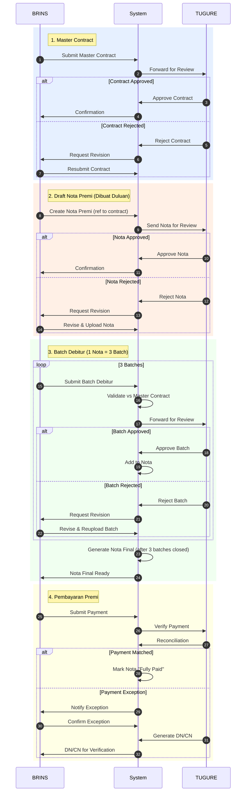

### 2.2 Workflow Baru - Sequence Diagram

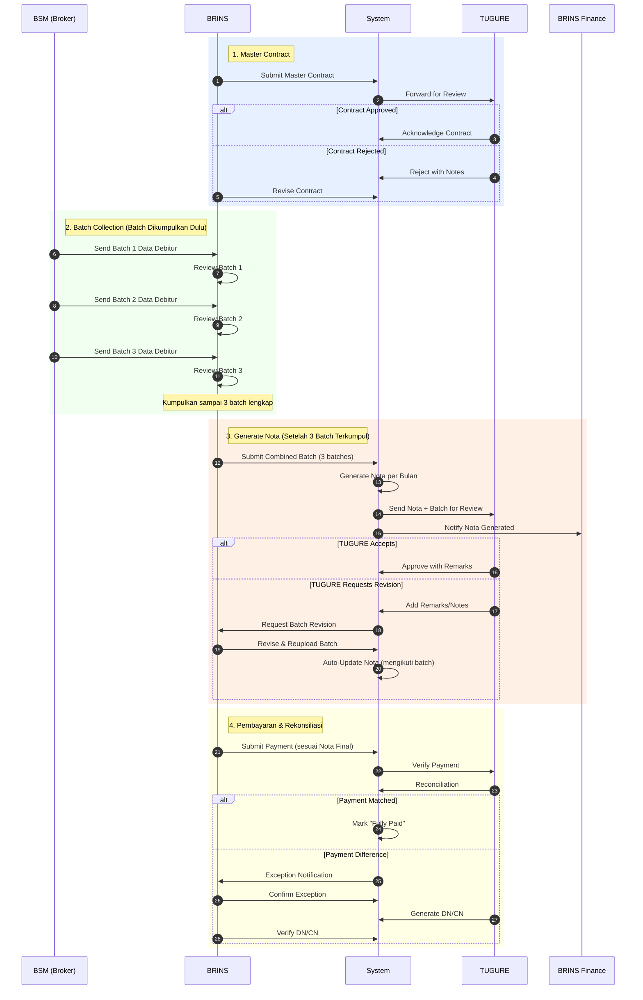

---

## 3. Data Model - Workflow Lama

### 3.1 Entity Overview

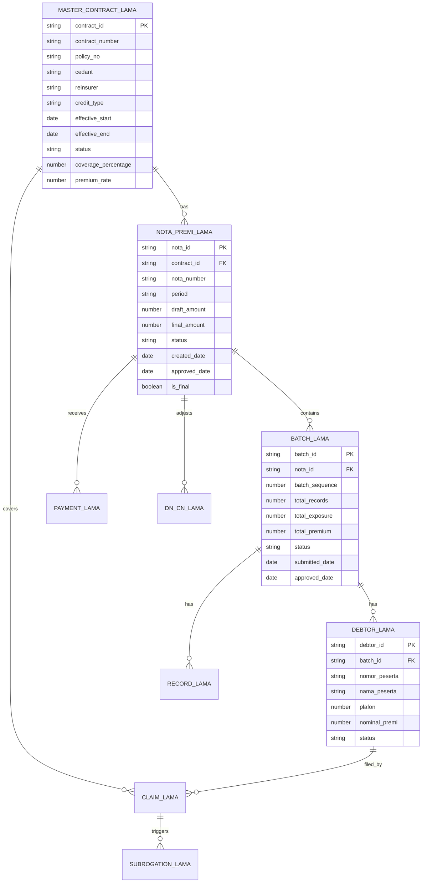

### 3.2 Schema Detail - Workflow Lama

#### MasterContract_Lama
```json
{
  "name": "MasterContract_Lama",
  "description": "Master Contract entity for old workflow",
  "properties": {
    "contract_id": { "type": "string", "description": "Primary Key" },
    "contract_number": { "type": "string" },
    "policy_no": { "type": "string" },
    "cedant": { "type": "string", "enum": ["BRINS"] },
    "reinsurer": { "type": "string", "enum": ["TUGURE"] },
    "credit_type": { "type": "string", "enum": ["Individual", "Corporate"] },
    "effective_start": { "type": "date" },
    "effective_end": { "type": "date" },
    "status": { 
      "type": "string", 
      "enum": ["DRAFT", "SUBMITTED", "UNDER_REVIEW", "APPROVED", "REJECTED", "ACTIVE", "EXPIRED"]
    },
    "coverage_percentage": { "type": "number" },
    "premium_rate": { "type": "number" },
    "commission_rate": { "type": "number" },
    "max_plafon": { "type": "number" },
    "approved_by": { "type": "string" },
    "approved_date": { "type": "date" }
  }
}
```

#### NotaPremi_Lama (Dibuat Sebelum Batch)
```json
{
  "name": "NotaPremi_Lama",
  "description": "Nota Premi dibuat terlebih dahulu sebelum batch debitur",
  "properties": {
    "nota_id": { "type": "string", "description": "Primary Key" },
    "contract_id": { "type": "string", "description": "FK to MasterContract" },
    "nota_number": { "type": "string" },
    "period": { "type": "string", "format": "YYYY-MM" },
    "draft_amount": { "type": "number", "description": "Estimasi awal sebelum batch" },
    "final_amount": { "type": "number", "description": "Final setelah 3 batch closed" },
    "status": {
      "type": "string",
      "enum": ["DRAFT", "SUBMITTED", "UNDER_REVIEW", "APPROVED", "REJECTED", "REVISION_REQUIRED", "FINAL", "PAID"]
    },
    "created_by": { "type": "string" },
    "created_date": { "type": "date" },
    "submitted_date": { "type": "date" },
    "reviewed_by": { "type": "string" },
    "reviewed_date": { "type": "date" },
    "approved_by": { "type": "string" },
    "approved_date": { "type": "date" },
    "rejection_reason": { "type": "string" },
    "revision_count": { "type": "number", "default": 0 },
    "is_final": { "type": "boolean", "default": false }
  }
}
```

#### Batch_Lama (Dikaitkan ke Nota yang Sudah Ada)
```json
{
  "name": "Batch_Lama",
  "description": "Batch debitur yang dikaitkan ke Nota yang sudah dibuat",
  "properties": {
    "batch_id": { "type": "string", "description": "Primary Key" },
    "nota_id": { "type": "string", "description": "FK to NotaPremi (already exists)" },
    "batch_sequence": { "type": "number", "description": "1, 2, or 3" },
    "total_records": { "type": "number" },
    "total_exposure": { "type": "number" },
    "total_premium": { "type": "number" },
    "status": {
      "type": "string",
      "enum": ["UPLOADED", "VALIDATED", "UNDER_REVIEW", "APPROVED", "REJECTED", "CLOSED"]
    },
    "submitted_by": { "type": "string" },
    "submitted_date": { "type": "date" },
    "validated_date": { "type": "date" },
    "reviewed_by": { "type": "string" },
    "reviewed_date": { "type": "date" },
    "approved_by": { "type": "string" },
    "approved_date": { "type": "date" },
    "rejection_reason": { "type": "string" }
  }
}
```

### 3.3 State Flow - Workflow Lama

#### Nota Status Flow (Lama)

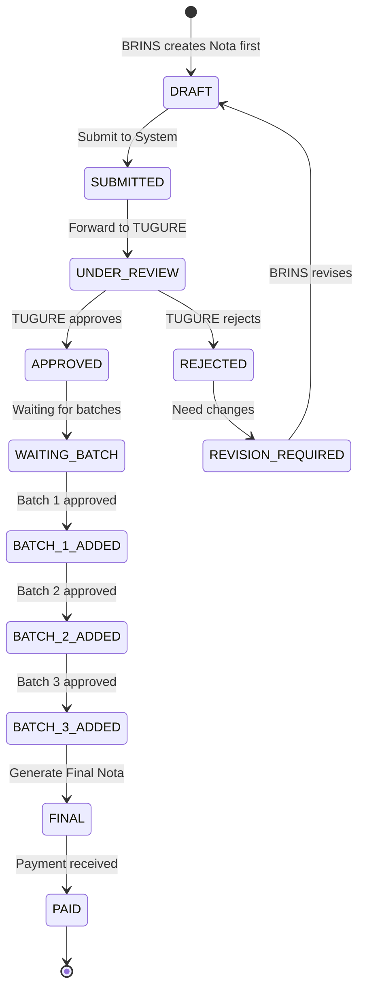

#### Batch Status Flow (Lama)

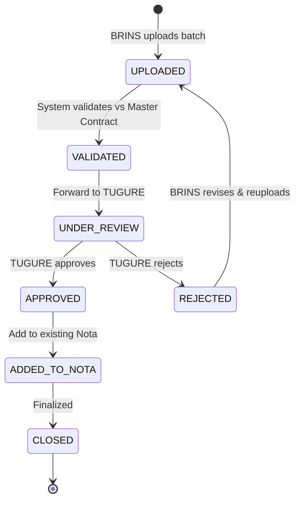

---

## 4. Data Model - Workflow Baru

### 4.1 Entity Overview

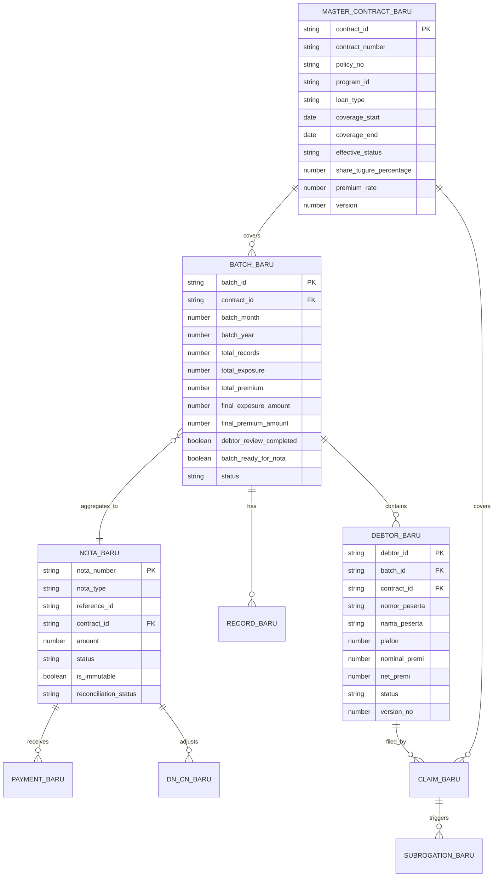

### 4.2 Schema Detail - Workflow Baru

#### MasterContract_Baru (Enhanced)
```json
{
  "name": "MasterContract_Baru",
  "description": "Master Contract dengan validation matrix terintegrasi",
  "properties": {
    "contract_id": { "type": "string", "description": "Primary Key" },
    "policy_no": { "type": "string" },
    "program_id": { "type": "string" },
    "product_type": { "type": "string", "enum": ["Treaty", "Facultative", "Retro"] },
    "credit_type": { "type": "string", "enum": ["Individual", "Corporate"] },
    "loan_type": { "type": "string" },
    "loan_type_desc": { "type": "string" },
    "coverage_start_date": { "type": "date" },
    "coverage_end_date": { "type": "date" },
    "max_tenor_month": { "type": "number" },
    "max_plafond": { "type": "number" },
    "share_tugure_percentage": { "type": "number" },
    "premium_rate": { "type": "number" },
    "ric_rate": { "type": "number" },
    "bf_rate": { "type": "number" },
    "allowed_kolektabilitas": { "type": "string", "description": "Comma-separated values" },
    "allowed_region": { "type": "string" },
    "effective_status": {
      "type": "string",
      "enum": ["Draft", "Pending First Approval", "Pending Second Approval", "Active", "Inactive", "Archived"]
    },
    "version": { "type": "number", "default": 1 },
    "parent_contract_id": { "type": "string", "description": "For versioning" },
    "first_approved_by": { "type": "string" },
    "first_approved_date": { "type": "datetime" },
    "second_approved_by": { "type": "string" },
    "second_approved_date": { "type": "datetime" }
  }
}
```

#### Batch_Baru (Batch Dikumpulkan Dulu, Nota Auto-Generate)
```json
{
  "name": "Batch_Baru",
  "description": "Batch dari BSM dikumpulkan dulu, nota di-generate setelah 3 batch",
  "properties": {
    "batch_id": { "type": "string", "description": "Primary Key" },
    "batch_month": { "type": "number", "description": "1-12" },
    "batch_year": { "type": "number" },
    "contract_id": { "type": "string", "description": "FK to MasterContract" },
    "total_records": { "type": "number", "default": 0 },
    "total_exposure": { "type": "number", "default": 0, "description": "Raw from upload" },
    "total_premium": { "type": "number", "default": 0, "description": "Raw from upload" },
    "final_exposure_amount": { "type": "number", "default": 0, "description": "After debtor review (approved only)" },
    "final_premium_amount": { "type": "number", "default": 0, "description": "After debtor review (approved only)" },
    "debtor_review_completed": { "type": "boolean", "default": false },
    "batch_ready_for_nota": { "type": "boolean", "default": false, "description": "TRUE after review with >=1 approved debtor" },
    "status": {
      "type": "string",
      "enum": ["Uploaded", "Validated", "Matched", "Approved", "Nota Issued", "Branch Confirmed", "Paid", "Closed", "Rejected", "Reopen Requested", "Reopened"]
    },
    "operational_locked": { "type": "boolean", "default": false, "description": "TRUE when Batch Closed" },
    "reopen_requested_by": { "type": "string" },
    "reopen_reason": { "type": "string" },
    "reopen_impact": { "type": "string", "enum": ["Data", "Financial"] },
    "validated_by": { "type": "string" },
    "validated_date": { "type": "date" },
    "matched_by": { "type": "string" },
    "matched_date": { "type": "date" },
    "approved_by": { "type": "string" },
    "approved_date": { "type": "date" },
    "nota_issued_by": { "type": "string" },
    "nota_issued_date": { "type": "date" },
    "branch_confirmed_by": { "type": "string" },
    "branch_confirmed_date": { "type": "date" },
    "paid_by": { "type": "string" },
    "paid_date": { "type": "date" },
    "closed_by": { "type": "string" },
    "closed_date": { "type": "date" }
  }
}
```

#### Nota_Baru (Auto-Generated dari Batch)
```json
{
  "name": "Nota_Baru",
  "description": "Nota yang di-generate otomatis setelah 3 batch terkumpul",
  "properties": {
    "nota_number": { "type": "string", "description": "Primary Key" },
    "nota_type": { "type": "string", "enum": ["Batch", "Claim", "Subrogation"] },
    "reference_id": { "type": "string", "description": "ID of related Batch/Claim/Subrogation" },
    "contract_id": { "type": "string", "description": "FK to Contract" },
    "amount": { "type": "number", "description": "IMMUTABLE after Issued - derived from final_premium_amount" },
    "currency": { "type": "string", "default": "IDR" },
    "status": {
      "type": "string",
      "enum": ["Draft", "Issued", "Confirmed", "Paid"]
    },
    "issued_by": { "type": "string" },
    "issued_date": { "type": "date" },
    "confirmed_by": { "type": "string" },
    "confirmed_date": { "type": "date" },
    "paid_date": { "type": "date" },
    "payment_reference": { "type": "string" },
    "total_actual_paid": { "type": "number", "default": 0 },
    "reconciliation_status": {
      "type": "string",
      "enum": ["PENDING", "PARTIAL", "MATCHED", "OVERPAID", "FINAL"]
    },
    "is_immutable": { "type": "boolean", "default": false, "description": "TRUE after Issued" }
  }
}
```

#### Debtor_Baru (Enhanced with Validation)
```json
{
  "name": "Debtor_Baru",
  "description": "Data debitur dari BSM dengan validasi terhadap master contract",
  "properties": {
    "debtor_id": { "type": "string", "description": "Auto-generated" },
    "cover_id": { "type": "number" },
    "program_id": { "type": "string" },
    "batch_id": { "type": "string", "description": "FK to Batch" },
    "contract_id": { "type": "string", "description": "FK to MasterContract" },
    "nomor_rekening_pinjaman": { "type": "string" },
    "nomor_peserta": { "type": "string" },
    "loan_type": { "type": "string" },
    "loan_type_desc": { "type": "string" },
    "tanggal_mulai_covering": { "type": "date" },
    "tanggal_akhir_covering": { "type": "date" },
    "plafon": { "type": "number" },
    "nominal_premi": { "type": "number" },
    "premi_percentage": { "type": "number" },
    "ric_percentage": { "type": "number" },
    "bf_percentage": { "type": "number" },
    "net_premi": { "type": "number" },
    "unit_code": { "type": "string" },
    "unit_desc": { "type": "string" },
    "branch_desc": { "type": "string" },
    "region_desc": { "type": "string" },
    "nama_peserta": { "type": "string" },
    "alamat_usaha": { "type": "string" },
    "kolektabilitas": { "type": "number", "description": "1-5" },
    "flag_restruktur": { "type": "number", "description": "0/1" },
    "status_aktif": { "type": "number", "description": "0/1" },
    "version_no": { "type": "number", "default": 1 },
    "status": {
      "type": "string",
      "enum": ["DRAFT", "SUBMITTED", "APPROVED", "REJECTED", "CONDITIONAL"]
    },
    "is_locked": { "type": "boolean", "default": false },
    "rejection_reason": { "type": "string" },
    "validation_remarks": { "type": "string" }
  }
}
```

### 4.3 State Flow - Workflow Baru

#### Batch Status Flow (Baru)

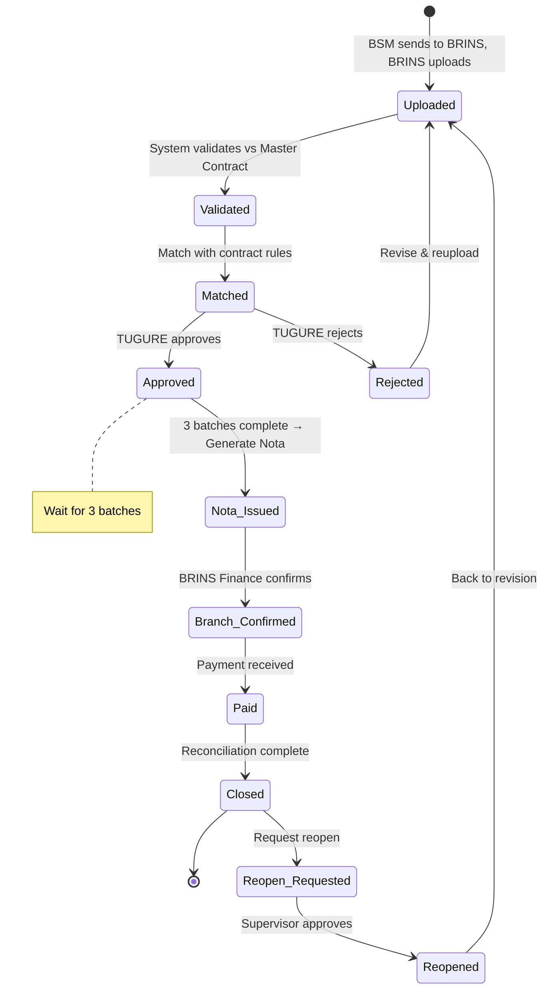

#### Nota Status Flow (Baru - Auto Generated)

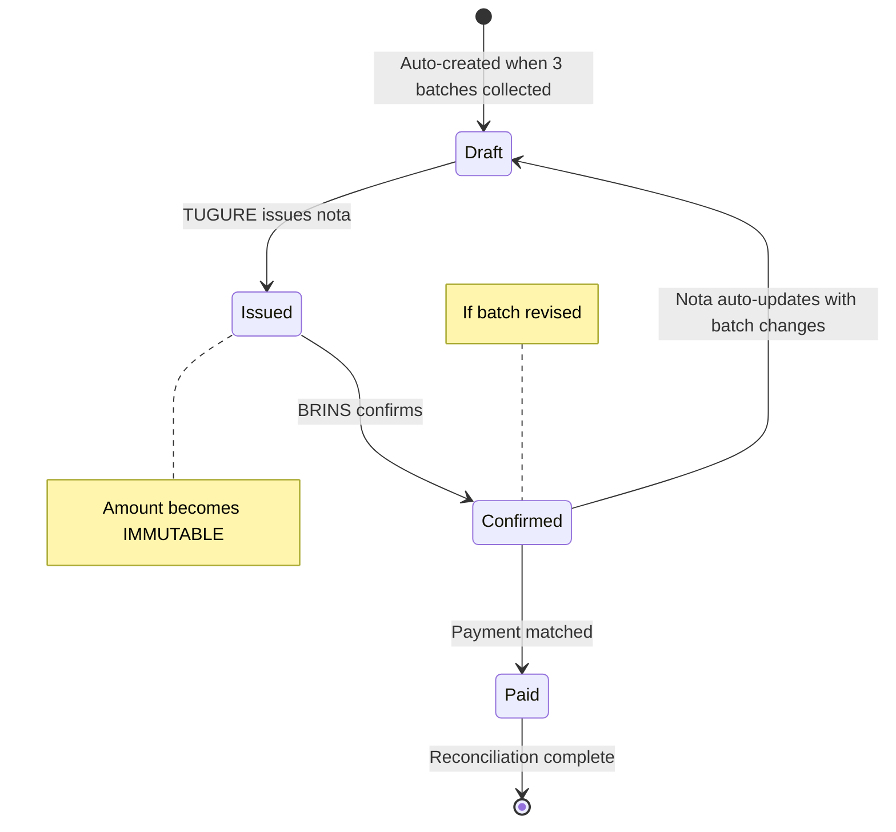

#### Claim Status Flow (Baru)

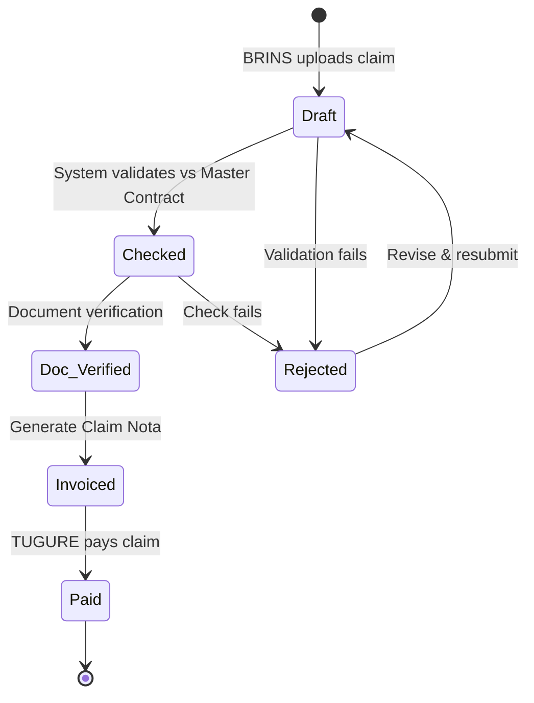

#### Subrogation Status Flow (Baru)

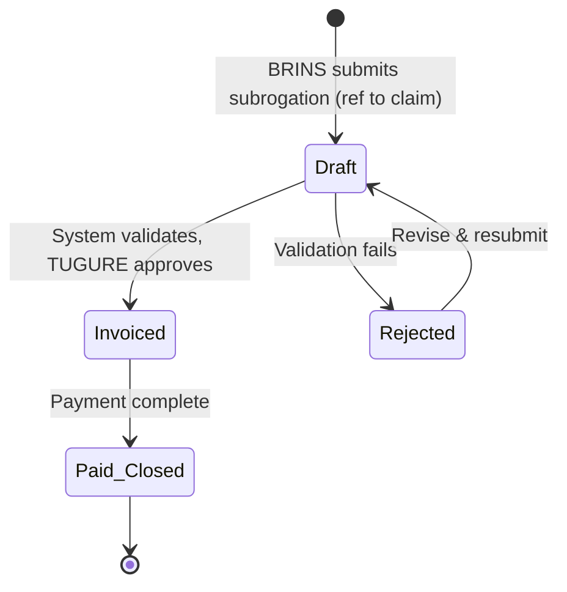

---

## 5. Entity Relationship Diagrams

### 5.1 Complete ER Diagram - Workflow Lama

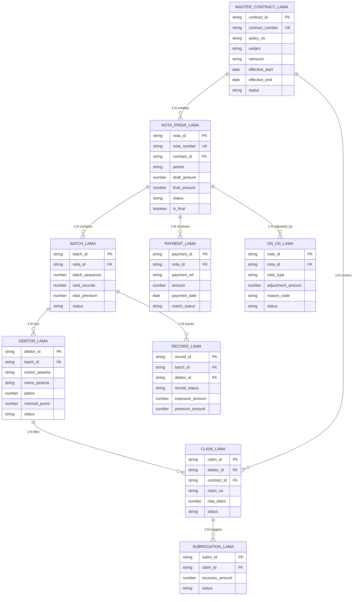

### 5.2 Complete ER Diagram - Workflow Baru

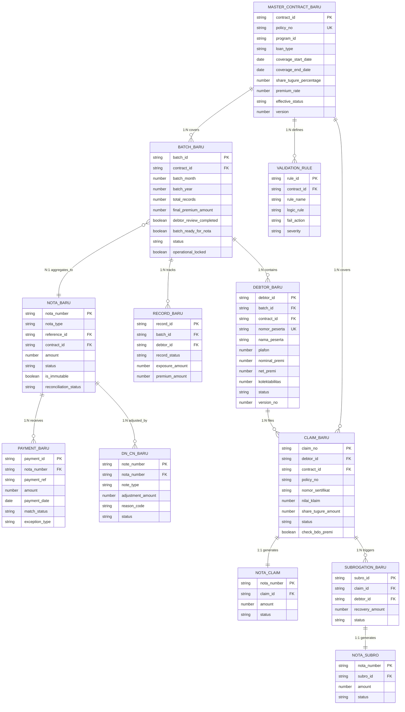

---

## 6. State Diagrams

### 6.1 Complete Process Flow - Workflow Lama

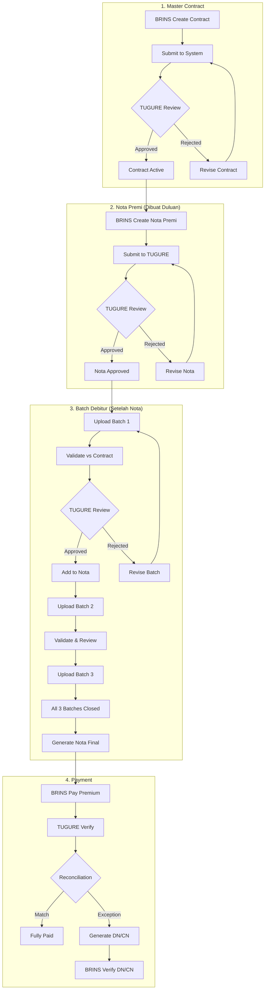

### 6.2 Complete Process Flow - Workflow Baru

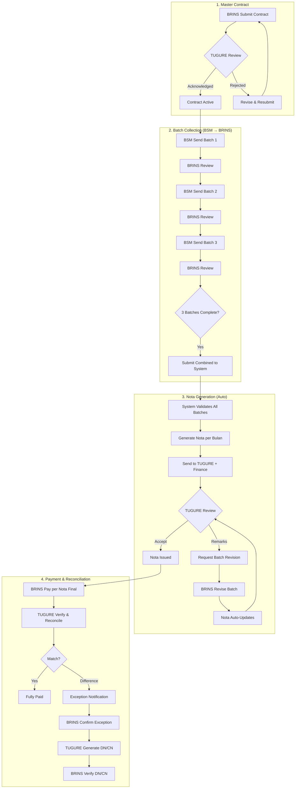

---

## 7. Perbandingan Schema

### 7.1 Tabel Perbandingan Entity

| Entity | Workflow Lama | Workflow Baru | Perubahan |
|--------|---------------|---------------|-----------|
| **MasterContract** | Basic fields | + program_id, loan_type, validation_rules, version, dual approval | Enhanced dengan validation matrix |
| **Nota** | Created first, manually | Auto-generated after 3 batches, immutable after issued | Flow berbeda, auto-generation |
| **Batch** | Links to existing Nota | Independent, aggregates to Nota | Batch independent, nota derived |
| **Debtor** | Basic info | + validation_remarks, version_no, is_locked | Enhanced validation tracking |
| **Record** | Simple tracking | + revision tracking | Enhanced audit |
| **Claim** | Basic | + check_bdo_premi, reference validation | Validation terhadap BDO Premi |
| **Subrogation** | Basic | Reference to claim required | Strict reference validation |
| **DN/CN** | Post-payment only | Can be generated at multiple stages | More flexible |

### 7.2 Key Relationship Changes

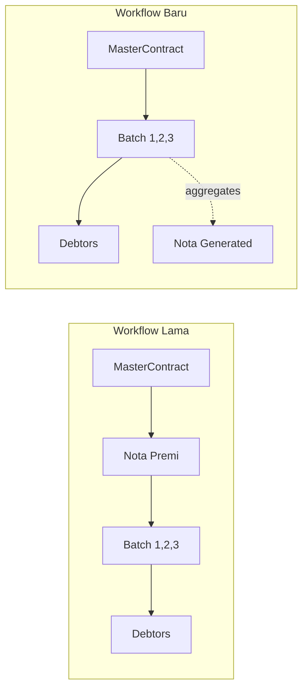

### 7.3 Status Mapping

| Stage | Workflow Lama Status | Workflow Baru Status |
|-------|---------------------|---------------------|
| Contract | DRAFT → SUBMITTED → UNDER_REVIEW → APPROVED | Draft → Pending First Approval → Pending Second Approval → Active |
| Nota | DRAFT → SUBMITTED → APPROVED → FINAL → PAID | Draft → Issued → Confirmed → Paid |
| Batch | UPLOADED → VALIDATED → APPROVED → CLOSED | Uploaded → Validated → Matched → Approved → Nota Issued → Closed |
| Debtor | DRAFT → SUBMITTED → APPROVED/REJECTED | DRAFT → SUBMITTED → APPROVED/REJECTED/CONDITIONAL |
| Claim | Draft → Checked → Invoiced → Paid | Draft → Checked → Doc Verified → Invoiced → Paid |
| Subrogation | Draft → Invoiced → Closed | Draft → Invoiced → Paid/Closed |

---

## Appendix: Info Tambahan

Berdasarkan dokumen `info_tambahan.txt`:

1. **Batch Consolidation**: Batch yang dikirim ke aplikasi berisi gabungan 3 batch + 1 nota dari 3 batch tersebut
2. **Single Submission View**: Di aplikasi, user melihatnya sebagai 1 submit batch debitur saja (bukan batch 1, 2, 3 terpisah)
3. **Claim/Subrogation Reference**: Keyword yang menjadi referensi claim dan subrogasi ke debtor adalah **nomor polis**
4. **Premium Payment Deduction**: Untuk proses pembayaran premi, akan dilihat claim di bulan sebelumnya. Jika ada claim, pembayaran premi langsung dikurangi claim tersebut

### Premium Calculation Flow (Baru)

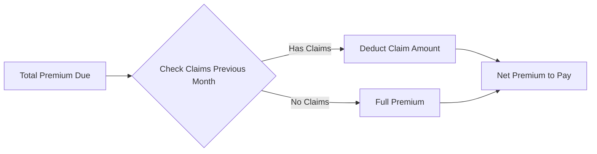
