# Information, Interaction, and Process Modelling
## Sistem Reasuransi BRINS - TUGURE (A3M)

---

## Daftar Isi
1. [Information Modelling](#1-information-modelling)
2. [Interaction Modelling](#2-interaction-modelling)
3. [Process Modelling](#3-process-modelling)

---

## 1. Information Modelling

### 1.1 Domain Model - Workflow Baru

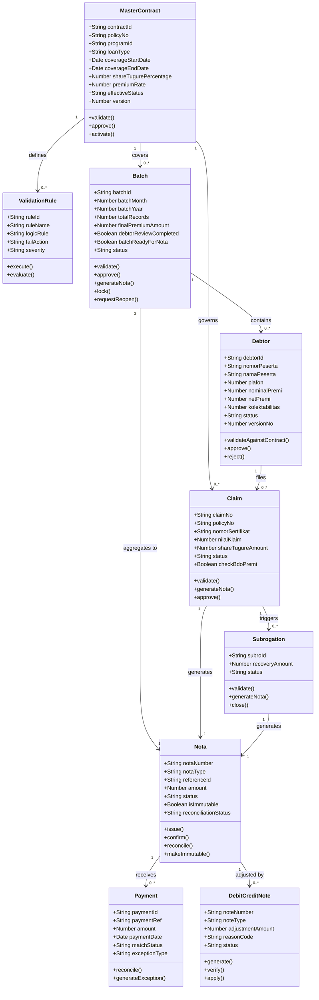

### 1.2 Information Architecture - Complete System

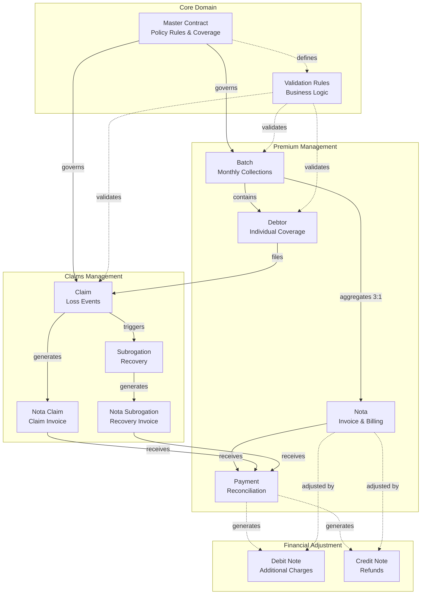

### 1.3 Data Model - Key Entities Detail### 1.4 Information States and Lifecycles

erDiagram
    MASTER_CONTRACT ||--o{ VALIDATION_RULE : "defines"
    MASTER_CONTRACT ||--o{ BATCH : "governs"
    MASTER_CONTRACT ||--o{ CLAIM : "covers"
    
    BATCH ||--o{ DEBTOR : "contains"
    BATCH }o--|| NOTA_BATCH : "aggregates to (3:1)"
    
    DEBTOR ||--o{ CLAIM : "may file"
    
    CLAIM ||--|| NOTA_CLAIM : "generates"
    CLAIM ||--o{ SUBROGATION : "may trigger"
    
    SUBROGATION ||--|| NOTA_SUBROGATION : "generates"
    
    NOTA_BATCH ||--o{ PAYMENT : "receives"
    NOTA_CLAIM ||--o{ PAYMENT : "receives"
    NOTA_SUBROGATION ||--o{ PAYMENT : "receives"
    
    NOTA_BATCH ||--o{ DN_CN : "may have adjustments"
    PAYMENT ||--o{ DN_CN : "may generate"
    
    MASTER_CONTRACT {
        string contract_id PK "Unique identifier"
        string policy_no UK "Policy number"
        string program_id "Program identifier"
        string loan_type "Type of loan covered"
        date coverage_start_date "Coverage begins"
        date coverage_end_date "Coverage ends"
        decimal share_tugure_percentage "Tugure's share %"
        decimal premium_rate "Premium rate %"
        decimal ric_rate "RIC rate %"
        decimal bf_rate "BF rate %"
        string allowed_kolektabilitas "Valid collectibility values"
        string allowed_region "Allowed regions"
        string effective_status "Draft|Active|Inactive"
        int version "Version number for amendments"
        string parent_contract_id FK "For version tracking"
        datetime first_approved_date "First approval timestamp"
        datetime second_approved_date "Second approval timestamp"
    }
    
    VALIDATION_RULE {
        string rule_id PK "Unique identifier"
        string contract_id FK "Links to contract"
        string rule_name "Name of validation rule"
        string logic_rule "Business logic expression"
        string fail_action "REJECT|WARNING|CONDITIONAL"
        string severity "HIGH|MEDIUM|LOW"
        boolean is_active "Rule active status"
    }
    
    BATCH {
        string batch_id PK "Unique identifier"
        string contract_id FK "Links to contract"
        int batch_month "1-12"
        int batch_year "Year"
        int total_records "Count of debtors"
        decimal total_exposure "Sum of plafon (raw)"
        decimal total_premium "Sum of premium (raw)"
        decimal final_exposure_amount "Approved debtors only"
        decimal final_premium_amount "Approved debtors only"
        boolean debtor_review_completed "All debtors reviewed"
        boolean batch_ready_for_nota "Ready to generate nota"
        string status "Uploaded|Validated|Matched|Approved|Nota_Issued|Closed"
        boolean operational_locked "Locked when closed"
        datetime validated_date "Validation timestamp"
        datetime approved_date "Approval timestamp"
        datetime nota_issued_date "Nota generation timestamp"
        datetime closed_date "Closure timestamp"
    }
    
    DEBTOR {
        string debtor_id PK "Auto-generated ID"
        string batch_id FK "Links to batch"
        string contract_id FK "Links to contract"
        string nomor_peserta UK "Participant number"
        string nomor_rekening_pinjaman "Loan account number"
        string nama_peserta "Participant name"
        string loan_type "Loan type code"
        date tanggal_mulai_covering "Coverage start"
        date tanggal_akhir_covering "Coverage end"
        decimal plafon "Loan amount"
        decimal nominal_premi "Gross premium"
        decimal premi_percentage "Premium %"
        decimal ric_percentage "RIC %"
        decimal bf_percentage "BF %"
        decimal net_premi "Net premium after deductions"
        string unit_code "Unit code"
        string region_desc "Region"
        int kolektabilitas "1-5 collectibility"
        int flag_restruktur "0 or 1"
        string status "DRAFT|SUBMITTED|APPROVED|REJECTED|CONDITIONAL"
        boolean is_locked "Locked after batch closed"
        string rejection_reason "Reason if rejected"
        string validation_remarks "Validation notes"
        int version_no "Version for amendments"
    }
    
    NOTA_BATCH {
        string nota_number PK "Invoice number"
        string nota_type "BATCH"
        string reference_id FK "Batch reference (aggregated)"
        string contract_id FK "Links to contract"
        decimal amount "IMMUTABLE after issued"
        string currency "IDR"
        string status "Draft|Issued|Confirmed|Paid"
        boolean is_immutable "TRUE after issued"
        string reconciliation_status "PENDING|PARTIAL|MATCHED|OVERPAID|FINAL"
        datetime issued_date "Issuance timestamp"
        datetime confirmed_date "Confirmation timestamp"
        datetime paid_date "Payment timestamp"
        string payment_reference "Payment ref number"
        decimal total_actual_paid "Actual payment received"
    }
    
    CLAIM {
        string claim_no PK "Claim number"
        string debtor_id FK "Links to debtor"
        string contract_id FK "Links to contract"
        string policy_no "Policy reference"
        string nomor_sertifikat "Certificate number"
        string nama_tertanggung "Insured name"
        date tanggal_kejadian "Incident date"
        date tanggal_meninggal "Death date (if applicable)"
        decimal nilai_klaim "Claim amount"
        decimal share_tugure_amount "Tugure's share of claim"
        string status "Draft|Checked|Doc_Verified|Invoiced|Paid"
        boolean check_bdo_premi "Validate against premium BDO"
        string rejection_reason "Reason if rejected"
    }
    
    NOTA_CLAIM {
        string nota_number PK "Claim invoice number"
        string nota_type "CLAIM"
        string claim_id FK "Links to claim"
        decimal amount "Claim payout amount"
        string status "Draft|Issued|Paid"
        datetime issued_date "Issuance timestamp"
    }
    
    SUBROGATION {
        string subro_id PK "Subrogation ID"
        string claim_id FK "Links to claim"
        string debtor_id FK "Links to debtor"
        decimal recovery_amount "Amount recovered"
        string status "Draft|Invoiced|Paid_Closed"
        datetime recovery_date "Recovery timestamp"
    }
    
    NOTA_SUBROGATION {
        string nota_number PK "Subrogation invoice"
        string nota_type "SUBROGATION"
        string subro_id FK "Links to subrogation"
        decimal amount "Recovery amount"
        string status "Draft|Issued|Paid"
        datetime issued_date "Issuance timestamp"
    }
    
    PAYMENT {
        string payment_id PK "Payment ID"
        string nota_number FK "Links to nota"
        string payment_ref "Bank reference"
        decimal amount "Payment amount"
        date payment_date "Payment date"
        string match_status "PENDING|MATCHED|PARTIAL|OVERPAID|UNMATCHED"
        string exception_type "UNDERPAYMENT|OVERPAYMENT|TIMING"
        datetime reconciled_date "Reconciliation timestamp"
    }
    
    DN_CN {
        string note_number PK "DN/CN number"
        string nota_number FK "Links to nota"
        string note_type "DEBIT|CREDIT"
        decimal adjustment_amount "Adjustment value"
        string reason_code "Reason for adjustment"
        string status "Draft|Issued|Verified|Applied"
        datetime issued_date "Issuance timestamp"
    }
    
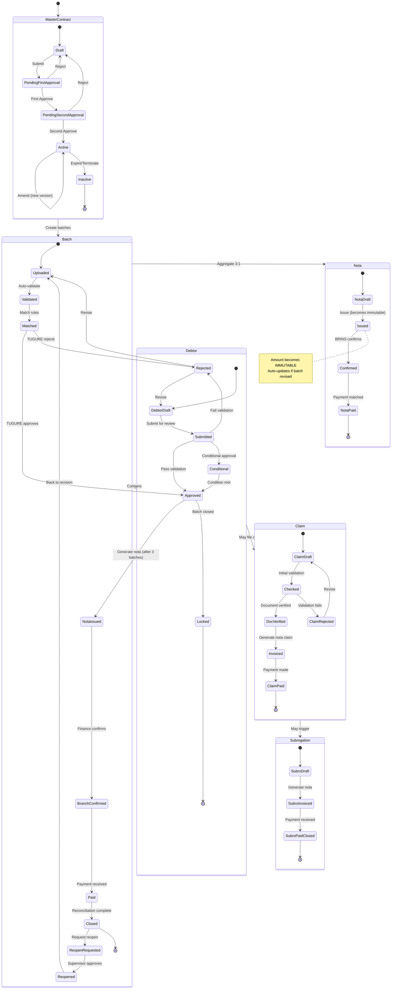

---

## 2. Interaction Modelling

### 2.1 Actor Interaction Overview

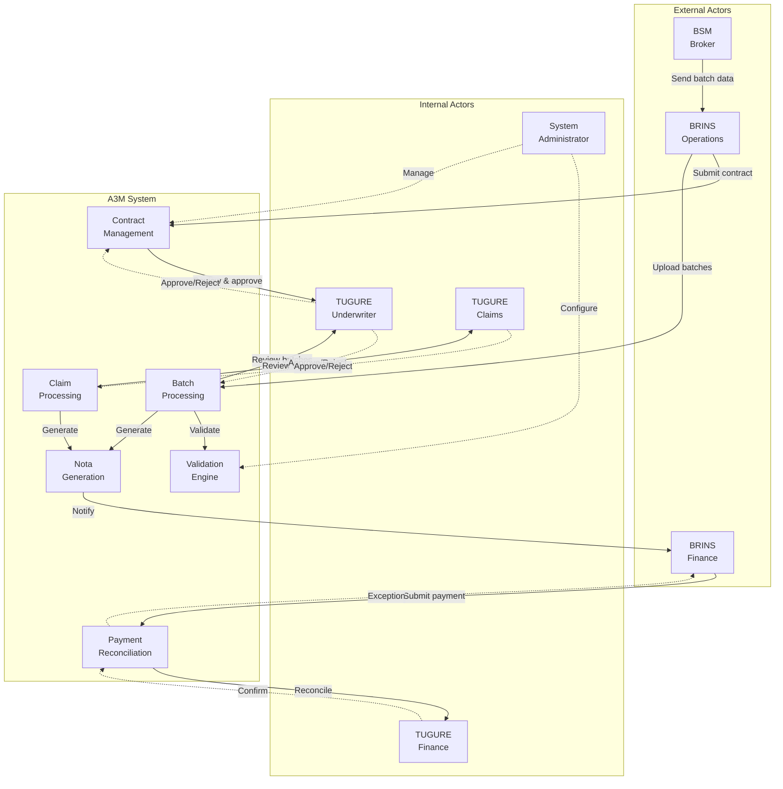

### 2.2 Use Case Diagram - Complete System### 2.3 Sequence Diagram - Premium Processing (End-to-End)

```mermaid
sequenceDiagram
    autonumber
    actor BSM as BSM Broker
    actor BRINS_OPS as BRINS Operations
    actor BRINS_FIN as BRINS Finance
    participant SYS as A3M System
    participant VAL as Validation Engine
    actor TUG_UW as TUGURE Underwriter
    actor TUG_FIN as TUGURE Finance
    
    rect rgb(230, 240, 255)
    note over BSM,SYS: Phase 1: Batch Collection (Month)
    BSM->>BRINS_OPS: Send Batch 1 Data (Week 1)
    BRINS_OPS->>BRINS_OPS: Internal Review
    BSM->>BRINS_OPS: Send Batch 2 Data (Week 2)
    BRINS_OPS->>BRINS_OPS: Internal Review
    BSM->>BRINS_OPS: Send Batch 3 Data (Week 3)
    BRINS_OPS->>BRINS_OPS: Internal Review
    note over BRINS_OPS: Collect all 3 batches
    end
    
    rect rgb(240, 255, 240)
    note over BRINS_OPS,VAL: Phase 2: System Upload & Validation
    BRINS_OPS->>SYS: Upload Combined Batches (3 batches)
    SYS->>SYS: Create Batch Records
    loop For each batch
        SYS->>VAL: Validate Batch
        VAL->>VAL: Check Master Contract Rules
        VAL->>VAL: Validate Each Debtor
        VAL-->>SYS: Validation Results
    end
    SYS->>SYS: Update Batch Status: Validated
    end
    
    rect rgb(255, 240, 230)
    note over SYS,TUG_UW: Phase 3: TUGURE Review
    SYS->>TUG_UW: Send Batches for Review
    TUG_UW->>TUG_UW: Review Batch Details
    TUG_UW->>TUG_UW: Review Debtor List
    
    alt All Batches Approved
        TUG_UW->>SYS: Approve All Batches
        SYS->>SYS: Update Status: Approved
    else Need Revision
        TUG_UW->>SYS: Add Remarks & Request Revision
        SYS->>BRINS_OPS: Notification: Revision Required
        BRINS_OPS->>SYS: Upload Revised Batch
        SYS->>VAL: Re-validate
        VAL-->>SYS: New Validation Results
        SYS->>TUG_UW: Send for Re-review
        TUG_UW->>SYS: Approve Revised Batch
    end
    end
    
    rect rgb(255, 255, 230)
    note over SYS,TUG_FIN: Phase 4: Nota Generation
    SYS->>SYS: Check: 3 Batches Approved?
    SYS->>SYS: Calculate Total Premium
    SYS->>SYS: Generate Nota (Auto)
    SYS->>SYS: Nota Status: Draft
    SYS->>TUG_FIN: Send Nota for Review
    SYS->>BRINS_FIN: Notify: Nota Generated
    
    TUG_FIN->>TUG_FIN: Review Nota Amount
    TUG_FIN->>SYS: Issue Nota
    SYS->>SYS: Nota Status: Issued (IMMUTABLE)
    SYS->>BRINS_FIN: Notify: Nota Issued
    
    BRINS_FIN->>SYS: Confirm Nota
    SYS->>SYS: Nota Status: Confirmed
    end
    
    rect rgb(230, 255, 255)
    note over BRINS_FIN,TUG_FIN: Phase 5: Payment & Netting
    BRINS_FIN->>SYS: Check: Any Claims Last Month?
    SYS->>SYS: Query Claims (Previous Month)
    
    alt Has Claims
        SYS-->>BRINS_FIN: Claim Amount: Rp X
        BRINS_FIN->>BRINS_FIN: Calculate Net Premium<br/>(Nota Amount - Claim)
        BRINS_FIN->>SYS: Submit Net Payment
    else No Claims
        BRINS_FIN->>SYS: Submit Full Payment
    end
    
    SYS->>SYS: Record Payment
    SYS->>TUG_FIN: Notify: Payment Received
    end
    
    rect rgb(255, 230, 255)
    note over SYS,TUG_FIN: Phase 6: Reconciliation
    TUG_FIN->>SYS: Reconcile Payment
    SYS->>SYS: Match Payment vs Nota
    
    alt Payment Matched
        SYS->>SYS: Nota Status: Paid
        SYS->>SYS: Reconciliation: MATCHED
        SYS->>BRINS_FIN: Confirmation: Payment Complete
    else Payment Mismatch
        SYS->>SYS: Reconciliation: PARTIAL/OVERPAID
        SYS->>BRINS_FIN: Exception Notification
        BRINS_FIN->>SYS: Confirm Exception
        TUG_FIN->>SYS: Generate DN/CN
        SYS->>BRINS_FIN: Send DN/CN for Verification
        BRINS_FIN->>SYS: Verify DN/CN
        SYS->>SYS: Apply Adjustment
        SYS->>SYS: Nota Status: Paid (Final)
    end
    
    SYS->>SYS: Batch Status: Paid → Closed
    SYS->>SYS: Lock Batch (Operational_Locked = TRUE)
    end
```

### 2.4 Sequence Diagram - Claim Processing

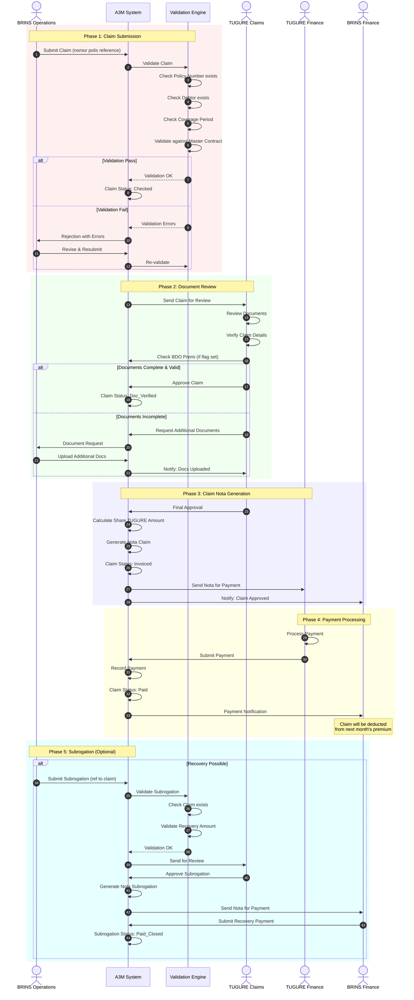

### 2.5 Collaboration Diagram - Batch to Nota Flow

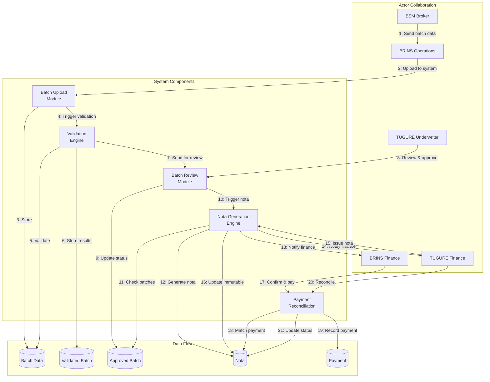

---

## 3. Process Modelling

### 3.1 BPMN - Premium Collection Process (Workflow Baru)### 3.2 BPMN - Claim Processing### 3.3 Activity Diagram - Contract Amendment

```mermaid
stateDiagram-v2
    [*] --> CheckAmendmentNeed: Amendment Required
    
    CheckAmendmentNeed --> PrepareAmendment: BRINS identifies changes
    PrepareAmendment --> CreateNewVersion: System creates v2
    CreateNewVersion --> CopyBaseData: Copy from v1
    
    CopyBaseData --> ModifyFields: BRINS modifies fields
    ModifyFields --> UpdateValidationRules: Update validation matrix
    UpdateValidationRules --> SubmitForApproval: Submit v2
    
    SubmitForApproval --> FirstApproval: TUGURE reviews
    
    state FirstApproval {
        [*] --> ReviewChanges
        ReviewChanges --> CompareVersions: Compare v1 vs v2
        CompareVersions --> ValidateImpact: Assess impact
        ValidateImpact --> DecisionFirst
        
        DecisionFirst --> ApprovedFirst: Changes acceptable
        DecisionFirst --> RejectedFirst: Changes unacceptable
        
        RejectedFirst --> [*]: Reject
        ApprovedFirst --> [*]: First Approve
    }
    
    FirstApproval --> ModifyFields: Rejected - revise
    FirstApproval --> SecondApproval: First Approved
    
    state SecondApproval {
        [*] --> FinalReview
        FinalReview --> CheckCompliance: Compliance check
        CheckCompliance --> DecisionSecond
        
        DecisionSecond --> ApprovedSecond: Compliant
        DecisionSecond --> RejectedSecond: Non-compliant
        
        RejectedSecond --> [*]: Reject
        ApprovedSecond --> [*]: Final Approve
    }
    
    SecondApproval --> ModifyFields: Rejected - revise
    SecondApproval --> ActivateNewVersion: Second Approved
    
    ActivateNewVersion --> DeactivateOldVersion: Set v1 = Inactive
    DeactivateOldVersion --> SetNewActive: Set v2 = Active
    SetNewActive --> NotifyStakeholders: Send notifications
    NotifyStakeholders --> UpdateRelatedBatches: Link new batches to v2
    
    UpdateRelatedBatches --> [*]: Amendment Complete
```

### 3.4 Swimlane Diagram - Payment Reconciliation Process

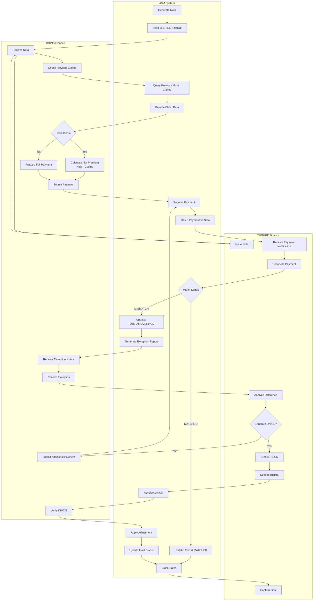

### 3.5 Data Flow Diagram - Level 0 (Context Diagram)

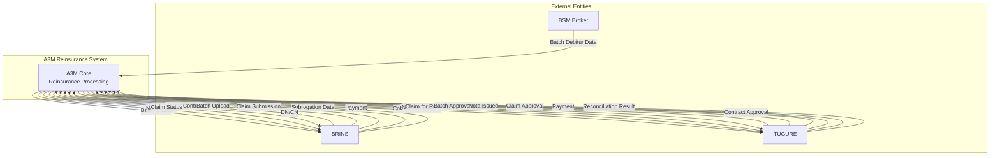

### 3.6 Data Flow Diagram - Level 1 (Premium Process)

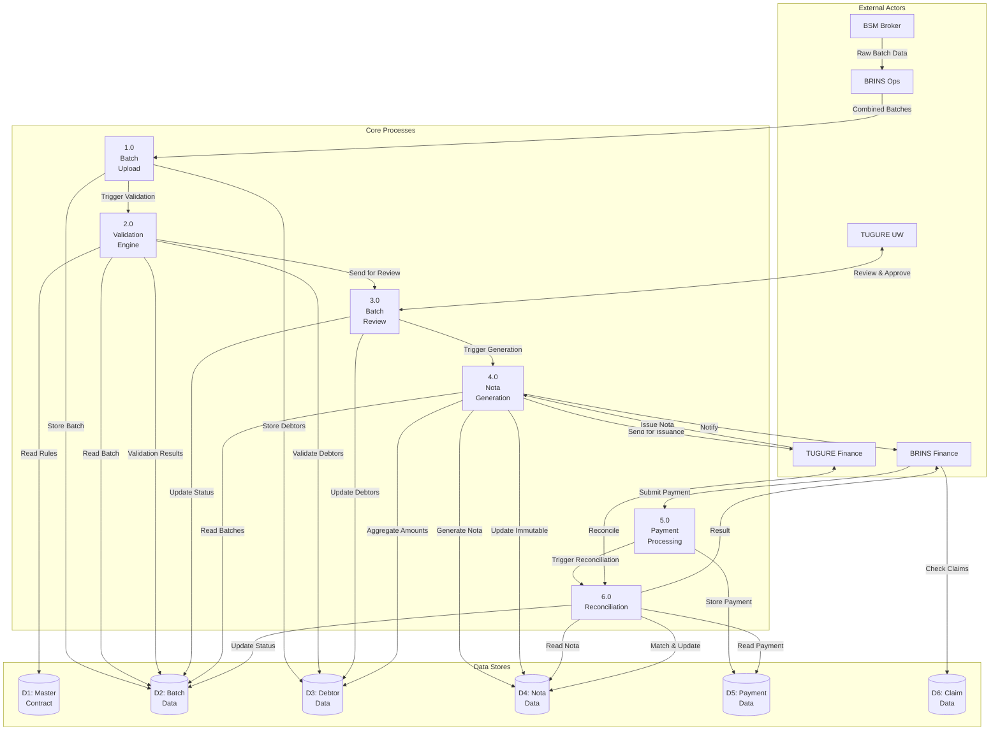

### 3.7 Process Comparison - Lama vs Baru

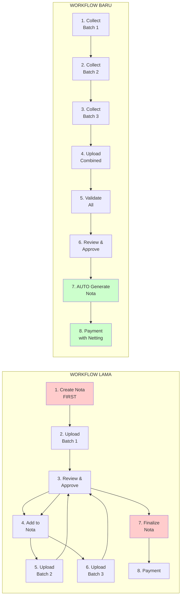

---

## Summary: Key Modelling Insights

### Information Model
- **Workflow Baru**: Nota is derived from Batch (3:1 aggregation), not created independently
- **Immutability**: Nota becomes immutable after issuance, ensuring data integrity
- **Versioning**: Master Contract supports versioning for amendments
- **Validation Matrix**: Embedded in Master Contract for automated validation

### Interaction Model
- **Simplified Actor Flow**: BSM → BRINS → System → TUGURE (linear flow)
- **Auto-Generation**: System autonomously generates Nota after 3 batches approved
- **Premium Netting**: System automatically deducts previous month's claims from premium payment
- **Exception Handling**: Structured DN/CN generation for payment mismatches

### Process Model
- **Batch-First Approach**: Collect all batches before nota generation
- **Validation-Driven**: Automated validation at multiple checkpoints
- **Status-Based Workflow**: Clear state transitions for each entity
- **Reconciliation Integration**: Built-in payment reconciliation with automatic exception handling
