# Detailed Process Flow Diagrams

## 1. System Architecture Overview

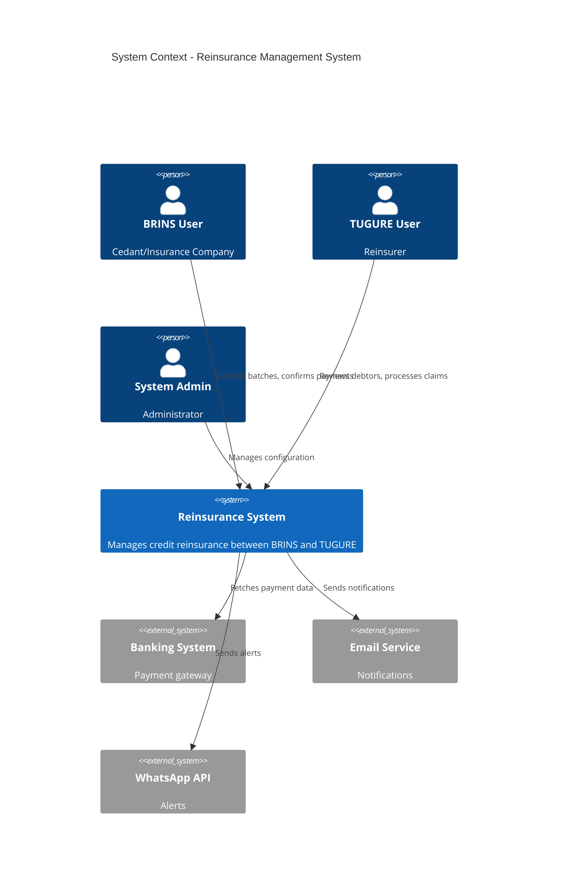

---

## 2. Batch Processing - Detailed State Machine

```mermaid
stateDiagram-v2
    [*] --> Uploaded: User uploads Excel
    
    state Uploaded {
        [*] --> ParseFile
        ParseFile --> ValidateFormat
        ValidateFormat --> CreateRecords
        CreateRecords --> [*]
    }
    
    Uploaded --> Validated: Auto-validation
    
    state Validated {
        [*] --> CheckDuplicates
        CheckDuplicates --> ValidateFields
        ValidateFields --> CheckMandatory
        CheckMandatory --> [*]
    }
    
    Validated --> Matched: Contract matching
    
    state Matched {
        [*] --> FindContract
        FindContract --> CheckEligibility
        CheckEligibility --> MatchDebtors
        MatchDebtors --> [*]
    }
    
    Matched --> Approved: TUGURE approves
    
    state "Debtor Review" as DebtorReview {
        [*] --> ReviewEachDebtor
        ReviewEachDebtor --> CheckKolektabilitas
        CheckKolektabilitas --> CheckRegion
        CheckRegion --> CheckPlafond
        CheckPlafond --> UpdateRecordStatus
        UpdateRecordStatus --> [*]
    }
    
    Matched --> DebtorReview: Start review
    DebtorReview --> Matched: Review ongoing
    DebtorReview --> Approved: All debtors reviewed
    
    state Approved {
        [*] --> CalculateFinalAmounts
        CalculateFinalAmounts --> SetReviewCompleted
        SetReviewCompleted --> SetReadyForNota
        SetReadyForNota --> [*]
    }
    
    Approved --> NotaIssued: Issue Nota
    
    state NotaIssued {
        [*] --> CreateNota
        CreateNota --> SetNotaAmount
        SetNotaAmount --> MarkImmutable
        MarkImmutable --> [*]
    }
    
    NotaIssued --> BranchConfirmed: BRINS confirms
    BranchConfirmed --> Paid: Payment matched
    Paid --> Closed: Close batch
    
    state Closed {
        [*] --> LockOperations
        LockOperations --> LockDebtors
        LockDebtors --> FinalizeReconciliation
        FinalizeReconciliation --> [*]
    }
    
    Closed --> ReopenRequested: Request reopen
    
    state ReopenRequested {
        [*] --> CaptureReason
        CaptureReason --> AssessImpact
        AssessImpact --> RequestApproval
        RequestApproval --> [*]
    }
    
    ReopenRequested --> Reopened: Supervisor approves
    ReopenRequested --> Closed: Request denied
    
    state Reopened {
        [*] --> UnlockBatch
        UnlockBatch --> UnlockDebtors
        UnlockDebtors --> EnableEditing
        EnableEditing --> [*]
    }
    
    Reopened --> Validated: Resume from validation
    
    Validated --> Rejected: Validation errors
    Matched --> Rejected: Matching errors
    Approved --> Rejected: Approval denied
    
    state Rejected {
        [*] --> CaptureRejectionReason
        CaptureRejectionReason --> NotifyUsers
        NotifyUsers --> [*]
    }
    
    Rejected --> [*]
```

---

## 3. Debtor Lifecycle - Complete Flow

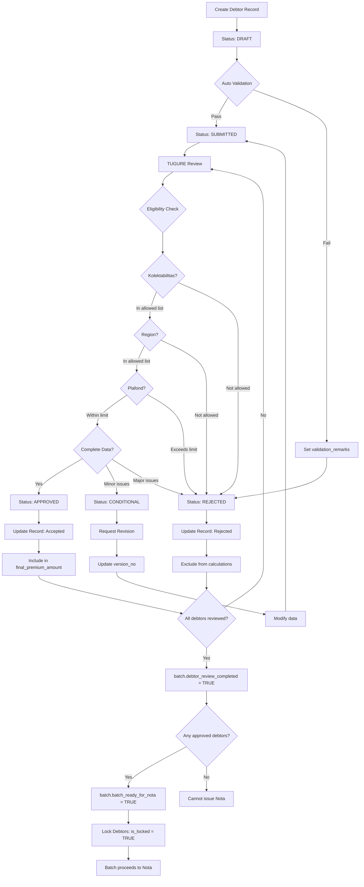

---

## 4. Payment Matching Algorithm

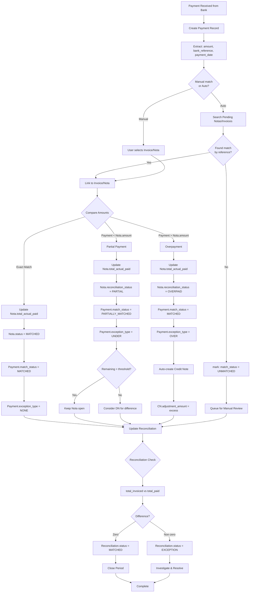

---

## 5. Nota Generation Logic

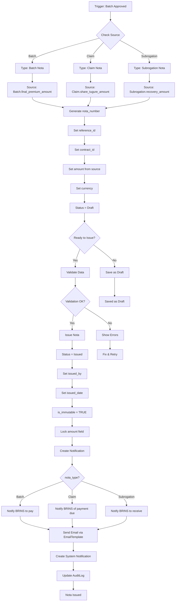

---

## 6. Claim Processing - End to End

```mermaid
graph LR
    subgraph "1. Claim Creation"
        A1[Loss Event Occurs] --> A2[Create Claim Record]
        A2 --> A3[Status: Draft]
        A3 --> A4[Link to Debtor]
        A4 --> A5[Link to Contract]
    end
    
    subgraph "2. Initial Check"
        B1[Assign to Checker] --> B2[Verify Basic Info]
        B2 --> B3[Check Policy No]
        B3 --> B4[Verify Debtor]
        B4 --> B5[Status: Checked]
    end
    
    subgraph "3. Document Verification"
        C1[Upload Documents] --> C2[Verify Completeness]
        C2 --> C3{check_bdo_premi?}
        C3 -->|Pass| C4[Verify Coverage Period]
        C3 -->|Fail| C5[Reject: Wrong Period]
        C4 --> C6[Verify KOL Status]
        C6 --> C7{Valid KOL?}
        C7 -->|Yes| C8[Status: Doc Verified]
        C7 -->|No| C9[Reject: Invalid KOL]
    end
    
    subgraph "4. Amount Calculation"
        D1[Get max_coverage] --> D2[Get share_tugure_%]
        D2 --> D3[Calculate: nilai_klaim * share_%]
        D3 --> D4[Set share_tugure_amount]
    end
    
    subgraph "5. Invoicing"
        E1[Create Claim Nota] --> E2[Amount = share_tugure_amount]
        E2 --> E3[Issue to BRINS]
        E3 --> E4[Status: Invoiced]
    end
    
    subgraph "6. Payment"
        F1[TUGURE Processes Payment] --> F2[Payment Record Created]
        F2 --> F3[Match to Claim Nota]
        F3 --> F4[Claim Status: Paid]
    end
    
    subgraph "7. Subrogation (Optional)"
        G1{Recovery Possible?} -->|Yes| G2[Create Subrogation]
        G2 --> G3[Recovery Process]
        G3 --> G4[Amount Recovered]
        G4 --> G5[Create Subrogation Nota]
        G5 --> G6[BRINS Pays Back]
    end
    
    A5 --> B1
    B5 --> C1
    C8 --> D1
    D4 --> E1
    E4 --> F1
    F4 --> G1
```

---

## 7. Reconciliation Process Flow

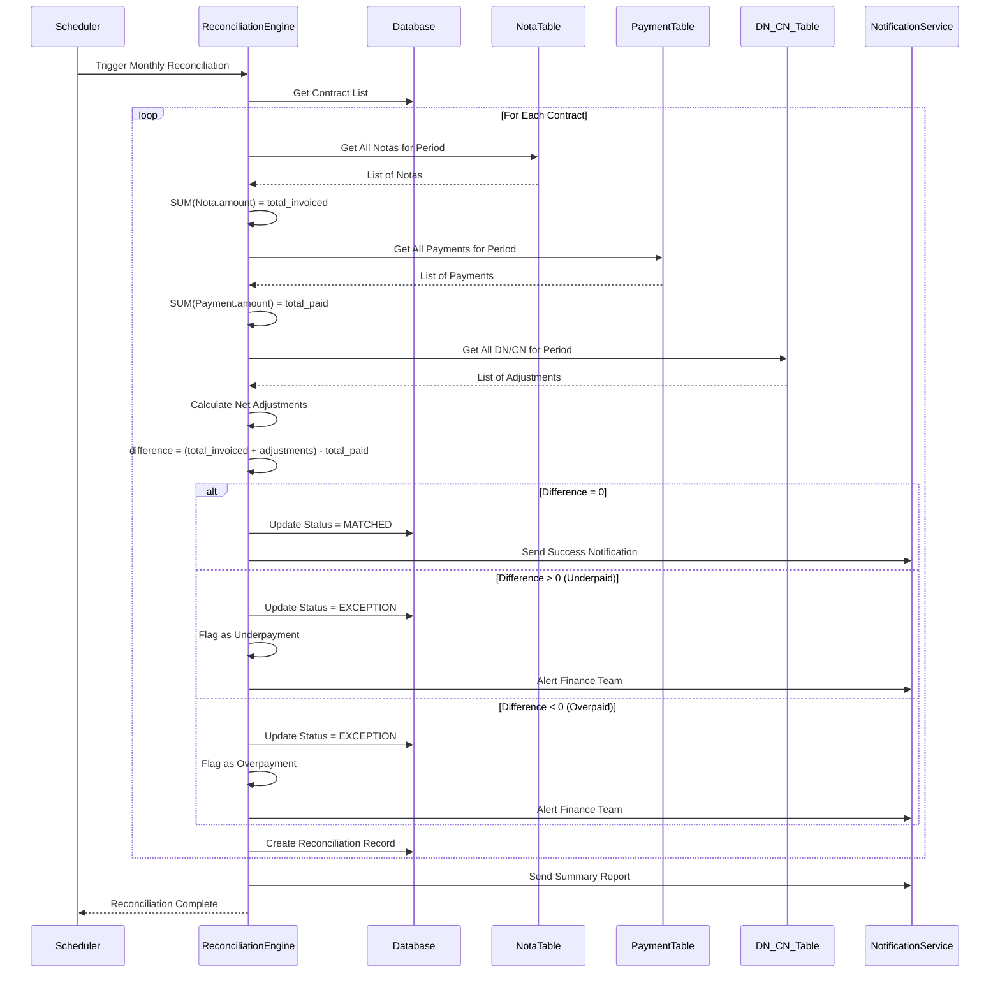

---

## 8. Debit/Credit Note Flow

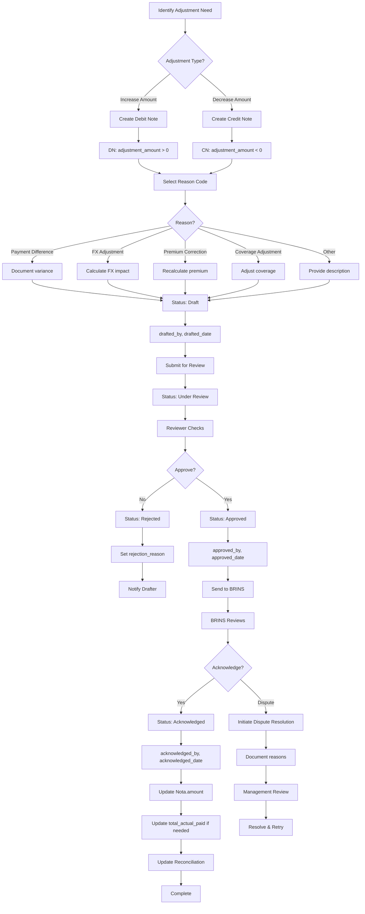

---

## 9. SLA Monitoring System

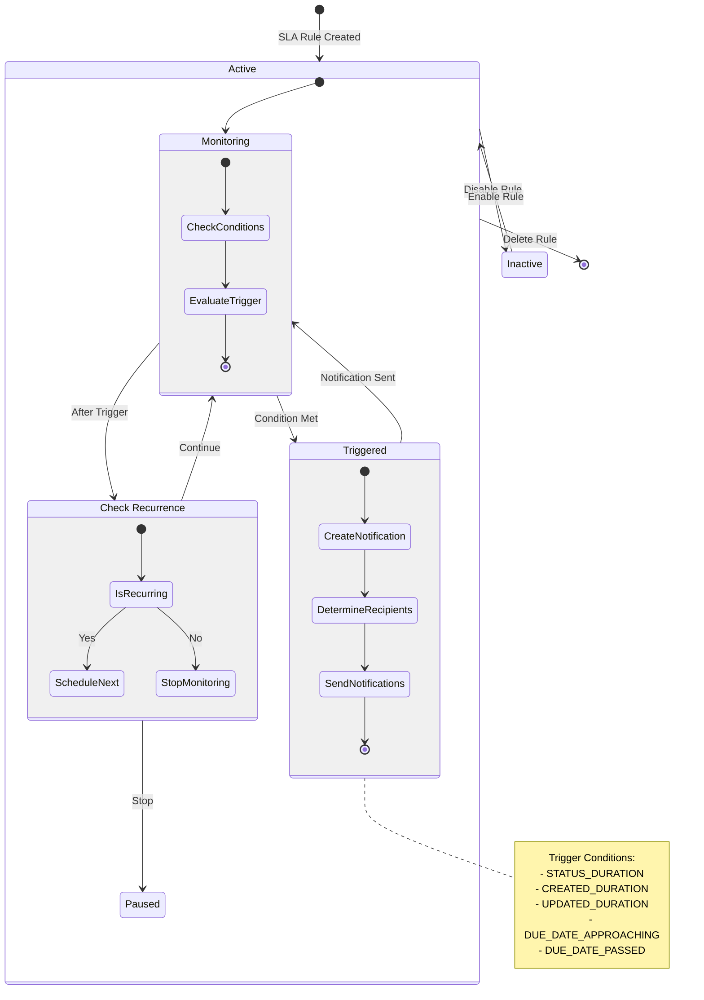

---

## 10. User Role Permissions Matrix

```mermaid
graph TD
    subgraph "BRINS User Permissions"
        B1[Upload Batch] --> B2[View Own Batches]
        B2 --> B3[Confirm Branch Receipt]
        B3 --> B4[Submit Payment Intent]
        B4 --> B5[View Notas]
        B5 --> B6[Acknowledge DN/CN]
        B6 --> B7[Create Claims]
        B7 --> B8[View Reports]
    end
    
    subgraph "TUGURE User Permissions"
        T1[View All Batches] --> T2[Review Debtors]
        T2 --> T3[Approve/Reject Batches]
        T3 --> T4[Issue Notas]
        T4 --> T5[Process Claims]
        T5 --> T6[Create DN/CN]
        T6 --> T7[Match Payments]
        T7 --> T8[Reconciliation]
    end
    
    subgraph "Admin Permissions"
        A1[Manage MasterContracts] --> A2[Manage Contracts]
        A2 --> A3[Configure System]
        A3 --> A4[Manage Users]
        A4 --> A5[View Audit Logs]
        A5 --> A6[Approve Reopens]
        A6 --> A7[Override Actions]
        A7 --> A8[Full System Access]
    end
```

---

## 11. Integration Points

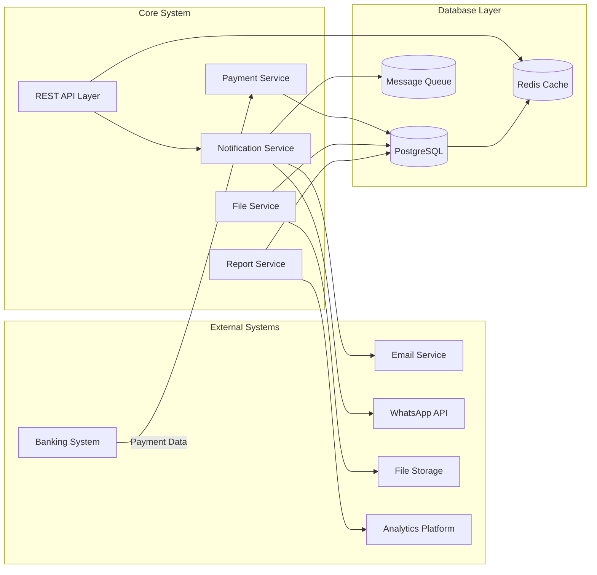

---

## 12. Data Archival Strategy

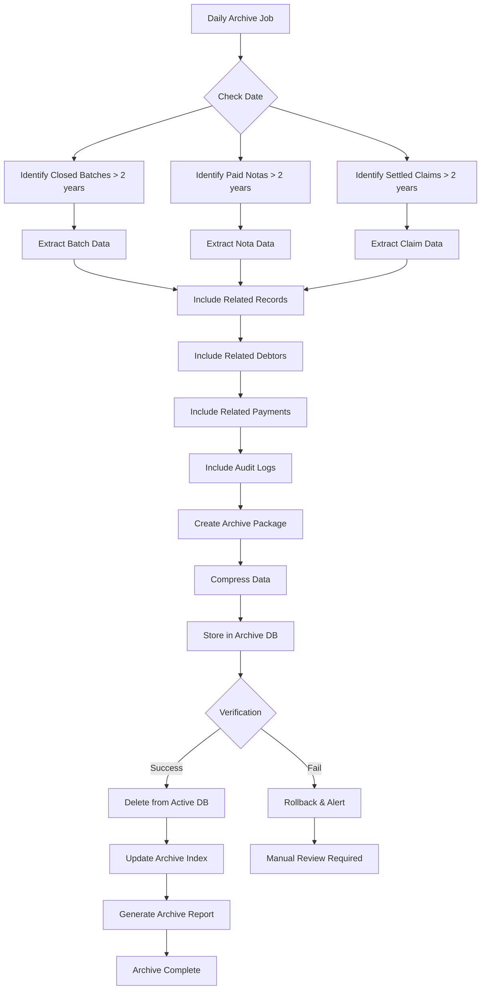

---

## Document Information

**Version**: 1.0  
**Created**: 2025-01-22  
**Purpose**: Detailed process flows and state machines for reinsurance system  
**Status**: Final
