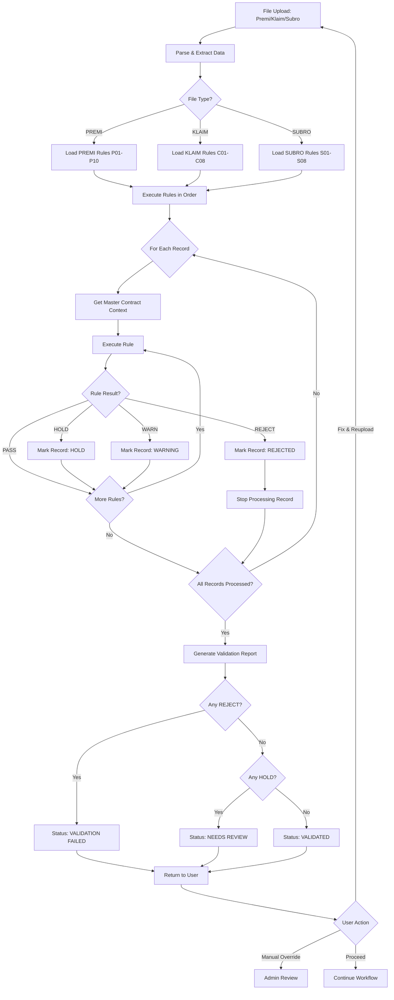

# Validation Framework - System Validation Rules

## Overview

Sistem menggunakan **automated validation engine** yang memvalidasi data Premi, Klaim, dan Subrogasi terhadap Master Contract sebelum data dikirim ke Tugure untuk review manual. 

**Total: 26 Validation Rules**
- ✅ **10 Rules** untuk Premi
- ✅ **8 Rules** untuk Klaim  
- ✅ **8 Rules** untuk Subrogasi

---

## Validation Actions & Severity

### Fail Actions

| Action | Behavior | UI Impact | Next Step |
|--------|----------|-----------|-----------|
| **REJECT** | Hard stop - data ditolak | ❌ Red error | Must fix before proceeding |
| **HOLD** | Soft stop - perlu review | ⚠️ Orange warning | Manual review required |
| **WARN** | Warning only | ⚡ Yellow notice | Can proceed with caution |

### Severity Levels

| Severity | Priority | Description |
|----------|----------|-------------|
| **HIGH** | 🔴 Critical | Business critical, data integrity risk |
| **MEDIUM** | 🟠 Important | Significant but not blocking |
| **LOW** | 🟡 Minor | Nice to have, informational |

---

## Entity: ValidationRule

```json
{
  "rule_id": "string (PK) - e.g., P01, C01, S01",
  "rule_name": "string - Human readable name",
  "file_type": "enum: PREMI|KLAIM|SUBRO",
  "category": "string - e.g., Contract Match, Amount Validation",
  
  "// Columns Used": "",
  "file_columns_used": "text - Columns from uploaded file",
  "master_columns_used": "text - Columns from master contract",
  
  "// Logic": "",
  "logic_rule": "text - Pseudocode of validation logic",
  "tolerance_parameter": "string - Tolerance allowed",
  
  "// Action": "",
  "fail_action": "enum: REJECT|HOLD|WARN",
  "severity": "enum: HIGH|MEDIUM|LOW",
  
  "// Settings": "",
  "is_active": "boolean - Can enable/disable rule",
  "execution_order": "number - Order of execution",
  "depends_on_rule": "string - FK to rule_id (if dependent)",
  
  "// Documentation": "",
  "notes": "text - Additional notes",
  "error_message_template": "text - Message shown to user",
  
  "// Audit": "",
  "created_at": "timestamp",
  "updated_at": "timestamp",
  "last_modified_by": "string"
}
```

---

## PREMI Validation Rules

### P01: Master Contract Match Exists 🔴 HIGH
**Action**: REJECT

**Logic**:
```sql
Find master contract row where:
  PROGRAM_ID = program_id 
  AND LOAN_TYPE = loan_type 
  AND UNIT_CODE = unit_code 
  AND TANGGAL_MULAI_COVERING BETWEEN effective_start AND effective_end
  AND status = 'ACTIVE'
```

**Fail Condition**: No matching master contract found

**Error Message**: "Data premi tidak sesuai kontrak aktif. Program ID, Loan Type, atau Unit Code tidak ditemukan dalam master contract."

**Impact**: Data tidak bisa masuk sistem sama sekali

---

### P02: Covering Date Within Contract Period 🔴 HIGH
**Action**: REJECT

**Logic**:
```javascript
TANGGAL_MULAI_COVERING >= effective_start 
AND TANGGAL_AKHIR_COVERING <= effective_end
AND TANGGAL_AKHIR_COVERING >= TANGGAL_MULAI_COVERING
```

**Fail Condition**: Coverage dates outside contract period OR end date before start date

**Error Message**: "Periode covering tidak sesuai dengan periode kontrak yang aktif."

---

### P03: Plafon Within Max Limit 🔴 HIGH
**Action**: REJECT

**Logic**:
```javascript
PLAFON <= max_plafon_per_loan
```

**Fail Condition**: Plafon exceeds maximum allowed per loan

**Error Message**: "Plafon melebihi batas maksimum per loan: {max_plafon_per_loan}"

---

### P04: Premium Rate Within Allowed Range 🟠 MEDIUM
**Action**: HOLD

**Logic**:
```javascript
rate_est = NOMINAL_PREMI / PLAFON
premium_rate_min <= rate_est <= premium_rate_max
```

**Tolerance**: ±0.0005 for rounding

**Fail Condition**: Calculated rate outside allowed range

**Error Message**: "Rate premi ({rate_est}) di luar range yang diizinkan: {premium_rate_min} - {premium_rate_max}"

**Note**: Kalau premi berbasis tenor/produk khusus, sesuaikan formula

---

### P05: Commission Within Contract Rate 🟠 MEDIUM
**Action**: HOLD

**Logic**:
```javascript
commission_actual = KOMISI / NOMINAL_PREMI
abs(commission_actual - commission_rate) <= 0.001
```

**Tolerance**: 0.1% absolute difference

**Fail Condition**: Commission rate difference > tolerance

**Error Message**: "Komisi tidak sesuai dengan rate kontrak."

---

### P06: Broker Commission Within Range 🟡 LOW
**Action**: WARN

**Logic**:
```javascript
broker_rate = NOMINAL_KOMISI_BROKER / NOMINAL_PREMI
broker_commission_rate_min <= broker_rate <= broker_commission_rate_max
```

**Tolerance**: 0.2% absolute

**Fail Condition**: Broker commission outside range

**Error Message**: "Komisi broker di luar range normal. Perlu review."

---

### P07: Net Premium Calculation Check 🟠 MEDIUM
**Action**: HOLD

**Logic**:
```javascript
expected = (NOMINAL_PREMI - KOMISI - NOMINAL_KOMISI_BROKER) * reins_share_premium_expected
abs(NET_PREMI - expected) <= 1
```

**Tolerance**: IDR 1

**Fail Condition**: Net premium calculation mismatch

**Error Message**: "Net premi tidak sesuai dengan kalkulasi: (Premi - Komisi - Broker) x Share"

**Note**: Pattern sesuai data A3M

---

### P08: Status Aktif Must Be True 🟡 LOW
**Action**: WARN

**Logic**:
```javascript
If status = 'ACTIVE' 
Then STATUS_AKTIF in {1, 'Y', 'ACTIVE'}
```

**Fail Condition**: Status inconsistency

**Error Message**: "Status aktif tidak konsisten dengan status kontrak."

---

### P09: Collectibility Flag Threshold 🟡 LOW
**Action**: WARN

**Logic**:
```javascript
If KOLEKTABILITAS > eligible_kol_max 
Then flag 'high risk'
```

**Fail Condition**: KOL above threshold (does not reject)

**Error Message**: "Kolektibilitas tinggi ({KOLEKTABILITAS}). Perhatian khusus diperlukan."

**Note**: Ini early warning, bukan blocking premi

---

### P10: DN/CN Policy Allowed 🟠 MEDIUM
**Action**: HOLD

**Logic**:
```javascript
If endorsement/restrukturasi flagged 
Then allow_endorsement = 'Y' 
AND dn_cn_allowed = 'Y'
```

**Fail Condition**: Endorsement/restructuring not allowed per contract

**Error Message**: "Endorsement atau restrukturasi tidak diizinkan untuk kontrak ini."

---

## KLAIM Validation Rules

### C01: Claim Must Be Linkable to Contract 🔴 HIGH
**Action**: REJECT

**Logic**:
```javascript
// Step 1: Try direct policy match
POLICYNO startsWith policy_no_prefix 
AND year(BORDERO_KLAIM) within contract_year

// Step 2: If not found, lookup via NOMOR_PESERTA
Find in Debtor where nomor_peserta = NOMOR_PESERTA
Get PROGRAM_ID, UNIT_CODE, LOAN_TYPE from debtor
Match to master contract
```

**Fail Condition**: Cannot link claim to any active contract

**Error Message**: "Claim tidak dapat dihubungkan ke kontrak. Nomor polis atau nomor peserta tidak ditemukan."

**Note**: File klaim tidak punya PROGRAM_ID, jadi perlu lookup ke Debtor via nomor_peserta

**Implementation**:
```sql
-- Step 1: Direct policy match
SELECT mc.* 
FROM master_contract mc
WHERE '{POLICYNO}' LIKE CONCAT(mc.policy_no_prefix, '%')
AND YEAR('{BORDERO_KLAIM}') BETWEEN YEAR(mc.effective_start) AND YEAR(mc.effective_end)
AND mc.status = 'ACTIVE'

-- Step 2: Via debtor lookup
SELECT mc.*
FROM debtor d
JOIN monthly_batch mb ON d.monthly_batch_id = mb.monthly_batch_id
JOIN contract c ON mb.contract_id = c.contract_number
JOIN master_contract mc ON c.contract_number = mc.contract_id
WHERE d.nomor_peserta = '{NOMOR_PESERTA}'
OR d.nomor_polis = '{POLICYNO}'
AND mc.status = 'ACTIVE'
```

---

### C02: Premium-Paid Prerequisite 🔴 HIGH
**Action**: REJECT

**Logic**:
```javascript
If claim_requires_premium_paid = 'Y'
Then must exist premium record (Debtor) for same NOMOR_PESERTA or NOMOR_SERTIFIKAT
WHERE debtor.created_date < BORDERO_KLAIM date
AND debtor.status = 'APPROVED'
```

**Fail Condition**: No premium payment found before claim

**Error Message**: "Premi harus dibayar sebelum klaim dapat diproses. Tidak ditemukan record premi untuk nomor peserta ini."

**Note**: Cross-file validation antara Claim dan Debtor

**Implementation**:
```sql
SELECT COUNT(*) as premium_exists
FROM debtor d
WHERE (d.nomor_peserta = '{NOMOR_PESERTA}' 
       OR d.nomor_polis = '{NOMOR_SERTIFIKAT}')
AND d.status = 'APPROVED'
AND d.created_at < '{BORDERO_KLAIM}'
```

---

### C03: KOL Eligible Threshold 🔴 HIGH
**Action**: HOLD

**Logic**:
```javascript
KOL <= eligible_kol_max
```

**Fail Condition**: KOL exceeds maximum eligible

**Error Message**: "Kolektibilitas ({KOL}) melebihi threshold yang diizinkan ({eligible_kol_max})."

**Note**: KOL di klaim adalah indikator kolektibilitas saat default

---

### C04: DOL Within Contract Limit 🟠 MEDIUM
**Action**: HOLD

**Logic**:
```javascript
DOL <= max_dol_for_claim
```

**Fail Condition**: Date of Loss exceeds contract limit

**Error Message**: "Date of Loss melebihi batas waktu yang diizinkan dalam kontrak."

---

### C05: Claim Amount Within Plafon Bound 🟠 MEDIUM
**Action**: HOLD

**Logic**:
```javascript
max_allowed = max_plafon_per_loan * coverage_pct
abs(CLAIM_AMOUNT) <= max_allowed
```

**Tolerance**: 5%

**Fail Condition**: Claim amount exceeds coverage limit

**Error Message**: "Jumlah klaim ({CLAIM_AMOUNT}) melebihi batas coverage: {max_allowed}"

**Note**: Gunakan absolute karena data contoh menyimpan claim amount negatif

---

### C06: Share Tugure Matches Contract Share 🟠 MEDIUM
**Action**: HOLD

**Logic**:
```javascript
abs(share_tugure - reins_share_claim_expected) <= 0.005
```

**Tolerance**: 0.5% absolute

**Fail Condition**: Share percentage mismatch

**Error Message**: "Share Tugure ({share_tugure}) tidak sesuai dengan kontrak ({reins_share_claim_expected})."

---

### C07: Unique Claim Number Within Contract 🔴 HIGH
**Action**: HOLD

**Logic**:
```javascript
SELECT COUNT(*) as duplicate_count
FROM claim
WHERE claim_no = '{CLAIMNO}'
AND contract_id = '{contract_id}'

// If duplicate_count > 1 then HOLD
```

**Fail Condition**: Duplicate claim number found

**Error Message**: "Nomor klaim ({CLAIMNO}) sudah ada dalam sistem. Kemungkinan double booking."

---

### C08: Mandatory Identifiers Present 🔴 HIGH
**Action**: REJECT

**Logic**:
```javascript
CLAIMNO IS NOT NULL
AND POLICYNO IS NOT NULL
AND (NOMOR_SERTIFIKAT IS NOT NULL OR NOMOR_PESERTA IS NOT NULL)
```

**Fail Condition**: Missing required identifiers

**Error Message**: "Data mandatory tidak lengkap: Claim No, Policy No, dan Nomor Sertifikat/Peserta harus diisi."

---

## SUBROGASI Validation Rules

### S01: Subrogation Must Be Linkable to Contract & Claim 🔴 HIGH
**Action**: REJECT

**Logic**:
```javascript
// Step 1: Check policy
policyno startsWith policy_no_prefix

// Step 2: Check claim reference
No_Claim_Asli IS NOT NULL

// Step 3: If subro_requires_claim_paid = 'Y'
If subro_requires_claim_paid = 'Y'
Then must exist claim record:
  WHERE claim_no = No_Claim_Asli
  AND payment_status = 'Paid'
```

**Fail Condition**: Cannot link to contract OR claim not found/paid

**Error Message**: "Subrogasi tidak dapat dihubungkan ke kontrak atau klaim tidak ditemukan/belum dibayar."

**Note**: Cross-file validation dengan Claim

**Implementation**:
```sql
-- Check claim exists and paid
SELECT c.*, mc.subro_requires_claim_paid
FROM claim c
JOIN master_contract mc ON c.contract_id = mc.contract_id
WHERE c.claim_no = '{No_Claim_Asli}'
AND (mc.subro_requires_claim_paid = 'N' 
     OR (mc.subro_requires_claim_paid = 'Y' AND c.payment_status = 'Paid'))
```

---

### S02: Subrogation Amount Decomposition Check 🟠 MEDIUM
**Action**: HOLD

**Logic**:
```javascript
Sum_of_Subrogasi = COALESCE(Tugu, 0) + COALESCE(Nasre, 0) + COALESCE(ASM, 0)
abs(Sum_of_Subrogasi - expected_sum) <= 1
```

**Tolerance**: IDR 1

**Fail Condition**: Sum of reinsurer shares doesn't match total

**Error Message**: "Total subrogasi tidak sesuai dengan pembagian ke reinsurer (Tugu + Nasre + ASM)."

**Note**: Treat NaN as 0

---

### S03: Reinsurer Split Amounts Align with Master Split 🟡 LOW
**Action**: WARN

**Logic**:
```javascript
Expected_Tugu = Sum_of_Subrogasi * reins_split_tugu
Expected_Nasre = Sum_of_Subrogasi * reins_split_nasre
Expected_ASM = Sum_of_Subrogasi * reins_split_asm

abs(Tugu - Expected_Tugu) / Expected_Tugu <= 0.02
```

**Tolerance**: 2%

**Fail Condition**: Actual split differs from master contract split

**Error Message**: "Pembagian subrogasi ke reinsurer tidak sesuai dengan split ratio di master contract."

**Note**: Optional - aktifkan hanya jika master split memang menjadi dasar pembagian

---

### S04: Fee Fields Presence & Sign Check 🟡 LOW
**Action**: WARN

**Logic**:
```javascript
// Fee should be negative (cost)
If (Fee_Tugu > 0 OR Fee_Nasre > 0 OR Fee_ASM > 0)
Then flag inconsistent sign
```

**Fail Condition**: Fee has wrong sign

**Error Message**: "Fee/expense harus bernilai negatif (biaya). Periksa tanda nilai."

---

### S05: DOL Date Consistency 🟡 LOW
**Action**: WARN

**Logic**:
```javascript
DOL BETWEEN effective_start AND (effective_end + 365 days)
```

**Tolerance**: 365 days window after contract end

**Fail Condition**: DOL outside reasonable window

**Error Message**: "Date of Loss di luar periode kontrak atau window pelaporan yang wajar."

---

### S06: Bdo Premi / Bdo Klaim Consistency 🟠 MEDIUM
**Action**: HOLD

**Logic**:
```javascript
Bdo_Premi BETWEEN effective_start AND effective_end
AND Bdo_Klaim BETWEEN effective_start AND effective_end
AND Bdo_Premi <= Bdo_Klaim
```

**Fail Condition**: Bdo dates outside period OR Premi after Klaim

**Error Message**: "Bordero Premi/Klaim tidak konsisten. Bdo Premi harus lebih awal dari Bdo Klaim."

---

### S07: No Duplicate Subrogation Per Claim Per Month 🟠 MEDIUM
**Action**: HOLD

**Logic**:
```javascript
SELECT COUNT(*) as duplicate_count
FROM subrogation
WHERE No_Claim_Asli = '{No_Claim_Asli}'
AND Bdo_Klaim = '{Bdo_Klaim}'
AND contract_id = '{contract_id}'

// If duplicate_count > 1 then HOLD
```

**Fail Condition**: Duplicate subrogation found

**Error Message**: "Subrogasi untuk klaim ini pada bulan yang sama sudah ada."

---

### S08: Mandatory Identifiers Present 🔴 HIGH
**Action**: REJECT

**Logic**:
```javascript
policyno IS NOT NULL
AND No_Claim_Asli IS NOT NULL
AND Sum_of_Subrogasi IS NOT NULL
```

**Fail Condition**: Missing required fields

**Error Message**: "Data mandatory tidak lengkap: Policy No, No Claim, dan Sum of Subrogasi harus diisi."

---

## Validation Execution Flow



---

## Validation Report Structure

### Report Header
```json
{
  "validation_id": "VAL-2025-001",
  "file_name": "premi_batch_jan2025.xlsx",
  "file_type": "PREMI",
  "upload_date": "2025-01-23T10:30:00Z",
  "uploaded_by": "user@brins.com",
  "total_records": 150,
  "validated_records": 145,
  "rejected_records": 3,
  "hold_records": 2,
  "warning_records": 10,
  "overall_status": "NEEDS_REVIEW"
}
```

### Validation Results Per Record
```json
{
  "record_id": "REC-001",
  "record_data": {
    "NOMOR_PESERTA": "P-12345",
    "PROGRAM_ID": "PRG-001",
    "PLAFON": 50000000
  },
  "validation_status": "REJECTED",
  "rules_executed": 10,
  "rules_passed": 7,
  "rules_failed": 3,
  "failures": [
    {
      "rule_id": "P01",
      "rule_name": "Master contract match exists",
      "fail_action": "REJECT",
      "severity": "HIGH",
      "error_message": "Data premi tidak sesuai kontrak aktif. Program ID tidak ditemukan.",
      "details": {
        "searched_for": "PROGRAM_ID=PRG-001, LOAN_TYPE=KPR, UNIT_CODE=001",
        "found": 0
      }
    }
  ],
  "warnings": [
    {
      "rule_id": "P09",
      "rule_name": "Collectibility flag threshold",
      "fail_action": "WARN",
      "severity": "LOW",
      "message": "Kolektibilitas tinggi (4). Perhatian khusus diperlukan."
    }
  ]
}
```

---

## Implementation: ValidationEngine Class

```python
class ValidationEngine:
    """
    Central validation engine for PREMI, KLAIM, SUBRO
    """
    
    def __init__(self, db_connection):
        self.db = db_connection
        self.rules = self.load_rules()
        self.master_contracts = self.load_master_contracts()
    
    def validate_file(self, file_path, file_type):
        """
        Main validation entry point
        
        Args:
            file_path: Path to uploaded file
            file_type: PREMI | KLAIM | SUBRO
            
        Returns:
            ValidationReport object
        """
        # Load data
        records = self.parse_file(file_path, file_type)
        
        # Get applicable rules
        rules = self.get_rules_for_type(file_type)
        
        # Create report
        report = ValidationReport(
            file_name=file_path,
            file_type=file_type,
            total_records=len(records)
        )
        
        # Validate each record
        for record in records:
            result = self.validate_record(record, rules)
            report.add_result(result)
        
        # Generate summary
        report.finalize()
        
        return report
    
    def validate_record(self, record, rules):
        """
        Validate single record against all rules
        """
        result = ValidationResult(record)
        
        # Get master contract context
        master = self.find_master_contract(record)
        
        if not master and self.requires_master(rules):
            result.add_failure(
                rule_id="MASTER_REQUIRED",
                message="Cannot find applicable master contract"
            )
            return result
        
        # Execute rules in order
        for rule in sorted(rules, key=lambda r: r.execution_order):
            if not rule.is_active:
                continue
            
            # Check dependencies
            if rule.depends_on_rule and not result.is_passed(rule.depends_on_rule):
                continue
            
            # Execute rule
            rule_result = self.execute_rule(rule, record, master)
            
            if rule_result.passed:
                result.mark_passed(rule.rule_id)
            else:
                if rule.fail_action == 'REJECT':
                    result.add_failure(rule.rule_id, rule_result.message)
                    break  # Stop processing on REJECT
                elif rule.fail_action == 'HOLD':
                    result.add_hold(rule.rule_id, rule_result.message)
                elif rule.fail_action == 'WARN':
                    result.add_warning(rule.rule_id, rule_result.message)
        
        return result
    
    def execute_rule(self, rule, record, master):
        """
        Execute specific validation rule
        """
        # Get rule executor
        executor = self.get_rule_executor(rule.rule_id)
        
        # Execute
        try:
            result = executor.execute(record, master, rule)
            return result
        except Exception as e:
            return RuleResult(
                passed=False,
                message=f"Rule execution error: {str(e)}"
            )
```

---

## Rule Executor Examples

### P01: Master Contract Match Executor
```python
class P01MasterContractMatchExecutor:
    """
    Find master contract that matches PROGRAM_ID + LOAN_TYPE + UNIT_CODE
    """
    
    def execute(self, record, master, rule):
        program_id = record.get('PROGRAM_ID')
        loan_type = record.get('LOAN_TYPE')
        unit_code = record.get('UNIT_CODE')
        tanggal_mulai = record.get('TANGGAL_MULAI_COVERING')
        
        # Query master contract
        query = """
            SELECT * FROM master_contract
            WHERE program_id = %s
            AND loan_type = %s
            AND unit_code = %s
            AND %s BETWEEN effective_start AND effective_end
            AND status = 'ACTIVE'
        """
        
        result = db.query(query, [program_id, loan_type, unit_code, tanggal_mulai])
        
        if result:
            return RuleResult(
                passed=True,
                message="Master contract found"
            )
        else:
            return RuleResult(
                passed=False,
                message=f"Data premi tidak sesuai kontrak aktif. Tidak ditemukan master contract untuk PROGRAM_ID={program_id}, LOAN_TYPE={loan_type}, UNIT_CODE={unit_code}"
            )
```

### C02: Premium-Paid Prerequisite Executor
```python
class C02PremiumPaidExecutor:
    """
    Check if premium payment exists before claim
    """
    
    def execute(self, record, master, rule):
        nomor_peserta = record.get('NOMOR_PESERTA')
        nomor_sertifikat = record.get('NOMOR_SERTIFIKAT')
        bordero_klaim = record.get('BORDERO_KLAIM')
        
        # Check if prerequisite is required
        if master.claim_requires_premium_paid != 'Y':
            return RuleResult(passed=True, message="Prerequisite not required")
        
        # Query debtor (premium) table
        query = """
            SELECT COUNT(*) as count
            FROM debtor
            WHERE (nomor_peserta = %s OR nomor_polis = %s)
            AND status = 'APPROVED'
            AND created_at < %s
        """
        
        result = db.query_one(query, [nomor_peserta, nomor_sertifikat, bordero_klaim])
        
        if result['count'] > 0:
            return RuleResult(
                passed=True,
                message=f"Premium payment found for peserta {nomor_peserta}"
            )
        else:
            return RuleResult(
                passed=False,
                message=f"Premi harus dibayar sebelum klaim. Tidak ditemukan record premi untuk nomor peserta {nomor_peserta}"
            )
```

---

## Database Schema for Validation

### ValidationRule Table
```sql
CREATE TABLE validation_rule (
    rule_id VARCHAR(10) PRIMARY KEY,
    rule_name VARCHAR(200) NOT NULL,
    file_type VARCHAR(10) NOT NULL CHECK (file_type IN ('PREMI', 'KLAIM', 'SUBRO')),
    category VARCHAR(50),
    
    file_columns_used TEXT,
    master_columns_used TEXT,
    
    logic_rule TEXT NOT NULL,
    tolerance_parameter VARCHAR(100),
    
    fail_action VARCHAR(10) NOT NULL CHECK (fail_action IN ('REJECT', 'HOLD', 'WARN')),
    severity VARCHAR(10) NOT NULL CHECK (severity IN ('HIGH', 'MEDIUM', 'LOW')),
    
    is_active BOOLEAN DEFAULT TRUE,
    execution_order INTEGER,
    depends_on_rule VARCHAR(10) REFERENCES validation_rule(rule_id),
    
    notes TEXT,
    error_message_template TEXT,
    
    created_at TIMESTAMP DEFAULT CURRENT_TIMESTAMP,
    updated_at TIMESTAMP DEFAULT CURRENT_TIMESTAMP,
    last_modified_by VARCHAR(100),
    
    UNIQUE(file_type, execution_order)
);

CREATE INDEX idx_validation_rule_type ON validation_rule(file_type, is_active);
CREATE INDEX idx_validation_rule_order ON validation_rule(execution_order);
```

### ValidationExecution Table
```sql
CREATE TABLE validation_execution (
    validation_id VARCHAR(50) PRIMARY KEY,
    file_name VARCHAR(200),
    file_type VARCHAR(10),
    upload_date TIMESTAMP,
    uploaded_by VARCHAR(100),
    
    total_records INTEGER,
    validated_records INTEGER,
    rejected_records INTEGER,
    hold_records INTEGER,
    warning_records INTEGER,
    
    overall_status VARCHAR(20) CHECK (overall_status IN ('VALIDATED', 'NEEDS_REVIEW', 'VALIDATION_FAILED')),
    
    execution_time_ms INTEGER,
    
    created_at TIMESTAMP DEFAULT CURRENT_TIMESTAMP
);

CREATE INDEX idx_validation_execution_user ON validation_execution(uploaded_by);
CREATE INDEX idx_validation_execution_date ON validation_execution(upload_date);
```

### ValidationResult Table
```sql
CREATE TABLE validation_result (
    result_id BIGSERIAL PRIMARY KEY,
    validation_id VARCHAR(50) REFERENCES validation_execution(validation_id),
    
    record_id VARCHAR(50),
    record_data JSONB,
    
    validation_status VARCHAR(20) CHECK (validation_status IN ('PASSED', 'REJECTED', 'HOLD', 'WARNING')),
    
    rules_executed INTEGER,
    rules_passed INTEGER,
    rules_failed INTEGER,
    
    failures JSONB, -- Array of failure details
    holds JSONB,    -- Array of hold details
    warnings JSONB, -- Array of warning details
    
    created_at TIMESTAMP DEFAULT CURRENT_TIMESTAMP
);

CREATE INDEX idx_validation_result_validation ON validation_result(validation_id);
CREATE INDEX idx_validation_result_status ON validation_result(validation_status);
CREATE INDEX idx_validation_result_data ON validation_result USING GIN(record_data);
```

---

## UI Components

### Validation Status Dashboard
```
┌─────────────────────────────────────────────────────┐
│ Validation Report: premi_batch_jan2025.xlsx        │
│ Upload Date: 2025-01-23 10:30:00                   │
│ Uploaded By: user@brins.com                        │
├─────────────────────────────────────────────────────┤
│                                                     │
│  Overall Status: ⚠️ NEEDS REVIEW                   │
│                                                     │
│  ╔════════════════════════════════════════╗        │
│  ║  Total Records:        150             ║        │
│  ║  ✅ Validated:         145  (96.7%)    ║        │
│  ║  ❌ Rejected:            3  (2.0%)     ║        │
│  ║  ⚠️  Needs Review:       2  (1.3%)     ║        │
│  ║  ⚡ Warnings:           10  (6.7%)     ║        │
│  ╚════════════════════════════════════════╝        │
│                                                     │
│  Rules Summary:                                     │
│  • P01: 147 passed, 3 failed (REJECT)              │
│  • P02: 150 passed, 0 failed                       │
│  • P03: 150 passed, 0 failed                       │
│  • P04: 148 passed, 2 failed (HOLD)                │
│  • P09: 140 passed, 10 failed (WARN)               │
│                                                     │
│  [📥 Download Full Report]  [🔄 Retry]             │
│  [✏️ Fix & Reupload]        [➡️ Continue Anyway]   │
└─────────────────────────────────────────────────────┘
```

### Record Detail View
```
┌─────────────────────────────────────────────────────┐
│ Record: REC-001                                     │
│ Status: ❌ REJECTED                                 │
├─────────────────────────────────────────────────────┤
│                                                     │
│ Record Data:                                        │
│  NOMOR_PESERTA: P-12345                            │
│  PROGRAM_ID: PRG-001                               │
│  LOAN_TYPE: KPR                                    │
│  PLAFON: 50,000,000                                │
│                                                     │
│ Validation Results:                                 │
│                                                     │
│ ❌ CRITICAL FAILURE (Rule P01)                     │
│    Master contract match exists                     │
│    Data premi tidak sesuai kontrak aktif.          │
│    Program ID tidak ditemukan dalam master.        │
│                                                     │
│    Searched for:                                    │
│    • PROGRAM_ID = PRG-001                          │
│    • LOAN_TYPE = KPR                               │
│    • UNIT_CODE = 001                               │
│    • Date: 2025-01-15                              │
│                                                     │
│    ℹ️ Suggestion: Check Program ID or ensure       │
│       master contract is active for this period.   │
│                                                     │
│ ⚡ WARNING (Rule P09)                              │
│    Collectibility flag threshold                    │
│    Kolektibilitas tinggi (4). Perhatian khusus    │
│    diperlukan.                                      │
│                                                     │
│  [✏️ Edit Record]  [🗑️ Remove Record]             │
└─────────────────────────────────────────────────────┘
```

---

## Admin Configuration Panel

```
┌─────────────────────────────────────────────────────┐
│ Validation Rules Configuration                      │
├─────────────────────────────────────────────────────┤
│                                                     │
│ File Type: [PREMI ▼]                               │
│                                                     │
│ ╔════╦═══════════════════════╦═══════╦═══════╗    │
│ ║ ID ║ Rule Name             ║Action ║Active ║    │
│ ╠════╬═══════════════════════╬═══════╬═══════╣    │
│ ║P01 ║Master contract match  ║REJECT ║  ☑    ║    │
│ ║P02 ║Covering date valid    ║REJECT ║  ☑    ║    │
│ ║P03 ║Plafon within limit    ║REJECT ║  ☑    ║    │
│ ║P04 ║Premium rate range     ║HOLD   ║  ☑    ║    │
│ ║P05 ║Commission rate        ║HOLD   ║  ☑    ║    │
│ ║P06 ║Broker commission      ║WARN   ║  ☑    ║    │
│ ║P07 ║Net premium calc       ║HOLD   ║  ☑    ║    │
│ ║P08 ║Status aktif check     ║WARN   ║  ☑    ║    │
│ ║P09 ║Collectibility threshold║WARN  ║  ☑    ║    │
│ ║P10 ║DN/CN policy           ║HOLD   ║  ☐    ║    │
│ ╚════╩═══════════════════════╩═══════╩═══════╝    │
│                                                     │
│ [+ Add New Rule]  [💾 Save Changes]                │
│                                                     │
│ Rule Details: (Select a rule to view/edit)         │
│                                                     │
└─────────────────────────────────────────────────────┘
```

---

## API Endpoints

### Execute Validation
```http
POST /api/validation/execute
Content-Type: multipart/form-data

{
  "file": <uploaded_file>,
  "file_type": "PREMI|KLAIM|SUBRO",
  "uploaded_by": "user@brins.com"
}

Response:
{
  "validation_id": "VAL-2025-001",
  "overall_status": "NEEDS_REVIEW",
  "summary": {
    "total_records": 150,
    "validated": 145,
    "rejected": 3,
    "hold": 2,
    "warning": 10
  },
  "report_url": "/api/validation/report/VAL-2025-001"
}
```

### Get Validation Report
```http
GET /api/validation/report/{validation_id}

Response:
{
  "validation_id": "VAL-2025-001",
  "file_name": "premi_batch_jan2025.xlsx",
  "overall_status": "NEEDS_REVIEW",
  "results": [
    {
      "record_id": "REC-001",
      "status": "REJECTED",
      "failures": [...],
      "warnings": [...]
    }
  ]
}
```

### Get Rules Configuration
```http
GET /api/validation/rules?file_type=PREMI

Response:
{
  "rules": [
    {
      "rule_id": "P01",
      "rule_name": "Master contract match exists",
      "fail_action": "REJECT",
      "severity": "HIGH",
      "is_active": true,
      "execution_order": 1
    }
  ]
}
```

---

## Migration Script: Load Validation Rules

```python
import csv
import psycopg2

def migrate_validation_rules(csv_path, db_connection):
    """
    Load validation rules from CSV into database
    """
    with open(csv_path, 'r', encoding='utf-8-sig') as f:
        reader = csv.DictReader(f)
        rules = list(reader)
    
    cursor = db_connection.cursor()
    
    execution_order = 1
    
    for rule in rules:
        # Prepare data
        rule_id = rule['rule_id']
        rule_name = rule['rule_name']
        file_type = rule['file_type']
        
        file_columns = rule['file_columns_used']
        master_columns = rule['master_columns_used']
        logic_rule = rule['logic_rule (pseudo)']
        tolerance = rule['tolerance/parameter']
        fail_action = rule['fail_action']
        severity = rule['severity']
        notes = rule['notes']
        
        # Generate error message template
        error_template = generate_error_template(rule)
        
        # Insert
        query = """
            INSERT INTO validation_rule (
                rule_id, rule_name, file_type, 
                file_columns_used, master_columns_used,
                logic_rule, tolerance_parameter,
                fail_action, severity,
                is_active, execution_order,
                notes, error_message_template
            ) VALUES (%s, %s, %s, %s, %s, %s, %s, %s, %s, %s, %s, %s, %s)
            ON CONFLICT (rule_id) DO UPDATE SET
                rule_name = EXCLUDED.rule_name,
                logic_rule = EXCLUDED.logic_rule,
                updated_at = CURRENT_TIMESTAMP
        """
        
        cursor.execute(query, [
            rule_id, rule_name, file_type,
            file_columns, master_columns,
            logic_rule, tolerance,
            fail_action, severity,
            True, execution_order,
            notes, error_template
        ])
        
        execution_order += 1
    
    db_connection.commit()
    print(f"✓ Migrated {len(rules)} validation rules")
```

---

## Performance Considerations

### Batch Processing
- Process records in batches of 100-500
- Use database connection pooling
- Cache master contract data in memory

### Rule Optimization
- Execute rules in order of likelihood to fail
- Stop processing on REJECT (fail-fast)
- Parallelize independent rule execution

### Caching Strategy
```python
# Cache master contracts by key patterns
master_cache = {
    "PRG-001:KPR:001": <master_contract_object>,
    "PRG-002:KMK:002": <master_contract_object>
}

# Cache rule executors
executor_cache = {
    "P01": P01Executor(),
    "P02": P02Executor()
}
```

---

## Testing Strategy

### Unit Tests
```python
def test_p01_master_contract_match():
    """Test P01 rule execution"""
    record = {
        'PROGRAM_ID': 'PRG-001',
        'LOAN_TYPE': 'KPR',
        'UNIT_CODE': '001',
        'TANGGAL_MULAI_COVERING': '2025-01-15'
    }
    
    executor = P01Executor()
    result = executor.execute(record, None, rule_p01)
    
    assert result.passed == True
```

### Integration Tests
```python
def test_full_validation_flow():
    """Test end-to-end validation"""
    file_path = 'test_data/premi_sample.xlsx'
    
    engine = ValidationEngine(db_connection)
    report = engine.validate_file(file_path, 'PREMI')
    
    assert report.total_records == 10
    assert report.overall_status in ['VALIDATED', 'NEEDS_REVIEW', 'VALIDATION_FAILED']
```

---

## Monitoring & Alerts

### Metrics to Track
- Validation execution time
- Rules pass/fail rates
- Most common failures
- Processing throughput

### Alert Conditions
- Validation execution > 5 minutes
- REJECT rate > 10%
- System errors > 1%
- Database connection failures

---

## Future Enhancements

1. **Machine Learning**
   - Predict likely failures
   - Suggest fixes automatically
   - Learn from manual overrides

2. **Custom Rules**
   - Allow users to define custom rules
   - Rule builder UI
   - Template library

3. **Real-time Validation**
   - Validate while typing
   - Progressive validation
   - Instant feedback

4. **Integration**
   - Webhook notifications
   - External validation services
   - Third-party data sources

---

**Version**: 1.0  
**Last Updated**: 2025-01-23  
**Status**: ✅ Complete Validation Framework  
**Source**: Master_Kontrak_A3M Validation Matrix
